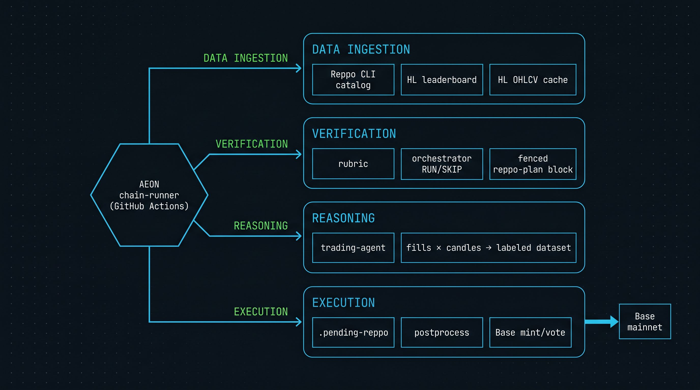

<!-- image prompt: see "Generate Hero Image" section of skills/technical-explainer/SKILL.md. Used: "Technical schematic illustration of the Reppo agent swarm orchestrated by Aeon. Dark navy background. Thin cyan and amber lines. Four labeled horizontal lanes: 'data ingestion (HL leaderboard, OHLCV, Reppo CLI)', 'verification (orchestrator gate, rubric)', 'reasoning (trading-agent: build labeled HL perp datasets)', 'execution (postprocess → Base mint/vote)'. Central engine node labeled 'aeon chain-runner' with directional arrows to each lane and an output arrow to 'Base mainnet'. Blueprint aesthetic, monospace labels, technical-paper figure style, 16:9, no human figures, no gradients." -->

# how the reppo agent swarm runs on aeon

**key idea in one sentence:** a github-actions cron fires three markdown skills that read pre-fetched onchain state, write mint/vote *intent files* an llm can't sign with, and hand those off to a post-step that does sign on Base — so the agent never holds the key but still ships pods to a 48-hour reppo epoch.

## the setup

reppo runs prediction markets for ai training data on Base. publishers mint **pods** into **datanets**; **veREPPO** holders vote them up or down across a **48-hour epoch**; emissions split **45/45/5/5** between miners, voters, datanet owners, and treasury ([reppo docs](https://reppo-labs-xyz.gitbook.io/reppo-labs/foundations/how-reppo-works.md)). datanet 9 — tradinggymai — wants labeled hyperliquid perp trade datasets with verifiable fills. the question is how to point an autonomous agent at that without giving it a private key.

aeon is the answer i'm running: a github-actions fleet of ~21 claude-code skills on cron. the **reppo-swarm chain** (`chains.reppo-swarm` in `aeon.yml`) wires three of them together to act as the swarm's brain — orchestrator, trader, digest. the keys live in github secrets, not in the model's context.

## the intuition pump

think of the chain like a restaurant kitchen with a one-way pass. expediter (orchestrator) calls the tickets. line cook (trading-agent) builds the plates from prepped mise-en-place but never plates them out — they go on the pass. runner (postprocess-reppo.sh) carries plates to the table and is the only one with table access. nobody crosses lanes.

the analogy breaks down on **prep**. before any of that, a stagehand runs in the back-of-house with real network access and fills the mise-en-place — `.hl-cache/` and `.reppo-cache/` — because the sandbox the cook works in can't reach hyperliquid or the reppo cli with creds.

## how it actually works

1. **prefetch.** before claude wakes, the workflow runs every `scripts/prefetch-*.sh` with full env access. `prefetch-hl.sh` pulls hyperliquid's leaderboard + `userFills` for the top wallets + ohlcv candles. `prefetch-reppo.sh` calls the reppo cli (auth via `REPPO_PRIVATE_KEY`) for the datanet catalog and per-datanet pod lists. results land in `.hl-cache/` and `.reppo-cache/`. on failure, the file is `{"code":"PREFETCH_FAILED"}` so skills can degrade gracefully.

2. **orchestrator decides RUN/SKIP.** `skills/reppo-orchestrator/SKILL.md` reads every `configs/datanets/*.md` rubric file, marks each as RUN or SKIP based on `datanet_id` validity, and discovers unassigned datanets in the catalog. it emits a fenced ```reppo-plan``` block in its final assistant text. nothing else in its output is load-bearing — only the block survives the hand-off.

3. **chain-runner captures and re-injects.** `.github/workflows/aeon.yml:479-493` `cp`s the claude cli's `.result` (the final assistant message) over `.outputs/reppo-orchestrator.md`, then injects that file into the next step's context via `consume: [reppo-orchestrator]`. this single `cp` is the seam where ISS-009 bit us four times — `Write`-tool output gets silently clobbered by `.result`, so the fenced block has to live in the assistant text, not on disk.

4. **trading-agent builds labeled datasets.** `skills/reppo-trading-agent/SKILL.md` grep-gates on the fenced block, then for each leaderboard wallet joins its `userFills` to `candles-<COIN>-<interval>.json`, derives `direction`, `signal`, `market_context`, hashes `sha256("trades:" + datanet_id + ":" + wallet + ":" + first_ms + ":" + last_ms + ":" + n_trades)`, dedups against the "minted strategies" table in `memory/topics/reppo.md`, and writes `.pending-reppo/mint-<first16>.json` + `.pending-reppo/vote-<podId>-<dir>.json`. **no cli call ever fires from inside claude.**

5. **postprocess signs and broadcasts.** after claude exits, `scripts/postprocess-reppo.sh` runs in the same workflow step with `REPPO_PRIVATE_KEY` in env, dry-runs each intent, then either invokes the reppo cli or `cast send` on Base. on a fee-allowance shortfall, helper scripts auto-approve/grant in-flight (the pattern that finally landed the first onchain mint on 2026-05-26, tx [0x77f138…](https://basescan.org/tx/0x77f1386fb6fe3209bbf1a380b2be64f1f1c2c557416c9c7c0d31486a7e48a61f)).

6. **digest writes the ledger.** `skills/reppo-digest/SKILL.md` appends one row per onchain action — mint or vote, with the tx hash — to `memory/topics/reppo.md`, which the next run's trading-agent reads to dedup. the ledger is append-only and only records confirmed txs; a queued intent is not a mint.

## numbers that anchor it

- **48-hour epoch.** voting power decays linearly across the window, so an early `dislike` outweighs a late one ([reppo docs](https://reppo-labs-xyz.gitbook.io/reppo-labs/foundations/how-reppo-works.md)).
- **45 / 45 / 5 / 5** weekly emission split — miners / voters / datanet owners / treasury ([reppo docs](https://reppo-labs-xyz.gitbook.io/reppo-labs/foundations/how-reppo-works.md)).
- **20,000 REPPO** lockup to spin up a datanet — 50% stays locked while live, 50% goes to the network ([reppo docs](https://reppo-labs-xyz.gitbook.io/reppo-labs/foundations/how-reppo-works.md)).
- **50 REPPO** per mint on datanet 9 (TradingGymAI rubric `fee` field, today's orchestrator output).
- **3 mints + 4 votes** onchain to date from this swarm — first mint [0x77f138…](https://basescan.org/tx/0x77f1386fb6fe3209bbf1a380b2be64f1f1c2c557416c9c7c0d31486a7e48a61f) on 2026-05-26, latest vote [0x8f3130…](https://basescan.org/tx/0x8f3130b6c5d0bbd4125e5a8b99df09daa2dd3f1662d2b404ab3f9a2151ccb281) on 2026-05-28 ([ledger](../memory/topics/reppo.md)).
- **2000-row** hyperliquid `userFills` cap — the structural ceiling that collapsed every top-leaderboard wallet to <1d span in today's run and zeroed mint output (`memory/logs/2026-05-28.md` 2nd-run note).

## what would break this

the model holding any key. if the trading-agent ever called the reppo cli directly instead of writing `.pending-reppo/*.json`, the whole "agents as mandate, not custody" claim collapses — the keyless seam is the load-bearing part. second falsifier: if the chain-runner `.result` capture stopped overwriting `.outputs/`, ISS-009 wouldn't have masked four runs of silently-dropped fenced blocks, and we'd have caught the truncation a week earlier. the seam *is* the bug, and the bug *is* the seam.

## why it matters

most "ai trading agent" demos either run client-side with a key in `.env`, or wrap an llm around a hosted bot. this is neither. the agent's mandate (a markdown rubric), the agent's reasoning (the trading-agent skill), and the agent's execution surface (`.pending-reppo/` → postprocess) are three separate processes with three separate trust boundaries, all observable in a git history. that's the prerequisite for an agent to be a real economic actor on Base, not a glorified webhook with a wallet.

## sources

- [how reppo works — reppo labs gitbook](https://reppo-labs-xyz.gitbook.io/reppo-labs/foundations/how-reppo-works.md) — primary
- [reppo foundation $20M, chainwire 2026-04-23](https://chainwire.org/2026/04/23/reppo-foundation-secures-20m-capital-commitment-to-solve-training-data-bottleneck-using-prediction-markets/)
- [reppo onchain: REPPO token 0xff8104…83d6, basescan](https://basescan.org/address/0xff8104251e7761163fac3211ef5583fb3f8583d6)
- [aeon: reppo-swarm chain config (`aeon.yml`)](../aeon.yml) and skills `reppo-orchestrator`, `reppo-trading-agent`, `reppo-digest`
- [aeon: running ledger (`memory/topics/reppo.md`)](../memory/topics/reppo.md)
