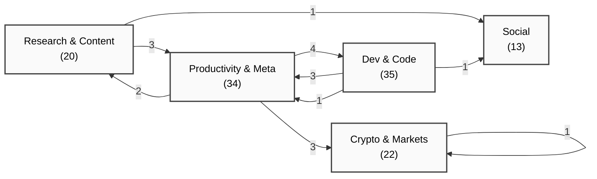
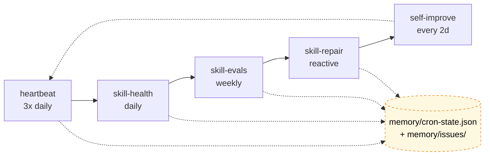
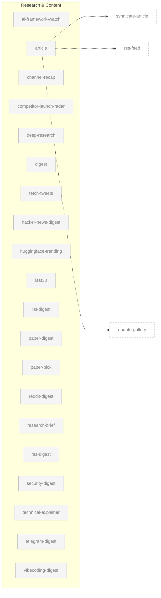
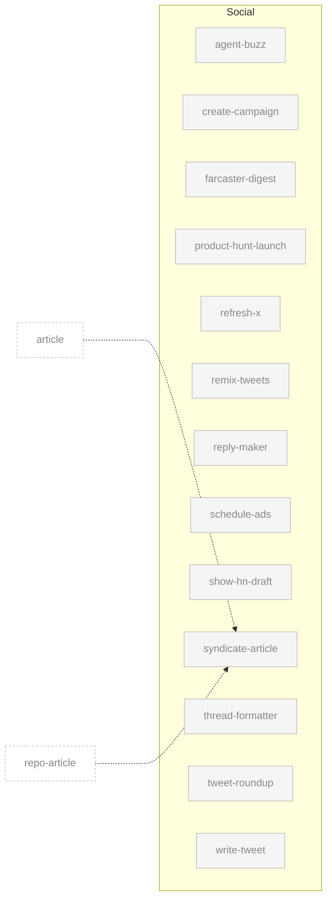

# Skill Dependency Graph

> Auto-generated by `skill-graph` on 2026-05-28. Mode: `SKILL_GRAPH_NEW`.

**Verdict:** `SKILL_GRAPH_NEW — first run with state file; baseline established for 124 skills across 5 categories (21 enabled).`

Navigable Mermaid map of every Aeon skill, grouped by category, with a self-healing-loop callout, per-category drill-downs, click-through to source, and an enabled overlay.

---

## Overview

Edge labels = count of edges crossing that category boundary. Self-loops collapsed into a single line per category.

---

## Self-Healing Loop

The most load-bearing chain in the fleet. Five skills + one shared state file form a closed loop that detects, classifies, and patches failures without operator intervention.

> Every skill writes `memory/cron-state.json` after each run. This single shared state is what makes the loop self-correcting — rather than 90 explicit edges into the loop, it is collapsed into one state node here. Same convention applies to the per-category diagrams below.

---

## Per-Category Diagrams

### Research & Content (20)

None enabled this run. Content distribution edges shown as faded ghost nodes (defined in other categories).

### Dev & Code (35)

```mermaid
flowchart LR
    subgraph dev [" Dev & Code "]
        direction TB
        auto-merge[auto-merge]:::disabled
        auto-workflow[auto-workflow]:::disabled
        autoresearch["autoresearch<br/>workflow_dispatch"]:::enabled
        changelog[changelog]:::disabled
        code-health[code-health]:::disabled
        create-skill[create-skill]:::disabled
        deploy-prototype[deploy-prototype]:::disabled
        external-feature[external-feature]:::disabled
        fleet-control[fleet-control]:::disabled
        fork-cohort[fork-cohort]:::disabled
        fork-first-run-alert[fork-first-run-alert]:::disabled
        fork-fleet[fork-fleet]:::disabled
        fork-release-tracker[fork-release-tracker]:::disabled
        fork-skill-gap[fork-skill-gap]:::disabled
        github-issues[github-issues]:::disabled
        github-monitor[github-monitor]:::disabled
        github-releases[github-releases]:::disabled
        github-trending["github-trending<br/>0 9 * * *"]:::enabled
        issue-triage[issue-triage]:::disabled
        pr-review[pr-review]:::disabled
        pr-triage[pr-triage]:::disabled
        project-lens[project-lens]:::disabled
        push-recap[push-recap]:::disabled
        repo-actions[repo-actions]:::disabled
        repo-article[repo-article]:::disabled
        repo-pulse[repo-pulse]:::disabled
        repo-scanner[repo-scanner]:::disabled
        search-skill["search-skill<br/>0 14 * * *"]:::enabled
        skill-security-scan["skill-security-scan<br/>0 16 * * 1"]:::enabled
        smithery-manifest[smithery-manifest]:::disabled
        spawn-instance[spawn-instance]:::disabled
        star-milestone[star-milestone]:::disabled
        vercel-projects[vercel-projects]:::disabled
        vuln-scanner[vuln-scanner]:::disabled
        workflow-security-audit[workflow-security-audit]:::disabled
    end

    skill-health_ext[skill-health]:::external
    syndicate_ext2[syndicate-article]:::external
    rss-feed_ext2[rss-feed]:::external
    update-gallery_ext2[update-gallery]:::external

    external-feature --> repo-scanner
    vuln-scanner --> github-trending
    autoresearch -..-> skill-health_ext
    repo-article -..-> syndicate_ext2
    repo-article -..-> rss-feed_ext2
    repo-article -..-> update-gallery_ext2
    project-lens -..-> syndicate_ext2

    click auto-merge "../skills/auto-merge/SKILL.md"
    click auto-workflow "../skills/auto-workflow/SKILL.md"
    click autoresearch "../skills/autoresearch/SKILL.md"
    click changelog "../skills/changelog/SKILL.md"
    click code-health "../skills/code-health/SKILL.md"
    click create-skill "../skills/create-skill/SKILL.md"
    click deploy-prototype "../skills/deploy-prototype/SKILL.md"
    click external-feature "../skills/external-feature/SKILL.md"
    click fleet-control "../skills/fleet-control/SKILL.md"
    click fork-cohort "../skills/fork-cohort/SKILL.md"
    click fork-first-run-alert "../skills/fork-first-run-alert/SKILL.md"
    click fork-fleet "../skills/fork-fleet/SKILL.md"
    click fork-release-tracker "../skills/fork-release-tracker/SKILL.md"
    click fork-skill-gap "../skills/fork-skill-gap/SKILL.md"
    click github-issues "../skills/github-issues/SKILL.md"
    click github-monitor "../skills/github-monitor/SKILL.md"
    click github-releases "../skills/github-releases/SKILL.md"
    click github-trending "../skills/github-trending/SKILL.md"
    click issue-triage "../skills/issue-triage/SKILL.md"
    click pr-review "../skills/pr-review/SKILL.md"
    click pr-triage "../skills/pr-triage/SKILL.md"
    click project-lens "../skills/project-lens/SKILL.md"
    click push-recap "../skills/push-recap/SKILL.md"
    click repo-actions "../skills/repo-actions/SKILL.md"
    click repo-article "../skills/repo-article/SKILL.md"
    click repo-pulse "../skills/repo-pulse/SKILL.md"
    click repo-scanner "../skills/repo-scanner/SKILL.md"
    click search-skill "../skills/search-skill/SKILL.md"
    click skill-security-scan "../skills/skill-security-scan/SKILL.md"
    click smithery-manifest "../skills/smithery-manifest/SKILL.md"
    click spawn-instance "../skills/spawn-instance/SKILL.md"
    click star-milestone "../skills/star-milestone/SKILL.md"
    click vercel-projects "../skills/vercel-projects/SKILL.md"
    click vuln-scanner "../skills/vuln-scanner/SKILL.md"
    click workflow-security-audit "../skills/workflow-security-audit/SKILL.md"

    classDef enabled fill:#fff,stroke:#000,stroke-width:2px,color:#000
    classDef disabled fill:#f5f5f5,stroke:#bbb,color:#888
    classDef external fill:none,stroke:#bbb,stroke-dasharray:3 3,color:#888
```

### Crypto & Markets (22)

```mermaid
flowchart LR
    subgraph crypto [" Crypto & Markets "]
        direction TB
        aixbt-pulse[aixbt-pulse]:::disabled
        contributor-reward[contributor-reward]:::disabled
        defi-monitor[defi-monitor]:::disabled
        defi-overview["defi-overview<br/>0 12 * * *"]:::enabled
        distribute-tokens[distribute-tokens]:::disabled
        market-context-refresh[market-context-refresh]:::disabled
        monitor-kalshi[monitor-kalshi]:::disabled
        monitor-polymarket[monitor-polymarket]:::disabled
        monitor-runners[monitor-runners]:::disabled
        narrative-tracker[narrative-tracker]:::disabled
        on-chain-monitor[on-chain-monitor]:::disabled
        polymarket-comments[polymarket-comments]:::disabled
        price-threshold-alert[price-threshold-alert]:::disabled
        reppo-digest[reppo-digest]:::disabled
        reppo-orchestrator[reppo-orchestrator]:::disabled
        reppo-trading-agent[reppo-trading-agent]:::disabled
        token-alert["token-alert<br/>0 12 * * *"]:::enabled
        token-movers[token-movers]:::disabled
        token-pick[token-pick]:::disabled
        token-report[token-report]:::disabled
        treasury-info[treasury-info]:::disabled
        unlock-monitor[unlock-monitor]:::disabled
    end

    market-context-refresh -..-> token-pick
    market-context-refresh -..-> narrative-tracker
    contributor-reward -..-> distribute-tokens
    reppo-orchestrator -.-> reppo-trading-agent
    reppo-orchestrator -.-> reppo-digest
    reppo-trading-agent -.-> reppo-digest

    click aixbt-pulse "../skills/aixbt-pulse/SKILL.md"
    click contributor-reward "../skills/contributor-reward/SKILL.md"
    click defi-monitor "../skills/defi-monitor/SKILL.md"
    click defi-overview "../skills/defi-overview/SKILL.md"
    click distribute-tokens "../skills/distribute-tokens/SKILL.md"
    click market-context-refresh "../skills/market-context-refresh/SKILL.md"
    click monitor-kalshi "../skills/monitor-kalshi/SKILL.md"
    click monitor-polymarket "../skills/monitor-polymarket/SKILL.md"
    click monitor-runners "../skills/monitor-runners/SKILL.md"
    click narrative-tracker "../skills/narrative-tracker/SKILL.md"
    click on-chain-monitor "../skills/on-chain-monitor/SKILL.md"
    click polymarket-comments "../skills/polymarket-comments/SKILL.md"
    click price-threshold-alert "../skills/price-threshold-alert/SKILL.md"
    click reppo-digest "../skills/reppo-digest/SKILL.md"
    click reppo-orchestrator "../skills/reppo-orchestrator/SKILL.md"
    click reppo-trading-agent "../skills/reppo-trading-agent/SKILL.md"
    click token-alert "../skills/token-alert/SKILL.md"
    click token-movers "../skills/token-movers/SKILL.md"
    click token-pick "../skills/token-pick/SKILL.md"
    click token-report "../skills/token-report/SKILL.md"
    click treasury-info "../skills/treasury-info/SKILL.md"
    click unlock-monitor "../skills/unlock-monitor/SKILL.md"

    classDef enabled fill:#fff,stroke:#000,stroke-width:2px,color:#000
    classDef disabled fill:#f5f5f5,stroke:#bbb,color:#888
```

### Social (13)

### Productivity & Meta (34)

```mermaid
flowchart LR
    subgraph productivity [" Productivity & Meta "]
        direction TB
        action-converter["action-converter<br/>0 18 * * *"]:::enabled
        contributor-spotlight[contributor-spotlight]:::disabled
        cost-report["cost-report<br/>0 7 * * 1"]:::enabled
        daily-routine[daily-routine]:::disabled
        deal-flow[deal-flow]:::disabled
        evening-recap["evening-recap<br/>0 21 * * *"]:::enabled
        fleet-state[fleet-state]:::disabled
        fork-contributor-leaderboard[fork-contributor-leaderboard]:::disabled
        fork-skill-digest[fork-skill-digest]:::disabled
        goal-tracker["goal-tracker<br/>0 18 * * *"]:::enabled
        heartbeat["heartbeat<br/>3x daily"]:::enabled
        idea-capture[idea-capture]:::disabled
        morning-brief["morning-brief<br/>0 7 * * *"]:::enabled
        onboard[onboard]:::disabled
        operator-scorecard["operator-scorecard<br/>30 10 * * 1"]:::enabled
        reflect["reflect<br/>0 18 * * *"]:::enabled
        reg-monitor[reg-monitor]:::disabled
        rss-feed[rss-feed]:::disabled
        self-improve["self-improve<br/>0 18 1/2 * *"]:::enabled
        skill-analytics["skill-analytics<br/>30 18 * * 3"]:::enabled
        skill-evals["skill-evals<br/>0 6 * * 0"]:::enabled
        skill-freshness["skill-freshness<br/>0 8 * * *"]:::enabled
        skill-graph[skill-graph]:::disabled
        skill-health["skill-health<br/>0 18 * * *"]:::enabled
        skill-leaderboard[skill-leaderboard]:::disabled
        skill-repair[skill-repair]:::disabled
        skill-update-check["skill-update-check<br/>0 19 * * 0"]:::enabled
        star-momentum-alert[star-momentum-alert]:::disabled
        startup-idea[startup-idea]:::disabled
        tool-builder[tool-builder]:::disabled
        update-gallery[update-gallery]:::disabled
        v4-readiness[v4-readiness]:::disabled
        weekly-review["weekly-review<br/>0 19 * * 1"]:::enabled
        weekly-shiplog[weekly-shiplog]:::disabled
    end

    token-movers_ext[token-movers]:::external
    paper-pick_ext[paper-pick]:::external
    github-issues_ext[github-issues]:::external
    hn-digest_ext[hacker-news-digest]:::external
    contributor-reward_ext[contributor-reward]:::external
    fork-skill-gap_ext[fork-skill-gap]:::external
    fork-release-tracker_ext[fork-release-tracker]:::external
    fork-first-run-alert_ext[fork-first-run-alert]:::external

    skill-repair --> skill-health
    tool-builder --> action-converter
    daily-routine -..-> token-movers_ext
    daily-routine -..-> paper-pick_ext
    daily-routine -..-> github-issues_ext
    daily-routine -..-> hn-digest_ext
    fork-contributor-leaderboard -..-> contributor-reward_ext
    skill-leaderboard -..-> contributor-reward_ext
    fork-skill-digest -..-> fork-skill-gap_ext
    contributor-spotlight -..-> fork-skill-gap_ext
    skill-evals -..-> skill-repair
    skill-health -..-> skill-evals
    heartbeat -..-> skill-health
    skill-repair -..-> self-improve

    click action-converter "../skills/action-converter/SKILL.md"
    click contributor-spotlight "../skills/contributor-spotlight/SKILL.md"
    click cost-report "../skills/cost-report/SKILL.md"
    click daily-routine "../skills/daily-routine/SKILL.md"
    click deal-flow "../skills/deal-flow/SKILL.md"
    click evening-recap "../skills/evening-recap/SKILL.md"
    click fleet-state "../skills/fleet-state/SKILL.md"
    click fork-contributor-leaderboard "../skills/fork-contributor-leaderboard/SKILL.md"
    click fork-skill-digest "../skills/fork-skill-digest/SKILL.md"
    click goal-tracker "../skills/goal-tracker/SKILL.md"
    click heartbeat "../skills/heartbeat/SKILL.md"
    click idea-capture "../skills/idea-capture/SKILL.md"
    click morning-brief "../skills/morning-brief/SKILL.md"
    click onboard "../skills/onboard/SKILL.md"
    click operator-scorecard "../skills/operator-scorecard/SKILL.md"
    click reflect "../skills/reflect/SKILL.md"
    click reg-monitor "../skills/reg-monitor/SKILL.md"
    click rss-feed "../skills/rss-feed/SKILL.md"
    click self-improve "../skills/self-improve/SKILL.md"
    click skill-analytics "../skills/skill-analytics/SKILL.md"
    click skill-evals "../skills/skill-evals/SKILL.md"
    click skill-freshness "../skills/skill-freshness/SKILL.md"
    click skill-graph "../skills/skill-graph/SKILL.md"
    click skill-health "../skills/skill-health/SKILL.md"
    click skill-leaderboard "../skills/skill-leaderboard/SKILL.md"
    click skill-repair "../skills/skill-repair/SKILL.md"
    click skill-update-check "../skills/skill-update-check/SKILL.md"
    click star-momentum-alert "../skills/star-momentum-alert/SKILL.md"
    click startup-idea "../skills/startup-idea/SKILL.md"
    click tool-builder "../skills/tool-builder/SKILL.md"
    click update-gallery "../skills/update-gallery/SKILL.md"
    click v4-readiness "../skills/v4-readiness/SKILL.md"
    click weekly-review "../skills/weekly-review/SKILL.md"
    click weekly-shiplog "../skills/weekly-shiplog/SKILL.md"

    classDef enabled fill:#fff,stroke:#000,stroke-width:2px,color:#000
    classDef disabled fill:#f5f5f5,stroke:#bbb,color:#888
    classDef external fill:none,stroke:#bbb,stroke-dasharray:3 3,color:#888
```

---

## Legend

| Edge | Meaning |
|------|---------|
| `-->` solid | `depends_on` — declared dependency in frontmatter |
| `-.->` dashed | `consume` — chain step receives output from prior step |
| `-..->` dotted | reactive trigger or shared-state dependency derived from `memory/topics/*` or `memory/state/*` reads/writes |

| Visual | Meaning |
|--------|---------|
| **Bold black border** | Skill is `enabled: true` in `aeon.yml` — schedule shown in label |
| Faded grey fill | Skill is `enabled: false` |
| Dashed grey outline | Ghost node — declared in another category, shown for cross-category edges |

**Click any node** on github.com to open its `SKILL.md` source.

> Collapsed convention: every skill writes `memory/cron-state.json` after each run. To keep the graph readable, those ~120 edges into the self-healing loop are collapsed into the single state node above. Same applies to `memory/skill-runs/` history.

---

## Summary

| Metric | Count |
|--------|------:|
| Total skills | 124 |
| Categories | 5 |
| Enabled | 21 |
| Disabled | 103 |
| Direct dependencies (`depends_on`) | 4 |
| Chain `consume` edges | 3 |
| Reactive trigger edges | 0 (commented) |
| Derived shared-state edges | 17 |

### By category

| Category | Total | Enabled |
|----------|------:|--------:|
| Research & Content | 20 | 0 |
| Dev & Code | 35 | 4 |
| Crypto & Markets | 22 | 2 |
| Social | 13 | 0 |
| Productivity & Meta | 34 | 15 |

### Enabled skills (21)

`action-converter` · `autoresearch` · `cost-report` · `defi-overview` · `evening-recap` · `github-trending` · `goal-tracker` · `heartbeat` · `morning-brief` · `operator-scorecard` · `reflect` · `search-skill` · `self-improve` · `skill-analytics` · `skill-evals` · `skill-freshness` · `skill-health` · `skill-security-scan` · `skill-update-check` · `token-alert` · `weekly-review`

### Chains

| Chain | Schedule | Steps |
|-------|----------|-------|
| `reppo-swarm` | `0 7 * * *` | `reppo-orchestrator` → `reppo-trading-agent` (consume) → `reppo-digest` (consume both) |

### Direct dependencies

| Skill | Depends on | Why |
|-------|-----------|-----|
| `external-feature` | `repo-scanner` | needs repo inventory to pick enhancement targets |
| `skill-repair` | `skill-health` | needs health metrics to identify what to fix |
| `tool-builder` | `action-converter` | builds scripts from action-converter suggestions |
| `vuln-scanner` | `github-trending` | audits trending repos for security vulns |

---

skills parsed: 124 · depends_on: 4 · consume: 3 · reactive: 0 · shared-state derived: 17 · enabled: 21/124 · mode: SKILL_GRAPH_NEW
