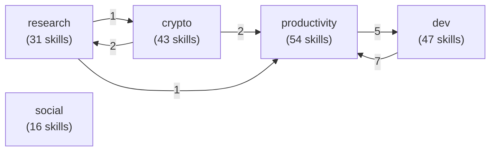
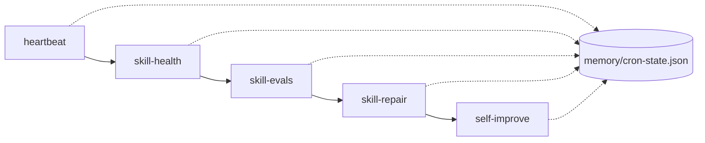

# Skill Dependency Graph

_Auto-generated by `skill-graph` on 2026-06-28 · Mode: `SKILL_GRAPH_OK`_

**Verdict:** `NEW_SKILLS: +68 | ENABLED_DELTA: -2 | DEPENDS_ON: 4->5 | SHARED_STATE: 9->36`

## What changed since last run

- Skills: 123 -> **191** (+68)
- Enabled: 44 -> **42** (-2)
- `depends_on` edges: 4 -> **5** (+1)
- `consume` edges: 0 (no change)
- `reactive` edges: 0 (no change)
- `shared_state` edges: 9 -> **36** (+27)

Prior run: 2026-06-21 (123 skills, 44 enabled).

## Overview

5 categories, 191 skills total (42 enabled). Cross-category coupling is sparse — most edges are intra-category. Edge counts on arrows below.

```mermaid
flowchart LR
  research["research<br/>(31 skills)"]
  dev["dev<br/>(47 skills)"]
  crypto["crypto<br/>(43 skills)"]
  social["social<br/>(16 skills)"]
  productivity["productivity<br/>(54 skills)"]
  crypto -->|2| productivity
  crypto -->|2| research
  dev -->|7| productivity
  productivity -->|5| dev
  research -->|1| crypto
  research -->|1| productivity
```

## Self-healing loop

The fleet's reliability loop: `heartbeat` detects, `skill-health` diagnoses, `skill-evals` validates, `skill-repair` fixes, `self-improve` evolves. All five share `memory/cron-state.json` as the implicit ledger — collapsed into this single sub-graph rather than rendered as N edges everywhere.

```mermaid
flowchart LR
  heartbeat["heartbeat"]
  skill_health["skill-health"]
  skill_evals["skill-evals"]
  skill_repair["skill-repair"]
  self_improve["self-improve"]
  state[("memory/cron-state.json")]
  heartbeat --> skill_health
  skill_health --> skill_evals
  skill_evals --> skill_repair
  skill_repair --> self_improve
  heartbeat -.-> state
  skill_health -.-> state
  skill_evals -.-> state
  skill_repair -.-> state
  self_improve -.-> state
```

## Per-category

### research (31 skills)

```mermaid
flowchart LR
  agent_displacement["agent-displacement"]
  click agent_displacement "../skills/agent-displacement/SKILL.md"
  ai_framework_watch["ai-framework-watch"]
  click ai_framework_watch "../skills/ai-framework-watch/SKILL.md"
  article["article<br/>(0 14 * * *)"]
  click article "../skills/article/SKILL.md"
  article_queue["article-queue"]
  click article_queue "../skills/article-queue/SKILL.md"
  beat_tracker["beat-tracker"]
  click beat_tracker "../skills/beat-tracker/SKILL.md"
  channel_recap["channel-recap<br/>(0 17 * * 0)"]
  click channel_recap "../skills/channel-recap/SKILL.md"
  competitor_launch_radar["competitor-launch-radar<br/>(0 10 * * 1)"]
  click competitor_launch_radar "../skills/competitor-launch-radar/SKILL.md"
  compute_pulse["compute-pulse"]
  click compute_pulse "../skills/compute-pulse/SKILL.md"
  content_performance["content-performance"]
  click content_performance "../skills/content-performance/SKILL.md"
  deep_research["deep-research<br/>(workflow_dispatch)"]
  click deep_research "../skills/deep-research/SKILL.md"
  digest["digest<br/>(0 14 * * *)"]
  click digest "../skills/digest/SKILL.md"
  ecosystem_links["ecosystem-links"]
  click ecosystem_links "../skills/ecosystem-links/SKILL.md"
  ecosystem_pulse["ecosystem-pulse"]
  click ecosystem_pulse "../skills/ecosystem-pulse/SKILL.md"
  fetch_tweets["fetch-tweets"]
  click fetch_tweets "../skills/fetch-tweets/SKILL.md"
  hacker_news_digest["hacker-news-digest"]
  click hacker_news_digest "../skills/hacker-news-digest/SKILL.md"
  huggingface_trending["huggingface-trending"]
  click huggingface_trending "../skills/huggingface-trending/SKILL.md"
  idea_validator["idea-validator"]
  click idea_validator "../skills/idea-validator/SKILL.md"
  last30["last30<br/>(workflow_dispatch)"]
  click last30 "../skills/last30/SKILL.md"
  list_digest["list-digest<br/>(0 17 * * *)"]
  click list_digest "../skills/list-digest/SKILL.md"
  mcp_pulse["mcp-pulse"]
  click mcp_pulse "../skills/mcp-pulse/SKILL.md"
  narrative_convergence["narrative-convergence"]
  click narrative_convergence "../skills/narrative-convergence/SKILL.md"
  paper_digest["paper-digest<br/>(0 7 * * *)"]
  click paper_digest "../skills/paper-digest/SKILL.md"
  paper_pick["paper-pick<br/>(0 14 * * *)"]
  click paper_pick "../skills/paper-pick/SKILL.md"
  reddit_digest["reddit-digest"]
  click reddit_digest "../skills/reddit-digest/SKILL.md"
  research_brief["research-brief<br/>(0 14 * * *)"]
  click research_brief "../skills/research-brief/SKILL.md"
  rss_digest["rss-digest<br/>(0 7 * * *)"]
  click rss_digest "../skills/rss-digest/SKILL.md"
  security_digest["security-digest<br/>(0 14 * * *)"]
  click security_digest "../skills/security-digest/SKILL.md"
  technical_explainer["technical-explainer"]
  click technical_explainer "../skills/technical-explainer/SKILL.md"
  telegram_digest["telegram-digest<br/>(30 7 * * *)"]
  click telegram_digest "../skills/telegram-digest/SKILL.md"
  topic_momentum["topic-momentum"]
  click topic_momentum "../skills/topic-momentum/SKILL.md"
  vibecoding_digest["vibecoding-digest"]
  click vibecoding_digest "../skills/vibecoding-digest/SKILL.md"
  content_performance -..-> article_queue
  beat_tracker -..-> article_queue
  beat_tracker -..-> ext_fear_divergence
  ext_fear_divergence -..-> topic_momentum
  ext_market_context_refresh -..-> topic_momentum
  idea_validator -..-> ext_idea_pipeline
  ext_fear_divergence["fear-divergence<br/>(crypto)"]:::external
  ext_idea_pipeline["idea-pipeline<br/>(productivity)"]:::external
  ext_market_context_refresh["market-context-refresh<br/>(crypto)"]:::external
  class agent_displacement disabled
  class ai_framework_watch disabled
  class article disabled
  class article_queue disabled
  class beat_tracker disabled
  class channel_recap disabled
  class competitor_launch_radar disabled
  class compute_pulse disabled
  class content_performance disabled
  class deep_research disabled
  class digest disabled
  class ecosystem_links disabled
  class ecosystem_pulse disabled
  class fetch_tweets disabled
  class hacker_news_digest disabled
  class huggingface_trending disabled
  class idea_validator disabled
  class last30 disabled
  class list_digest enabled
  class mcp_pulse disabled
  class narrative_convergence disabled
  class paper_digest disabled
  class paper_pick disabled
  class reddit_digest disabled
  class research_brief disabled
  class rss_digest disabled
  class security_digest enabled
  class technical_explainer disabled
  class telegram_digest disabled
  class topic_momentum disabled
  class vibecoding_digest disabled
  classDef enabled fill:#fff,stroke:#000,stroke-width:2px,color:#000
  classDef disabled fill:#f5f5f5,stroke:#bbb,color:#888
  classDef external fill:none,stroke:#bbb,stroke-dasharray:3 3,color:#888
```

### dev (47 skills)

```mermaid
flowchart LR
  atrium_watch["atrium-watch"]
  click atrium_watch "../skills/atrium-watch/SKILL.md"
  auto_merge["auto-merge"]
  click auto_merge "../skills/auto-merge/SKILL.md"
  auto_workflow["auto-workflow<br/>(workflow_dispatch)"]
  click auto_workflow "../skills/auto-workflow/SKILL.md"
  autoresearch["autoresearch<br/>(workflow_dispatch)"]
  click autoresearch "../skills/autoresearch/SKILL.md"
  builder_map["builder-map"]
  click builder_map "../skills/builder-map/SKILL.md"
  capabilities_map["capabilities-map"]
  click capabilities_map "../skills/capabilities-map/SKILL.md"
  changelog["changelog<br/>(0 16 * * *)"]
  click changelog "../skills/changelog/SKILL.md"
  code_health["code-health<br/>(0 16 * * *)"]
  click code_health "../skills/code-health/SKILL.md"
  create_skill["create-skill<br/>(workflow_dispatch)"]
  click create_skill "../skills/create-skill/SKILL.md"
  deploy_prototype["deploy-prototype<br/>(workflow_dispatch)"]
  click deploy_prototype "../skills/deploy-prototype/SKILL.md"
  disclosure_tracker["disclosure-tracker"]
  click disclosure_tracker "../skills/disclosure-tracker/SKILL.md"
  external_feature["external-feature<br/>(30 16 * * *)"]
  click external_feature "../skills/external-feature/SKILL.md"
  fleet_control["fleet-control<br/>("0 9)"]
  click fleet_control "../skills/fleet-control/SKILL.md"
  fork_cohort["fork-cohort<br/>(0 19 * * 0)"]
  click fork_cohort "../skills/fork-cohort/SKILL.md"
  fork_first_run_alert["fork-first-run-alert"]
  click fork_first_run_alert "../skills/fork-first-run-alert/SKILL.md"
  fork_fleet["fork-fleet"]
  click fork_fleet "../skills/fork-fleet/SKILL.md"
  fork_skill_gap["fork-skill-gap"]
  click fork_skill_gap "../skills/fork-skill-gap/SKILL.md"
  github_issues["github-issues<br/>(0 9 * * *)"]
  click github_issues "../skills/github-issues/SKILL.md"
  github_monitor["github-monitor<br/>(0 9 * * *)"]
  click github_monitor "../skills/github-monitor/SKILL.md"
  github_releases["github-releases"]
  click github_releases "../skills/github-releases/SKILL.md"
  github_trending["github-trending<br/>(0 9 * * *)"]
  click github_trending "../skills/github-trending/SKILL.md"
  install_skill["install-skill<br/>(workflow_dispatch)"]
  click install_skill "../skills/install-skill/SKILL.md"
  issue_triage["issue-triage<br/>(0 9 * * *)"]
  click issue_triage "../skills/issue-triage/SKILL.md"
  pr_merge["pr-merge<br/>(45 9 * * *)"]
  click pr_merge "../skills/pr-merge/SKILL.md"
  pr_review["pr-review<br/>(0 9 * * *)"]
  click pr_review "../skills/pr-review/SKILL.md"
  pr_triage["pr-triage<br/>(30 9 * * *)"]
  click pr_triage "../skills/pr-triage/SKILL.md"
  project_lens["project-lens<br/>("30 15 * * 1)"]
  click project_lens "../skills/project-lens/SKILL.md"
  push_recap["push-recap<br/>(0 15 * * *)"]
  click push_recap "../skills/push-recap/SKILL.md"
  pvr_triage["pvr-triage"]
  click pvr_triage "../skills/pvr-triage/SKILL.md"
  pvr_watchlist["pvr-watchlist"]
  click pvr_watchlist "../skills/pvr-watchlist/SKILL.md"
  repo_actions["repo-actions<br/>(0 15 * * *)"]
  click repo_actions "../skills/repo-actions/SKILL.md"
  repo_article["repo-article<br/>(0 15 * * *)"]
  click repo_article "../skills/repo-article/SKILL.md"
  repo_pulse["repo-pulse<br/>(0 15 * * *)"]
  click repo_pulse "../skills/repo-pulse/SKILL.md"
  repo_revive["repo-revive"]
  click repo_revive "../skills/repo-revive/SKILL.md"
  repo_scanner["repo-scanner"]
  click repo_scanner "../skills/repo-scanner/SKILL.md"
  search_skill["search-skill<br/>(0 14 * * *)"]
  click search_skill "../skills/search-skill/SKILL.md"
  skill_enabler["skill-enabler<br/>(workflow_dispatch)"]
  click skill_enabler "../skills/skill-enabler/SKILL.md"
  skill_security_scan["skill-security-scan<br/>(0 16 * * 1)"]
  click skill_security_scan "../skills/skill-security-scan/SKILL.md"
  skill_triage["skill-triage"]
  click skill_triage "../skills/skill-triage/SKILL.md"
  smithery_manifest["smithery-manifest<br/>(0 6 1/7 * *)"]
  click smithery_manifest "../skills/smithery-manifest/SKILL.md"
  sparkleware_catalog["sparkleware-catalog"]
  click sparkleware_catalog "../skills/sparkleware-catalog/SKILL.md"
  spawn_instance["spawn-instance<br/>(workflow_dispatch)"]
  click spawn_instance "../skills/spawn-instance/SKILL.md"
  star_milestone["star-milestone"]
  click star_milestone "../skills/star-milestone/SKILL.md"
  vercel_projects["vercel-projects"]
  click vercel_projects "../skills/vercel-projects/SKILL.md"
  vuln_scanner["vuln-scanner<br/>(0 16 * * 6)"]
  click vuln_scanner "../skills/vuln-scanner/SKILL.md"
  workflow_security_audit["workflow-security-audit"]
  click workflow_security_audit "../skills/workflow-security-audit/SKILL.md"
  x402_monitor["x402-monitor"]
  click x402_monitor "../skills/x402-monitor/SKILL.md"
  external_feature --> repo_scanner
  vuln_scanner --> github_trending
  fork_cohort -..-> fork_first_run_alert
  fork_cohort -..-> fork_skill_gap
  repo_scanner -..-> external_feature
  repo_scanner -..-> repo_actions
  repo_scanner -..-> vercel_projects
  vercel_projects -..-> external_feature
  vercel_projects -..-> repo_actions
  vercel_projects -..-> repo_scanner
  ext_vuln_tracker --> vuln_scanner
  builder_map -..-> ext_idea_pipeline
  fork_cohort -..-> ext_contributor_spotlight
  fork_cohort -..-> ext_fleet_state
  fork_cohort -..-> ext_fork_health
  fork_cohort -..-> ext_skill_adoption
  ext_fork_health -..-> fork_cohort
  ext_fork_health -..-> fork_first_run_alert
  ext_fork_health -..-> fork_skill_gap
  ext_pr_tracker -..-> disclosure_tracker
  deploy_prototype -..-> ext_idea_pipeline
  vercel_projects -..-> ext_idea_pipeline
  ext_contributor_spotlight["contributor-spotlight<br/>(productivity)"]:::external
  ext_fleet_state["fleet-state<br/>(productivity)"]:::external
  ext_fork_health["fork-health<br/>(productivity)"]:::external
  ext_idea_pipeline["idea-pipeline<br/>(productivity)"]:::external
  ext_pr_tracker["pr-tracker<br/>(productivity)"]:::external
  ext_skill_adoption["skill-adoption<br/>(productivity)"]:::external
  ext_vuln_tracker["vuln-tracker<br/>(productivity)"]:::external
  class atrium_watch disabled
  class auto_merge disabled
  class auto_workflow disabled
  class autoresearch enabled
  class builder_map disabled
  class capabilities_map disabled
  class changelog disabled
  class code_health disabled
  class create_skill disabled
  class deploy_prototype disabled
  class disclosure_tracker disabled
  class external_feature disabled
  class fleet_control enabled
  class fork_cohort enabled
  class fork_first_run_alert disabled
  class fork_fleet disabled
  class fork_skill_gap disabled
  class github_issues disabled
  class github_monitor disabled
  class github_releases disabled
  class github_trending enabled
  class install_skill disabled
  class issue_triage disabled
  class pr_merge disabled
  class pr_review disabled
  class pr_triage disabled
  class project_lens disabled
  class push_recap disabled
  class pvr_triage disabled
  class pvr_watchlist disabled
  class repo_actions disabled
  class repo_article disabled
  class repo_pulse disabled
  class repo_revive disabled
  class repo_scanner disabled
  class search_skill enabled
  class skill_enabler disabled
  class skill_security_scan enabled
  class skill_triage disabled
  class smithery_manifest disabled
  class sparkleware_catalog disabled
  class spawn_instance disabled
  class star_milestone disabled
  class vercel_projects disabled
  class vuln_scanner enabled
  class workflow_security_audit disabled
  class x402_monitor disabled
  classDef enabled fill:#fff,stroke:#000,stroke-width:2px,color:#000
  classDef disabled fill:#f5f5f5,stroke:#bbb,color:#888
  classDef external fill:none,stroke:#bbb,stroke-dasharray:3 3,color:#888
```

### crypto (43 skills)

```mermaid
flowchart LR
  aixbt_pulse["aixbt-pulse<br/>(0 9,21 * * *)"]
  click aixbt_pulse "../skills/aixbt-pulse/SKILL.md"
  approval_audit["approval-audit<br/>(workflow_dispatch)"]
  click approval_audit "../skills/approval-audit/SKILL.md"
  base_mcp["base-mcp<br/>(workflow_dispatch)"]
  click base_mcp "../skills/base-mcp/SKILL.md"
  beamr_route["beamr-route<br/>(workflow_dispatch)"]
  click beamr_route "../skills/beamr-route/SKILL.md"
  btc_levels["btc-levels<br/>(15 */4 * * *)"]
  click btc_levels "../skills/btc-levels/SKILL.md"
  contract_audit["contract-audit<br/>(workflow_dispatch)"]
  click contract_audit "../skills/contract-audit/SKILL.md"
  contributor_reward["contributor-reward"]
  click contributor_reward "../skills/contributor-reward/SKILL.md"
  ctrl["ctrl<br/>(workflow_dispatch)"]
  click ctrl "../skills/ctrl/SKILL.md"
  defi_monitor["defi-monitor<br/>(40 12 * * *)"]
  click defi_monitor "../skills/defi-monitor/SKILL.md"
  defi_overview["defi-overview<br/>(0 12 * * *)"]
  click defi_overview "../skills/defi-overview/SKILL.md"
  deployer_trace["deployer-trace<br/>(workflow_dispatch)"]
  click deployer_trace "../skills/deployer-trace/SKILL.md"
  distribute_tokens["distribute-tokens<br/>(workflow_dispatch)"]
  click distribute_tokens "../skills/distribute-tokens/SKILL.md"
  fear_divergence["fear-divergence"]
  click fear_divergence "../skills/fear-divergence/SKILL.md"
  fund_flow["fund-flow<br/>(workflow_dispatch)"]
  click fund_flow "../skills/fund-flow/SKILL.md"
  holder_concentration["holder-concentration<br/>(workflow_dispatch)"]
  click holder_concentration "../skills/holder-concentration/SKILL.md"
  honeypot_check["honeypot-check<br/>(workflow_dispatch)"]
  click honeypot_check "../skills/honeypot-check/SKILL.md"
  investigation_report["investigation-report<br/>(workflow_dispatch)"]
  click investigation_report "../skills/investigation-report/SKILL.md"
  linked_wallets["linked-wallets<br/>(workflow_dispatch)"]
  click linked_wallets "../skills/linked-wallets/SKILL.md"
  liquidpad_launch["liquidpad-launch<br/>(workflow_dispatch)"]
  click liquidpad_launch "../skills/liquidpad-launch/SKILL.md"
  lp_lock["lp-lock<br/>(workflow_dispatch)"]
  click lp_lock "../skills/lp-lock/SKILL.md"
  market_context_refresh["market-context-refresh<br/>(0 13 * * *)"]
  click market_context_refresh "../skills/market-context-refresh/SKILL.md"
  monitor_kalshi["monitor-kalshi<br/>(0 13 * * *)"]
  click monitor_kalshi "../skills/monitor-kalshi/SKILL.md"
  monitor_polymarket["monitor-polymarket<br/>(30 12 * * *)"]
  click monitor_polymarket "../skills/monitor-polymarket/SKILL.md"
  monitor_runners["monitor-runners<br/>(0 12 * * *)"]
  click monitor_runners "../skills/monitor-runners/SKILL.md"
  narrative_tracker["narrative-tracker<br/>(30 13 * * *)"]
  click narrative_tracker "../skills/narrative-tracker/SKILL.md"
  on_chain_monitor["on-chain-monitor<br/>(20 12 * * *)"]
  click on_chain_monitor "../skills/on-chain-monitor/SKILL.md"
  pm_manipulation["pm-manipulation"]
  click pm_manipulation "../skills/pm-manipulation/SKILL.md"
  pm_pulse["pm-pulse"]
  click pm_pulse "../skills/pm-pulse/SKILL.md"
  polymarket_comments["polymarket-comments"]
  click polymarket_comments "../skills/polymarket-comments/SKILL.md"
  price_threshold_alert["price-threshold-alert"]
  click price_threshold_alert "../skills/price-threshold-alert/SKILL.md"
  rug_scan["rug-scan<br/>(workflow_dispatch)"]
  click rug_scan "../skills/rug-scan/SKILL.md"
  rwa_pulse["rwa-pulse"]
  click rwa_pulse "../skills/rwa-pulse/SKILL.md"
  token_alert["token-alert<br/>(0 12 * * *)"]
  click token_alert "../skills/token-alert/SKILL.md"
  token_movers["token-movers<br/>(10 12 * * *)"]
  click token_movers "../skills/token-movers/SKILL.md"
  token_pick["token-pick<br/>(0 12 * * *)"]
  click token_pick "../skills/token-pick/SKILL.md"
  token_report["token-report<br/>(30 12 * * *)"]
  click token_report "../skills/token-report/SKILL.md"
  treasury_info["treasury-info<br/>(0 12 * * *)"]
  click treasury_info "../skills/treasury-info/SKILL.md"
  tx_explain["tx-explain<br/>(workflow_dispatch)"]
  click tx_explain "../skills/tx-explain/SKILL.md"
  unlock_monitor["unlock-monitor"]
  click unlock_monitor "../skills/unlock-monitor/SKILL.md"
  vigil["vigil<br/>(workflow_dispatch)"]
  click vigil "../skills/vigil/SKILL.md"
  vigil_revoke["vigil-revoke<br/>(workflow_dispatch)"]
  click vigil_revoke "../skills/vigil-revoke/SKILL.md"
  wallet_profile["wallet-profile<br/>(workflow_dispatch)"]
  click wallet_profile "../skills/wallet-profile/SKILL.md"
  wallet_risk["wallet-risk"]
  click wallet_risk "../skills/wallet-risk/SKILL.md"
  fear_divergence -..-> market_context_refresh
  fear_divergence -..-> rwa_pulse
  market_context_refresh -..-> fear_divergence
  market_context_refresh -..-> rwa_pulse
  pm_pulse -..-> pm_manipulation
  ext_beat_tracker -..-> fear_divergence
  fear_divergence -..-> ext_idea_pipeline
  fear_divergence -..-> ext_topic_momentum
  market_context_refresh -..-> ext_idea_pipeline
  market_context_refresh -..-> ext_topic_momentum
  ext_beat_tracker["beat-tracker<br/>(research)"]:::external
  ext_idea_pipeline["idea-pipeline<br/>(productivity)"]:::external
  ext_topic_momentum["topic-momentum<br/>(research)"]:::external
  class aixbt_pulse enabled
  class approval_audit disabled
  class base_mcp disabled
  class beamr_route disabled
  class btc_levels enabled
  class contract_audit disabled
  class contributor_reward disabled
  class ctrl disabled
  class defi_monitor enabled
  class defi_overview enabled
  class deployer_trace disabled
  class distribute_tokens disabled
  class fear_divergence disabled
  class fund_flow disabled
  class holder_concentration disabled
  class honeypot_check disabled
  class investigation_report disabled
  class linked_wallets disabled
  class liquidpad_launch disabled
  class lp_lock disabled
  class market_context_refresh enabled
  class monitor_kalshi disabled
  class monitor_polymarket disabled
  class monitor_runners disabled
  class narrative_tracker enabled
  class on_chain_monitor enabled
  class pm_manipulation disabled
  class pm_pulse disabled
  class polymarket_comments disabled
  class price_threshold_alert disabled
  class rug_scan disabled
  class rwa_pulse disabled
  class token_alert enabled
  class token_movers enabled
  class token_pick enabled
  class token_report disabled
  class treasury_info disabled
  class tx_explain disabled
  class unlock_monitor enabled
  class vigil disabled
  class vigil_revoke disabled
  class wallet_profile disabled
  class wallet_risk disabled
  classDef enabled fill:#fff,stroke:#000,stroke-width:2px,color:#000
  classDef disabled fill:#f5f5f5,stroke:#bbb,color:#888
  classDef external fill:none,stroke:#bbb,stroke-dasharray:3 3,color:#888
```

### social (16 skills)

```mermaid
flowchart LR
  agent_buzz["agent-buzz"]
  click agent_buzz "../skills/agent-buzz/SKILL.md"
  create_campaign["create-campaign<br/>(workflow_dispatch)"]
  click create_campaign "../skills/create-campaign/SKILL.md"
  engagement_act["engagement-act"]
  click engagement_act "../skills/engagement-act/SKILL.md"
  farcaster_digest["farcaster-digest"]
  click farcaster_digest "../skills/farcaster-digest/SKILL.md"
  mention_radar["mention-radar"]
  click mention_radar "../skills/mention-radar/SKILL.md"
  product_hunt_launch["product-hunt-launch<br/>(workflow_dispatch)"]
  click product_hunt_launch "../skills/product-hunt-launch/SKILL.md"
  refresh_x["refresh-x<br/>(0 17 * * *)"]
  click refresh_x "../skills/refresh-x/SKILL.md"
  remix_tweets["remix-tweets"]
  click remix_tweets "../skills/remix-tweets/SKILL.md"
  reply_maker["reply-maker<br/>(0 17 * * *)"]
  click reply_maker "../skills/reply-maker/SKILL.md"
  schedule_ads["schedule-ads"]
  click schedule_ads "../skills/schedule-ads/SKILL.md"
  show_hn_draft["show-hn-draft<br/>(workflow_dispatch)"]
  click show_hn_draft "../skills/show-hn-draft/SKILL.md"
  soul_builder["soul-builder<br/>(workflow_dispatch)"]
  click soul_builder "../skills/soul-builder/SKILL.md"
  syndicate_article["syndicate-article"]
  click syndicate_article "../skills/syndicate-article/SKILL.md"
  thread_formatter["thread-formatter<br/>(30 17 * * *)"]
  click thread_formatter "../skills/thread-formatter/SKILL.md"
  tweet_roundup["tweet-roundup<br/>(0 17 * * *)"]
  click tweet_roundup "../skills/tweet-roundup/SKILL.md"
  write_tweet["write-tweet<br/>(0 17 * * *)"]
  click write_tweet "../skills/write-tweet/SKILL.md"
  class agent_buzz enabled
  class create_campaign disabled
  class engagement_act disabled
  class farcaster_digest disabled
  class mention_radar disabled
  class product_hunt_launch disabled
  class refresh_x disabled
  class remix_tweets disabled
  class reply_maker disabled
  class schedule_ads disabled
  class show_hn_draft disabled
  class soul_builder disabled
  class syndicate_article disabled
  class thread_formatter disabled
  class tweet_roundup disabled
  class write_tweet disabled
  classDef enabled fill:#fff,stroke:#000,stroke-width:2px,color:#000
  classDef disabled fill:#f5f5f5,stroke:#bbb,color:#888
  classDef external fill:none,stroke:#bbb,stroke-dasharray:3 3,color:#888
```

### productivity (54 skills)

```mermaid
flowchart LR
  action_converter["action-converter<br/>(0 18 * * *)"]
  click action_converter "../skills/action-converter/SKILL.md"
  api_health["api-health"]
  click api_health "../skills/api-health/SKILL.md"
  batch_health["batch-health"]
  click batch_health "../skills/batch-health/SKILL.md"
  config_validator["config-validator"]
  click config_validator "../skills/config-validator/SKILL.md"
  contributor_spotlight["contributor-spotlight"]
  click contributor_spotlight "../skills/contributor-spotlight/SKILL.md"
  cost_report["cost-report<br/>(0 7 * * 1)"]
  click cost_report "../skills/cost-report/SKILL.md"
  daily_routine["daily-routine<br/>(0 7 * * *)"]
  click daily_routine "../skills/daily-routine/SKILL.md"
  deal_flow["deal-flow"]
  click deal_flow "../skills/deal-flow/SKILL.md"
  evening_recap["evening-recap<br/>(0 21 * * *)"]
  click evening_recap "../skills/evening-recap/SKILL.md"
  fleet_scorecard["fleet-scorecard"]
  click fleet_scorecard "../skills/fleet-scorecard/SKILL.md"
  fleet_state["fleet-state"]
  click fleet_state "../skills/fleet-state/SKILL.md"
  followup_patrol["followup-patrol"]
  click followup_patrol "../skills/followup-patrol/SKILL.md"
  fork_contributor_leaderboard["fork-contributor-leaderboard<br/>(30 17 * * 0)"]
  click fork_contributor_leaderboard "../skills/fork-contributor-leaderboard/SKILL.md"
  fork_health["fork-health"]
  click fork_health "../skills/fork-health/SKILL.md"
  fork_release_tracker["fork-release-tracker"]
  click fork_release_tracker "../skills/fork-release-tracker/SKILL.md"
  fork_skill_digest["fork-skill-digest<br/>(30 18 * * 0)"]
  click fork_skill_digest "../skills/fork-skill-digest/SKILL.md"
  frequency_guard["frequency-guard"]
  click frequency_guard "../skills/frequency-guard/SKILL.md"
  goal_tracker["goal-tracker<br/>(0 18 * * *)"]
  click goal_tracker "../skills/goal-tracker/SKILL.md"
  heartbeat["heartbeat<br/>(0 8,14,20 * * *)"]
  click heartbeat "../skills/heartbeat/SKILL.md"
  idea_capture["idea-capture<br/>(0 14 * * *)"]
  click idea_capture "../skills/idea-capture/SKILL.md"
  idea_pipeline["idea-pipeline"]
  click idea_pipeline "../skills/idea-pipeline/SKILL.md"
  janitor["janitor"]
  click janitor "../skills/janitor/SKILL.md"
  memory_dedupe["memory-dedupe"]
  click memory_dedupe "../skills/memory-dedupe/SKILL.md"
  milestone_tracker["milestone-tracker"]
  click milestone_tracker "../skills/milestone-tracker/SKILL.md"
  morning_brief["morning-brief<br/>(0 7 * * *)"]
  click morning_brief "../skills/morning-brief/SKILL.md"
  onboard["onboard<br/>(workflow_dispatch)"]
  click onboard "../skills/onboard/SKILL.md"
  operator_scorecard["operator-scorecard"]
  click operator_scorecard "../skills/operator-scorecard/SKILL.md"
  pr_tracker["pr-tracker"]
  click pr_tracker "../skills/pr-tracker/SKILL.md"
  reflect["reflect<br/>(0 18 * * *)"]
  click reflect "../skills/reflect/SKILL.md"
  reg_monitor["reg-monitor"]
  click reg_monitor "../skills/reg-monitor/SKILL.md"
  rss_feed["rss-feed<br/>(30 17 * * *)"]
  click rss_feed "../skills/rss-feed/SKILL.md"
  self_improve["self-improve"]
  click self_improve "../skills/self-improve/SKILL.md"
  signal_verdict["signal-verdict"]
  click signal_verdict "../skills/signal-verdict/SKILL.md"
  skill_adoption["skill-adoption"]
  click skill_adoption "../skills/skill-adoption/SKILL.md"
  skill_analytics["skill-analytics<br/>(30 18 * * 3)"]
  click skill_analytics "../skills/skill-analytics/SKILL.md"
  skill_evals["skill-evals<br/>(0 6 * * 0)"]
  click skill_evals "../skills/skill-evals/SKILL.md"
  skill_freshness["skill-freshness<br/>(0 8 * * *)"]
  click skill_freshness "../skills/skill-freshness/SKILL.md"
  skill_graph["skill-graph"]
  click skill_graph "../skills/skill-graph/SKILL.md"
  skill_health["skill-health<br/>(0 18 * * *)"]
  click skill_health "../skills/skill-health/SKILL.md"
  skill_leaderboard["skill-leaderboard<br/>(0 17 * * 0)"]
  click skill_leaderboard "../skills/skill-leaderboard/SKILL.md"
  skill_repair["skill-repair<br/>(reactive)"]
  click skill_repair "../skills/skill-repair/SKILL.md"
  skill_spotlight["skill-spotlight<br/>(workflow_dispatch)"]
  click skill_spotlight "../skills/skill-spotlight/SKILL.md"
  skill_update_check["skill-update-check<br/>(0 19 * * 0)"]
  click skill_update_check "../skills/skill-update-check/SKILL.md"
  spend_monitor["spend-monitor"]
  click spend_monitor "../skills/spend-monitor/SKILL.md"
  star_momentum_alert["star-momentum-alert"]
  click star_momentum_alert "../skills/star-momentum-alert/SKILL.md"
  startup_idea["startup-idea<br/>(0 18 * * *)"]
  click startup_idea "../skills/startup-idea/SKILL.md"
  strategy_builder["strategy-builder<br/>(workflow_dispatch)"]
  click strategy_builder "../skills/strategy-builder/SKILL.md"
  thought_review["thought-review<br/>(0 7,21 * * *)"]
  click thought_review "../skills/thought-review/SKILL.md"
  tool_builder["tool-builder<br/>(reactive)"]
  click tool_builder "../skills/tool-builder/SKILL.md"
  update_gallery["update-gallery<br/>(0 18 * * 0)"]
  click update_gallery "../skills/update-gallery/SKILL.md"
  v4_readiness["v4-readiness"]
  click v4_readiness "../skills/v4-readiness/SKILL.md"
  vuln_tracker["vuln-tracker"]
  click vuln_tracker "../skills/vuln-tracker/SKILL.md"
  weekly_review["weekly-review<br/>(0 19 * * 1)"]
  click weekly_review "../skills/weekly-review/SKILL.md"
  weekly_shiplog["weekly-shiplog"]
  click weekly_shiplog "../skills/weekly-shiplog/SKILL.md"
  skill_repair --> skill_health
  tool_builder --> action_converter
  contributor_spotlight -..-> fleet_state
  fork_health -..-> contributor_spotlight
  fork_health -..-> fleet_state
  fork_health -..-> skill_adoption
  vuln_tracker --> ext_vuln_scanner
  ext_builder_map -..-> idea_pipeline
  ext_fork_cohort -..-> contributor_spotlight
  ext_fork_cohort -..-> fleet_state
  ext_fork_cohort -..-> fork_health
  ext_fork_cohort -..-> skill_adoption
  fork_health -..-> ext_fork_cohort
  fork_health -..-> ext_fork_first_run_alert
  fork_health -..-> ext_fork_skill_gap
  ext_fear_divergence -..-> idea_pipeline
  ext_market_context_refresh -..-> idea_pipeline
  pr_tracker -..-> ext_disclosure_tracker
  ext_deploy_prototype -..-> idea_pipeline
  ext_idea_validator -..-> idea_pipeline
  ext_vercel_projects -..-> idea_pipeline
  ext_builder_map["builder-map<br/>(dev)"]:::external
  ext_deploy_prototype["deploy-prototype<br/>(dev)"]:::external
  ext_disclosure_tracker["disclosure-tracker<br/>(dev)"]:::external
  ext_fear_divergence["fear-divergence<br/>(crypto)"]:::external
  ext_fork_cohort["fork-cohort<br/>(dev)"]:::external
  ext_fork_first_run_alert["fork-first-run-alert<br/>(dev)"]:::external
  ext_fork_skill_gap["fork-skill-gap<br/>(dev)"]:::external
  ext_idea_validator["idea-validator<br/>(research)"]:::external
  ext_market_context_refresh["market-context-refresh<br/>(crypto)"]:::external
  ext_vercel_projects["vercel-projects<br/>(dev)"]:::external
  ext_vuln_scanner["vuln-scanner<br/>(dev)"]:::external
  class action_converter enabled
  class api_health disabled
  class batch_health disabled
  class config_validator disabled
  class contributor_spotlight disabled
  class cost_report enabled
  class daily_routine enabled
  class deal_flow enabled
  class evening_recap enabled
  class fleet_scorecard disabled
  class fleet_state disabled
  class followup_patrol disabled
  class fork_contributor_leaderboard disabled
  class fork_health disabled
  class fork_release_tracker disabled
  class fork_skill_digest enabled
  class frequency_guard disabled
  class goal_tracker enabled
  class heartbeat enabled
  class idea_capture disabled
  class idea_pipeline disabled
  class janitor disabled
  class memory_dedupe disabled
  class milestone_tracker disabled
  class morning_brief enabled
  class onboard disabled
  class operator_scorecard disabled
  class pr_tracker disabled
  class reflect enabled
  class reg_monitor enabled
  class rss_feed disabled
  class self_improve enabled
  class signal_verdict disabled
  class skill_adoption disabled
  class skill_analytics enabled
  class skill_evals enabled
  class skill_freshness enabled
  class skill_graph enabled
  class skill_health enabled
  class skill_leaderboard disabled
  class skill_repair disabled
  class skill_spotlight disabled
  class skill_update_check enabled
  class spend_monitor disabled
  class star_momentum_alert disabled
  class startup_idea disabled
  class strategy_builder disabled
  class thought_review enabled
  class tool_builder disabled
  class update_gallery disabled
  class v4_readiness disabled
  class vuln_tracker disabled
  class weekly_review enabled
  class weekly_shiplog enabled
  classDef enabled fill:#fff,stroke:#000,stroke-width:2px,color:#000
  classDef disabled fill:#f5f5f5,stroke:#bbb,color:#888
  classDef external fill:none,stroke:#bbb,stroke-dasharray:3 3,color:#888
```

## Legend

- `A --> B` — `depends_on` (declared in frontmatter)
- `A -.-> B` — chain `consume` (downstream step reads upstream output)
- `A -..-> B` — `reactive` trigger OR shared-state edge (A writes a `memory/topics` or `memory/state` resource that B reads)
- **Bold-outline node** — `enabled: true` in `aeon.yml`; faded grey — disabled
- Faded dashed `external` node — a dependency that lives in another category
- Every node is a hyperlink — click through to the SKILL.md source
- The universal `memory/cron-state.json` is excluded from shared-state edges (every skill writes it; rendering as N edges would obscure real structure). See the self-healing loop above for its actual usage.

## Summary

| Category | Skills | Enabled |
|---|---:|---:|
| research | 31 | 2 |
| dev | 47 | 7 |
| crypto | 43 | 11 |
| social | 16 | 1 |
| productivity | 54 | 21 |
| **total** | **191** | **42** |

| Edge type | Count |
|---|---:|
| `depends_on` | 5 |
| `consume` | 0 |
| `reactive` | 0 |
| `shared_state` | 36 |

---

_skills parsed: 191 · depends_on: 5 · consume: 0 · reactive: 0 · shared-state derived: 36 · enabled: 42/191 · mode: SKILL_GRAPH_OK_
