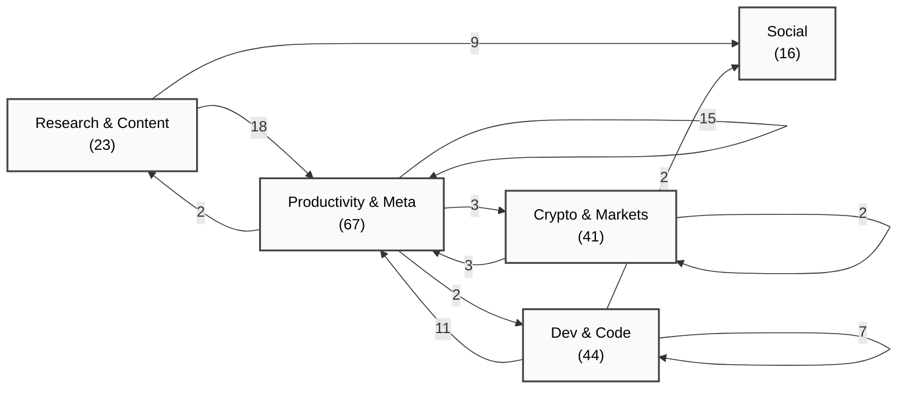
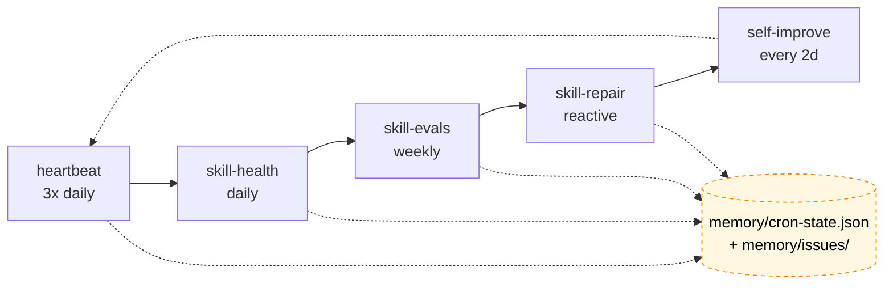

# Skill Dependency Graph

> Auto-generated by `skill-graph` on 2026-08-09. Mode: `SKILL_GRAPH_OK`.

**Verdict:** `EDGES_TOTAL: 32→74`

Navigable Mermaid map of every Aeon skill, grouped by category, with a self-healing-loop callout, per-category drill-downs, click-through to source, and an enabled overlay.

---

## What changed since last run

- **Edge totals**: depends_on 5→5 · consume 0→0 · shared_state 27→69 (per-edge diff unavailable — prior graph format differed)

---

## Overview

```mermaid
flowchart LR
    research["Research & Content<br/>(23)"]:::cat
    dev["Dev & Code<br/>(44)"]:::cat
    crypto["Crypto & Markets<br/>(41)"]:::cat
    social["Social<br/>(16)"]:::cat
    productivity["Productivity & Meta<br/>(67)"]:::cat

    research -- "18" --> productivity
    dev -- "11" --> productivity
    research -- "9" --> social
    productivity -- "3" --> crypto
    crypto -- "3" --> productivity
    productivity -- "2" --> dev
    dev -- "2" --> social
    productivity -- "2" --> research
    productivity -- "15" --> productivity
    dev -- "7" --> dev
    crypto -- "2" --> crypto

    classDef cat fill:#fafafa,stroke:#444,stroke-width:2px,color:#000
```

Edge labels = count of edges crossing that category boundary. Self-loops collapsed into a single line per category.

---

## Self-Healing Loop

The most load-bearing chain in the fleet. Five skills + one shared state file form a closed loop that detects, classifies, and patches failures without operator intervention.

```mermaid
flowchart LR
    heartbeat[heartbeat<br/>3x daily] --> health[skill-health<br/>daily]
    health --> evals[skill-evals<br/>weekly]
    evals --> repair[skill-repair<br/>reactive]
    repair --> improve[self-improve<br/>every 2d]
    improve -.-> heartbeat

    state[(memory/cron-state.json<br/>+ memory/issues/)]:::state
    heartbeat -.-> state
    health -.-> state
    evals -.-> state
    repair -.-> state

    click heartbeat "../skills/heartbeat/SKILL.md"
    click health "../skills/skill-health/SKILL.md"
    click evals "../skills/skill-evals/SKILL.md"
    click repair "../skills/skill-repair/SKILL.md"
    click improve "../skills/self-improve/SKILL.md"

    classDef state fill:#fff8e1,stroke:#f57c00,stroke-dasharray:4 4,color:#000
```

> Every skill writes `memory/cron-state.json` after each run. This single shared state is what makes the loop self-correcting — rather than ~120 explicit edges into the loop, it is collapsed into one state node here. Same convention applies to the per-category diagrams below.

---

## Per-Category Diagrams

### Research & Content (23)

```mermaid
flowchart LR
    subgraph research [" Research & Content "]
        direction TB
        agent-displacement[agent-displacement]:::disabled
        ai-framework-watch[ai-framework-watch]:::disabled
        article[article]:::disabled
        channel-recap[channel-recap]:::disabled
        competitor-launch-radar[competitor-launch-radar]:::disabled
        deep-research[deep-research]:::disabled
        digest[digest]:::disabled
        ecosystem-links[ecosystem-links]:::disabled
        ecosystem-pulse[ecosystem-pulse]:::disabled
        fetch-tweets[fetch-tweets]:::disabled
        hacker-news-digest[hacker-news-digest]:::disabled
        huggingface-trending[huggingface-trending]:::disabled
        last30[last30]:::disabled
        list-digest["list-digest<br/>0 17 * * *"]:::enabled
        paper-digest[paper-digest]:::disabled
        paper-pick[paper-pick]:::disabled
        reddit-digest[reddit-digest]:::disabled
        research-brief[research-brief]:::disabled
        rss-digest[rss-digest]:::disabled
        security-digest["security-digest<br/>0 14 * * *"]:::enabled
        technical-explainer[technical-explainer]:::disabled
        telegram-digest[telegram-digest]:::disabled
        vibecoding-digest[vibecoding-digest]:::disabled
    end

    rss-feed_ext1[rss-feed]:::external
    syndicate-article_ext2[syndicate-article]:::external
    update-gallery_ext3[update-gallery]:::external

    ai-framework-watch -..-> syndicate-article_ext2
    ai-framework-watch -..-> rss-feed_ext1
    ai-framework-watch -..-> update-gallery_ext3
    article -..-> syndicate-article_ext2
    article -..-> rss-feed_ext1
    article -..-> update-gallery_ext3
    channel-recap -..-> syndicate-article_ext2
    channel-recap -..-> rss-feed_ext1
    channel-recap -..-> update-gallery_ext3
    deep-research -..-> syndicate-article_ext2
    deep-research -..-> rss-feed_ext1
    deep-research -..-> update-gallery_ext3
    ecosystem-links -..-> syndicate-article_ext2
    ecosystem-links -..-> rss-feed_ext1
    ecosystem-links -..-> update-gallery_ext3
    last30 -..-> syndicate-article_ext2
    last30 -..-> rss-feed_ext1
    last30 -..-> update-gallery_ext3
    paper-digest -..-> syndicate-article_ext2
    paper-digest -..-> rss-feed_ext1
    paper-digest -..-> update-gallery_ext3
    research-brief -..-> syndicate-article_ext2
    research-brief -..-> rss-feed_ext1
    research-brief -..-> update-gallery_ext3
    technical-explainer -..-> syndicate-article_ext2
    technical-explainer -..-> rss-feed_ext1
    technical-explainer -..-> update-gallery_ext3

    click agent-displacement "../skills/agent-displacement/SKILL.md"
    click ai-framework-watch "../skills/ai-framework-watch/SKILL.md"
    click article "../skills/article/SKILL.md"
    click channel-recap "../skills/channel-recap/SKILL.md"
    click competitor-launch-radar "../skills/competitor-launch-radar/SKILL.md"
    click deep-research "../skills/deep-research/SKILL.md"
    click digest "../skills/digest/SKILL.md"
    click ecosystem-links "../skills/ecosystem-links/SKILL.md"
    click ecosystem-pulse "../skills/ecosystem-pulse/SKILL.md"
    click fetch-tweets "../skills/fetch-tweets/SKILL.md"
    click hacker-news-digest "../skills/hacker-news-digest/SKILL.md"
    click huggingface-trending "../skills/huggingface-trending/SKILL.md"
    click last30 "../skills/last30/SKILL.md"
    click list-digest "../skills/list-digest/SKILL.md"
    click paper-digest "../skills/paper-digest/SKILL.md"
    click paper-pick "../skills/paper-pick/SKILL.md"
    click reddit-digest "../skills/reddit-digest/SKILL.md"
    click research-brief "../skills/research-brief/SKILL.md"
    click rss-digest "../skills/rss-digest/SKILL.md"
    click security-digest "../skills/security-digest/SKILL.md"
    click technical-explainer "../skills/technical-explainer/SKILL.md"
    click telegram-digest "../skills/telegram-digest/SKILL.md"
    click vibecoding-digest "../skills/vibecoding-digest/SKILL.md"

    classDef enabled fill:#fff,stroke:#000,stroke-width:2px,color:#000
    classDef disabled fill:#f5f5f5,stroke:#bbb,color:#888
    classDef external fill:none,stroke:#bbb,stroke-dasharray:3 3,color:#888
```

2 enabled in this category.

### Dev & Code (44)

```mermaid
flowchart LR
    subgraph dev [" Dev & Code "]
        direction TB
        atrium-watch[atrium-watch]:::disabled
        auto-merge[auto-merge]:::disabled
        auto-workflow[auto-workflow]:::disabled
        autoresearch["autoresearch<br/>workflow_dispatch"]:::enabled
        builder-map[builder-map]:::disabled
        capabilities-map[capabilities-map]:::disabled
        changelog[changelog]:::disabled
        code-health[code-health]:::disabled
        create-skill[create-skill]:::disabled
        deploy-prototype[deploy-prototype]:::disabled
        external-feature[external-feature]:::disabled
        fleet-control[fleet-control]:::disabled
        fork-cohort["fork-cohort<br/>0 19 * * 0"]:::enabled
        fork-first-run-alert[fork-first-run-alert]:::disabled
        fork-fleet[fork-fleet]:::disabled
        fork-skill-gap["fork-skill-gap<br/>0 21 * * 0"]:::enabled
        github-issues[github-issues]:::disabled
        github-monitor[github-monitor]:::disabled
        github-releases[github-releases]:::disabled
        github-trending["github-trending<br/>0 9 * * *"]:::enabled
        install-skill[install-skill]:::disabled
        issue-triage[issue-triage]:::disabled
        pr-merge[pr-merge]:::disabled
        pr-review[pr-review]:::disabled
        pr-triage[pr-triage]:::disabled
        project-lens[project-lens]:::disabled
        push-recap[push-recap]:::disabled
        repo-actions[repo-actions]:::disabled
        repo-article[repo-article]:::disabled
        repo-pulse[repo-pulse]:::disabled
        repo-revive[repo-revive]:::disabled
        repo-scanner[repo-scanner]:::disabled
        search-skill["search-skill<br/>0 14 * * 1"]:::enabled
        skill-enabler[skill-enabler]:::disabled
        skill-security-scan["skill-security-scan<br/>0 16 * * 1"]:::enabled
        skill-triage[skill-triage]:::disabled
        smithery-manifest[smithery-manifest]:::disabled
        sparkleware-catalog[sparkleware-catalog]:::disabled
        spawn-instance[spawn-instance]:::disabled
        star-milestone[star-milestone]:::disabled
        vercel-projects[vercel-projects]:::disabled
        vuln-scanner["vuln-scanner<br/>0 16 * * 6"]:::enabled
        workflow-security-audit[workflow-security-audit]:::disabled
        x402-monitor[x402-monitor]:::disabled
    end

    contributor-spotlight_ext1[contributor-spotlight]:::external
    fleet-state_ext2[fleet-state]:::external
    fork-health_ext3[fork-health]:::external
    idea-pipeline_ext4[idea-pipeline]:::external
    rss-feed_ext5[rss-feed]:::external
    skill-adoption_ext6[skill-adoption]:::external
    syndicate-article_ext7[syndicate-article]:::external
    update-gallery_ext8[update-gallery]:::external

    external-feature --> repo-scanner
    vuln-scanner --> github-trending
    fork-cohort -..-> fork-first-run-alert
    fork-cohort -..-> fork-skill-gap
    repo-scanner -..-> external-feature
    repo-scanner -..-> repo-actions
    repo-scanner -..-> vercel-projects
    builder-map -..-> idea-pipeline_ext4
    fork-cohort -..-> contributor-spotlight_ext1
    fork-cohort -..-> fleet-state_ext2
    fork-cohort -..-> fork-health_ext3
    fork-cohort -..-> skill-adoption_ext6
    deploy-prototype -..-> idea-pipeline_ext4
    vercel-projects -..-> idea-pipeline_ext4
    project-lens -..-> syndicate-article_ext7
    project-lens -..-> rss-feed_ext5
    project-lens -..-> update-gallery_ext8
    repo-article -..-> syndicate-article_ext7
    repo-article -..-> rss-feed_ext5
    repo-article -..-> update-gallery_ext8

    click atrium-watch "../skills/atrium-watch/SKILL.md"
    click auto-merge "../skills/auto-merge/SKILL.md"
    click auto-workflow "../skills/auto-workflow/SKILL.md"
    click autoresearch "../skills/autoresearch/SKILL.md"
    click builder-map "../skills/builder-map/SKILL.md"
    click capabilities-map "../skills/capabilities-map/SKILL.md"
    click changelog "../skills/changelog/SKILL.md"
    click code-health "../skills/code-health/SKILL.md"
    click create-skill "../skills/create-skill/SKILL.md"
    click deploy-prototype "../skills/deploy-prototype/SKILL.md"
    click external-feature "../skills/external-feature/SKILL.md"
    click fleet-control "../skills/fleet-control/SKILL.md"
    click fork-cohort "../skills/fork-cohort/SKILL.md"
    click fork-first-run-alert "../skills/fork-first-run-alert/SKILL.md"
    click fork-fleet "../skills/fork-fleet/SKILL.md"
    click fork-skill-gap "../skills/fork-skill-gap/SKILL.md"
    click github-issues "../skills/github-issues/SKILL.md"
    click github-monitor "../skills/github-monitor/SKILL.md"
    click github-releases "../skills/github-releases/SKILL.md"
    click github-trending "../skills/github-trending/SKILL.md"
    click install-skill "../skills/install-skill/SKILL.md"
    click issue-triage "../skills/issue-triage/SKILL.md"
    click pr-merge "../skills/pr-merge/SKILL.md"
    click pr-review "../skills/pr-review/SKILL.md"
    click pr-triage "../skills/pr-triage/SKILL.md"
    click project-lens "../skills/project-lens/SKILL.md"
    click push-recap "../skills/push-recap/SKILL.md"
    click repo-actions "../skills/repo-actions/SKILL.md"
    click repo-article "../skills/repo-article/SKILL.md"
    click repo-pulse "../skills/repo-pulse/SKILL.md"
    click repo-revive "../skills/repo-revive/SKILL.md"
    click repo-scanner "../skills/repo-scanner/SKILL.md"
    click search-skill "../skills/search-skill/SKILL.md"
    click skill-enabler "../skills/skill-enabler/SKILL.md"
    click skill-security-scan "../skills/skill-security-scan/SKILL.md"
    click skill-triage "../skills/skill-triage/SKILL.md"
    click smithery-manifest "../skills/smithery-manifest/SKILL.md"
    click sparkleware-catalog "../skills/sparkleware-catalog/SKILL.md"
    click spawn-instance "../skills/spawn-instance/SKILL.md"
    click star-milestone "../skills/star-milestone/SKILL.md"
    click vercel-projects "../skills/vercel-projects/SKILL.md"
    click vuln-scanner "../skills/vuln-scanner/SKILL.md"
    click workflow-security-audit "../skills/workflow-security-audit/SKILL.md"
    click x402-monitor "../skills/x402-monitor/SKILL.md"

    classDef enabled fill:#fff,stroke:#000,stroke-width:2px,color:#000
    classDef disabled fill:#f5f5f5,stroke:#bbb,color:#888
    classDef external fill:none,stroke:#bbb,stroke-dasharray:3 3,color:#888
```

7 enabled in this category.

### Crypto & Markets (41)

```mermaid
flowchart LR
    subgraph crypto [" Crypto & Markets "]
        direction TB
        aixbt-pulse["aixbt-pulse<br/>0 9,21 * * *"]:::enabled
        approval-audit[approval-audit]:::disabled
        base-mcp[base-mcp]:::disabled
        beamr-route[beamr-route]:::disabled
        btc-levels["btc-levels<br/>15 */4 * * *"]:::enabled
        contract-audit[contract-audit]:::disabled
        contributor-reward[contributor-reward]:::disabled
        ctrl[ctrl]:::disabled
        defi-monitor["defi-monitor<br/>40 12 * * *"]:::enabled
        defi-overview["defi-overview<br/>0 12 * * *"]:::enabled
        deployer-trace[deployer-trace]:::disabled
        distribute-tokens[distribute-tokens]:::disabled
        fund-flow[fund-flow]:::disabled
        holder-concentration[holder-concentration]:::disabled
        honeypot-check[honeypot-check]:::disabled
        investigation-report[investigation-report]:::disabled
        linked-wallets[linked-wallets]:::disabled
        lp-lock[lp-lock]:::disabled
        market-context-refresh["market-context-refresh<br/>0 13 * * *"]:::enabled
        monitor-kalshi[monitor-kalshi]:::disabled
        monitor-polymarket[monitor-polymarket]:::disabled
        monitor-runners[monitor-runners]:::disabled
        narrative-tracker["narrative-tracker<br/>30 13 * * *"]:::enabled
        on-chain-monitor["on-chain-monitor<br/>20 12 * * *"]:::enabled
        pm-manipulation[pm-manipulation]:::disabled
        pm-pulse[pm-pulse]:::disabled
        polymarket-comments[polymarket-comments]:::disabled
        price-threshold-alert[price-threshold-alert]:::disabled
        rug-scan[rug-scan]:::disabled
        rwa-pulse[rwa-pulse]:::disabled
        token-alert["token-alert<br/>0 12 * * *"]:::enabled
        token-movers["token-movers<br/>10 12 * * *"]:::enabled
        token-pick["token-pick<br/>0 12 * * *"]:::enabled
        token-report[token-report]:::disabled
        treasury-info[treasury-info]:::disabled
        tx-explain[tx-explain]:::disabled
        unlock-monitor["unlock-monitor<br/>0 10 * * 1"]:::enabled
        vigil[vigil]:::disabled
        vigil-revoke[vigil-revoke]:::disabled
        wallet-profile[wallet-profile]:::disabled
        wallet-risk[wallet-risk]:::disabled
    end

    fear-divergence_ext1[fear-divergence]:::external
    idea-pipeline_ext2[idea-pipeline]:::external
    topic-momentum_ext3[topic-momentum]:::external

    market-context-refresh -..-> rwa-pulse
    pm-pulse -..-> pm-manipulation
    market-context-refresh -..-> fear-divergence_ext1
    market-context-refresh -..-> idea-pipeline_ext2
    market-context-refresh -..-> topic-momentum_ext3

    click aixbt-pulse "../skills/aixbt-pulse/SKILL.md"
    click approval-audit "../skills/approval-audit/SKILL.md"
    click base-mcp "../skills/base-mcp/SKILL.md"
    click beamr-route "../skills/beamr-route/SKILL.md"
    click btc-levels "../skills/btc-levels/SKILL.md"
    click contract-audit "../skills/contract-audit/SKILL.md"
    click contributor-reward "../skills/contributor-reward/SKILL.md"
    click ctrl "../skills/ctrl/SKILL.md"
    click defi-monitor "../skills/defi-monitor/SKILL.md"
    click defi-overview "../skills/defi-overview/SKILL.md"
    click deployer-trace "../skills/deployer-trace/SKILL.md"
    click distribute-tokens "../skills/distribute-tokens/SKILL.md"
    click fund-flow "../skills/fund-flow/SKILL.md"
    click holder-concentration "../skills/holder-concentration/SKILL.md"
    click honeypot-check "../skills/honeypot-check/SKILL.md"
    click investigation-report "../skills/investigation-report/SKILL.md"
    click linked-wallets "../skills/linked-wallets/SKILL.md"
    click lp-lock "../skills/lp-lock/SKILL.md"
    click market-context-refresh "../skills/market-context-refresh/SKILL.md"
    click monitor-kalshi "../skills/monitor-kalshi/SKILL.md"
    click monitor-polymarket "../skills/monitor-polymarket/SKILL.md"
    click monitor-runners "../skills/monitor-runners/SKILL.md"
    click narrative-tracker "../skills/narrative-tracker/SKILL.md"
    click on-chain-monitor "../skills/on-chain-monitor/SKILL.md"
    click pm-manipulation "../skills/pm-manipulation/SKILL.md"
    click pm-pulse "../skills/pm-pulse/SKILL.md"
    click polymarket-comments "../skills/polymarket-comments/SKILL.md"
    click price-threshold-alert "../skills/price-threshold-alert/SKILL.md"
    click rug-scan "../skills/rug-scan/SKILL.md"
    click rwa-pulse "../skills/rwa-pulse/SKILL.md"
    click token-alert "../skills/token-alert/SKILL.md"
    click token-movers "../skills/token-movers/SKILL.md"
    click token-pick "../skills/token-pick/SKILL.md"
    click token-report "../skills/token-report/SKILL.md"
    click treasury-info "../skills/treasury-info/SKILL.md"
    click tx-explain "../skills/tx-explain/SKILL.md"
    click unlock-monitor "../skills/unlock-monitor/SKILL.md"
    click vigil "../skills/vigil/SKILL.md"
    click vigil-revoke "../skills/vigil-revoke/SKILL.md"
    click wallet-profile "../skills/wallet-profile/SKILL.md"
    click wallet-risk "../skills/wallet-risk/SKILL.md"

    classDef enabled fill:#fff,stroke:#000,stroke-width:2px,color:#000
    classDef disabled fill:#f5f5f5,stroke:#bbb,color:#888
    classDef external fill:none,stroke:#bbb,stroke-dasharray:3 3,color:#888
```

11 enabled in this category.

### Social (16)

```mermaid
flowchart LR
    subgraph social [" Social "]
        direction TB
        agent-buzz["agent-buzz<br/>30 17 * * *"]:::enabled
        create-campaign[create-campaign]:::disabled
        engagement-act[engagement-act]:::disabled
        farcaster-digest[farcaster-digest]:::disabled
        mention-radar[mention-radar]:::disabled
        product-hunt-launch[product-hunt-launch]:::disabled
        refresh-x[refresh-x]:::disabled
        remix-tweets[remix-tweets]:::disabled
        reply-maker[reply-maker]:::disabled
        schedule-ads[schedule-ads]:::disabled
        show-hn-draft[show-hn-draft]:::disabled
        soul-builder[soul-builder]:::disabled
        syndicate-article[syndicate-article]:::disabled
        thread-formatter[thread-formatter]:::disabled
        tweet-roundup[tweet-roundup]:::disabled
        write-tweet[write-tweet]:::disabled
    end

    click agent-buzz "../skills/agent-buzz/SKILL.md"
    click create-campaign "../skills/create-campaign/SKILL.md"
    click engagement-act "../skills/engagement-act/SKILL.md"
    click farcaster-digest "../skills/farcaster-digest/SKILL.md"
    click mention-radar "../skills/mention-radar/SKILL.md"
    click product-hunt-launch "../skills/product-hunt-launch/SKILL.md"
    click refresh-x "../skills/refresh-x/SKILL.md"
    click remix-tweets "../skills/remix-tweets/SKILL.md"
    click reply-maker "../skills/reply-maker/SKILL.md"
    click schedule-ads "../skills/schedule-ads/SKILL.md"
    click show-hn-draft "../skills/show-hn-draft/SKILL.md"
    click soul-builder "../skills/soul-builder/SKILL.md"
    click syndicate-article "../skills/syndicate-article/SKILL.md"
    click thread-formatter "../skills/thread-formatter/SKILL.md"
    click tweet-roundup "../skills/tweet-roundup/SKILL.md"
    click write-tweet "../skills/write-tweet/SKILL.md"

    classDef enabled fill:#fff,stroke:#000,stroke-width:2px,color:#000
    classDef disabled fill:#f5f5f5,stroke:#bbb,color:#888
    classDef external fill:none,stroke:#bbb,stroke-dasharray:3 3,color:#888
```

1 enabled in this category.

### Productivity & Meta (67)

```mermaid
flowchart LR
    subgraph productivity [" Productivity & Meta "]
        direction TB
        action-converter["action-converter<br/>0 18 * * *"]:::enabled
        api-health[api-health]:::disabled
        article-queue[article-queue]:::disabled
        batch-health[batch-health]:::disabled
        beat-tracker[beat-tracker]:::disabled
        compute-pulse[compute-pulse]:::disabled
        config-validator[config-validator]:::disabled
        content-performance[content-performance]:::disabled
        contributor-spotlight[contributor-spotlight]:::disabled
        cost-report["cost-report<br/>0 7 * * 1"]:::enabled
        daily-routine["daily-routine<br/>0 7 * * *"]:::enabled
        deal-flow["deal-flow<br/>0 14 * * 1"]:::enabled
        disclosure-tracker[disclosure-tracker]:::disabled
        evening-recap["evening-recap<br/>0 21 * * *"]:::enabled
        fear-divergence[fear-divergence]:::disabled
        fleet-scorecard[fleet-scorecard]:::disabled
        fleet-state[fleet-state]:::disabled
        followup-patrol[followup-patrol]:::disabled
        fork-contributor-leaderboard[fork-contributor-leaderboard]:::disabled
        fork-health[fork-health]:::disabled
        fork-release-tracker[fork-release-tracker]:::disabled
        fork-skill-digest["fork-skill-digest<br/>30 18 * * 0"]:::enabled
        frequency-guard[frequency-guard]:::disabled
        goal-tracker["goal-tracker<br/>0 18 * * *"]:::enabled
        heartbeat["heartbeat<br/>0 8,14,20 * * *"]:::enabled
        idea-capture[idea-capture]:::disabled
        idea-pipeline[idea-pipeline]:::disabled
        idea-validator[idea-validator]:::disabled
        janitor[janitor]:::disabled
        liquidpad-launch[liquidpad-launch]:::disabled
        mcp-pulse[mcp-pulse]:::disabled
        memory-dedupe[memory-dedupe]:::disabled
        milestone-tracker[milestone-tracker]:::disabled
        morning-brief["morning-brief<br/>0 7 * * *"]:::enabled
        narrative-convergence[narrative-convergence]:::disabled
        onboard[onboard]:::disabled
        operator-scorecard["operator-scorecard<br/>30 10 * * 1"]:::enabled
        pr-tracker[pr-tracker]:::disabled
        pvr-triage[pvr-triage]:::disabled
        pvr-watchlist[pvr-watchlist]:::disabled
        reflect["reflect<br/>0 18 * * *"]:::enabled
        reg-monitor["reg-monitor<br/>0 14 * * 3"]:::enabled
        rss-feed[rss-feed]:::disabled
        self-improve["self-improve<br/>0 18 1/2 * *"]:::enabled
        signal-verdict[signal-verdict]:::disabled
        skill-adoption[skill-adoption]:::disabled
        skill-analytics["skill-analytics<br/>30 18 * * 3"]:::enabled
        skill-evals["skill-evals<br/>0 22 * * 0"]:::enabled
        skill-freshness["skill-freshness<br/>0 8 * * *"]:::enabled
        skill-graph["skill-graph<br/>0 17 * * 0"]:::enabled
        skill-health["skill-health<br/>0 18 * * *"]:::enabled
        skill-leaderboard[skill-leaderboard]:::disabled
        skill-repair[skill-repair]:::disabled
        skill-spotlight[skill-spotlight]:::disabled
        skill-update-check["skill-update-check<br/>0 19 * * 0"]:::enabled
        spend-monitor[spend-monitor]:::disabled
        star-momentum-alert[star-momentum-alert]:::disabled
        startup-idea[startup-idea]:::disabled
        strategy-builder[strategy-builder]:::disabled
        thought-review["thought-review<br/>0 7,21 * * *"]:::enabled
        tool-builder[tool-builder]:::disabled
        topic-momentum[topic-momentum]:::disabled
        update-gallery[update-gallery]:::disabled
        v4-readiness[v4-readiness]:::disabled
        vuln-tracker[vuln-tracker]:::disabled
        weekly-review["weekly-review<br/>0 19 * * 1"]:::enabled
        weekly-shiplog["weekly-shiplog<br/>0 9 * * 1"]:::enabled
    end

    github-issues_ext1[github-issues]:::external
    hacker-news-digest_ext2[hacker-news-digest]:::external
    market-context-refresh_ext3[market-context-refresh]:::external
    paper-pick_ext4[paper-pick]:::external
    rwa-pulse_ext5[rwa-pulse]:::external
    token-movers_ext6[token-movers]:::external
    vuln-scanner_ext7[vuln-scanner]:::external

    skill-repair --> skill-health
    tool-builder --> action-converter
    article-queue -..-> content-performance
    beat-tracker -..-> article-queue
    beat-tracker -..-> fear-divergence
    contributor-spotlight -..-> fleet-state
    pr-tracker -..-> disclosure-tracker
    fear-divergence -..-> idea-pipeline
    fear-divergence -..-> topic-momentum
    idea-validator -..-> idea-pipeline
    heartbeat -..-> skill-health
    skill-health -..-> skill-evals
    skill-evals -..-> skill-repair
    skill-repair -..-> self-improve
    self-improve -..-> heartbeat
    vuln-tracker --> vuln-scanner_ext7
    fear-divergence -..-> market-context-refresh_ext3
    fear-divergence -..-> rwa-pulse_ext5
    daily-routine -..-> token-movers_ext6
    daily-routine -..-> paper-pick_ext4
    daily-routine -..-> github-issues_ext1
    daily-routine -..-> hacker-news-digest_ext2

    click action-converter "../skills/action-converter/SKILL.md"
    click api-health "../skills/api-health/SKILL.md"
    click article-queue "../skills/article-queue/SKILL.md"
    click batch-health "../skills/batch-health/SKILL.md"
    click beat-tracker "../skills/beat-tracker/SKILL.md"
    click compute-pulse "../skills/compute-pulse/SKILL.md"
    click config-validator "../skills/config-validator/SKILL.md"
    click content-performance "../skills/content-performance/SKILL.md"
    click contributor-spotlight "../skills/contributor-spotlight/SKILL.md"
    click cost-report "../skills/cost-report/SKILL.md"
    click daily-routine "../skills/daily-routine/SKILL.md"
    click deal-flow "../skills/deal-flow/SKILL.md"
    click disclosure-tracker "../skills/disclosure-tracker/SKILL.md"
    click evening-recap "../skills/evening-recap/SKILL.md"
    click fear-divergence "../skills/fear-divergence/SKILL.md"
    click fleet-scorecard "../skills/fleet-scorecard/SKILL.md"
    click fleet-state "../skills/fleet-state/SKILL.md"
    click followup-patrol "../skills/followup-patrol/SKILL.md"
    click fork-contributor-leaderboard "../skills/fork-contributor-leaderboard/SKILL.md"
    click fork-health "../skills/fork-health/SKILL.md"
    click fork-release-tracker "../skills/fork-release-tracker/SKILL.md"
    click fork-skill-digest "../skills/fork-skill-digest/SKILL.md"
    click frequency-guard "../skills/frequency-guard/SKILL.md"
    click goal-tracker "../skills/goal-tracker/SKILL.md"
    click heartbeat "../skills/heartbeat/SKILL.md"
    click idea-capture "../skills/idea-capture/SKILL.md"
    click idea-pipeline "../skills/idea-pipeline/SKILL.md"
    click idea-validator "../skills/idea-validator/SKILL.md"
    click janitor "../skills/janitor/SKILL.md"
    click liquidpad-launch "../skills/liquidpad-launch/SKILL.md"
    click mcp-pulse "../skills/mcp-pulse/SKILL.md"
    click memory-dedupe "../skills/memory-dedupe/SKILL.md"
    click milestone-tracker "../skills/milestone-tracker/SKILL.md"
    click morning-brief "../skills/morning-brief/SKILL.md"
    click narrative-convergence "../skills/narrative-convergence/SKILL.md"
    click onboard "../skills/onboard/SKILL.md"
    click operator-scorecard "../skills/operator-scorecard/SKILL.md"
    click pr-tracker "../skills/pr-tracker/SKILL.md"
    click pvr-triage "../skills/pvr-triage/SKILL.md"
    click pvr-watchlist "../skills/pvr-watchlist/SKILL.md"
    click reflect "../skills/reflect/SKILL.md"
    click reg-monitor "../skills/reg-monitor/SKILL.md"
    click rss-feed "../skills/rss-feed/SKILL.md"
    click self-improve "../skills/self-improve/SKILL.md"
    click signal-verdict "../skills/signal-verdict/SKILL.md"
    click skill-adoption "../skills/skill-adoption/SKILL.md"
    click skill-analytics "../skills/skill-analytics/SKILL.md"
    click skill-evals "../skills/skill-evals/SKILL.md"
    click skill-freshness "../skills/skill-freshness/SKILL.md"
    click skill-graph "../skills/skill-graph/SKILL.md"
    click skill-health "../skills/skill-health/SKILL.md"
    click skill-leaderboard "../skills/skill-leaderboard/SKILL.md"
    click skill-repair "../skills/skill-repair/SKILL.md"
    click skill-spotlight "../skills/skill-spotlight/SKILL.md"
    click skill-update-check "../skills/skill-update-check/SKILL.md"
    click spend-monitor "../skills/spend-monitor/SKILL.md"
    click star-momentum-alert "../skills/star-momentum-alert/SKILL.md"
    click startup-idea "../skills/startup-idea/SKILL.md"
    click strategy-builder "../skills/strategy-builder/SKILL.md"
    click thought-review "../skills/thought-review/SKILL.md"
    click tool-builder "../skills/tool-builder/SKILL.md"
    click topic-momentum "../skills/topic-momentum/SKILL.md"
    click update-gallery "../skills/update-gallery/SKILL.md"
    click v4-readiness "../skills/v4-readiness/SKILL.md"
    click vuln-tracker "../skills/vuln-tracker/SKILL.md"
    click weekly-review "../skills/weekly-review/SKILL.md"
    click weekly-shiplog "../skills/weekly-shiplog/SKILL.md"

    classDef enabled fill:#fff,stroke:#000,stroke-width:2px,color:#000
    classDef disabled fill:#f5f5f5,stroke:#bbb,color:#888
    classDef external fill:none,stroke:#bbb,stroke-dasharray:3 3,color:#888
```

22 enabled in this category.

---

## Legend

| Edge | Meaning |
|------|---------|
| `-->` solid | `depends_on` — declared dependency in frontmatter |
| `-.->` dashed | `consume` — chain step receives output from prior step |
| `-..->` dotted | reactive trigger or shared-state dependency derived from `memory/topics/*` or `memory/state/*` reads/writes |

| Visual | Meaning |
|--------|---------|
| **Bold black border** | Skill is `enabled: true` in `aeon.yml` — schedule shown in label |
| Faded grey fill | Skill is `enabled: false` |
| Dashed grey outline | Ghost node — declared in another category, shown for cross-category edges |

**Click any node** on github.com to open its `SKILL.md` source.

> Collapsed convention: every skill writes `memory/cron-state.json` after each run. To keep the graph readable, those ~120 edges into the self-healing loop are collapsed into the single state node above. Same applies to `memory/skill-runs/` history.

---

## Summary

| Metric | Count |
|--------|------:|
| Total skills | 191 |
| Categories | 5 |
| Enabled | 43 |
| Disabled | 148 |
| Direct dependencies (`depends_on`) | 5 |
| Chain `consume` edges | 0 |
| Reactive trigger edges | 0 (commented) |
| Derived shared-state edges | 69 |

### By category

| Category | Total | Enabled |
|----------|------:|--------:|
| Research & Content | 23 | 2 |
| Dev & Code | 44 | 7 |
| Crypto & Markets | 41 | 11 |
| Social | 16 | 1 |
| Productivity & Meta | 67 | 22 |

### Enabled skills (43)

`action-converter` · `agent-buzz` · `aixbt-pulse` · `autoresearch` · `btc-levels` · `cost-report` · `daily-routine` · `deal-flow` · `defi-monitor` · `defi-overview` · `evening-recap` · `fork-cohort` · `fork-skill-digest` · `fork-skill-gap` · `github-trending` · `goal-tracker` · `heartbeat` · `list-digest` · `market-context-refresh` · `morning-brief` · `narrative-tracker` · `on-chain-monitor` · `operator-scorecard` · `reflect` · `reg-monitor` · `search-skill` · `security-digest` · `self-improve` · `skill-analytics` · `skill-evals` · `skill-freshness` · `skill-graph` · `skill-health` · `skill-security-scan` · `skill-update-check` · `thought-review` · `token-alert` · `token-movers` · `token-pick` · `unlock-monitor` · `vuln-scanner` · `weekly-review` · `weekly-shiplog`

### Chains

| Chain | Schedule | Steps |
|-------|----------|-------|

### Direct dependencies

| Skill | Depends on |
|-------|-----------|
| `external-feature` | `repo-scanner` |
| `skill-repair` | `skill-health` |
| `tool-builder` | `action-converter` |
| `vuln-scanner` | `github-trending` |
| `vuln-tracker` | `vuln-scanner` |

---

skills parsed: 191 · depends_on: 5 · consume: 0 · reactive: 0 · shared-state derived: 69 · enabled: 43/191 · mode: SKILL_GRAPH_OK
