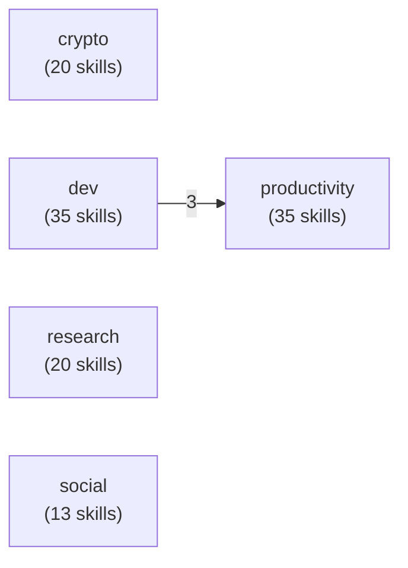
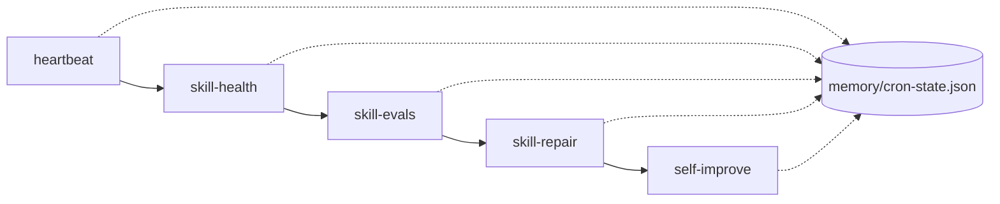

# Skill Dependency Graph

_Auto-generated by `skill-graph` on 2026-06-21 · Mode: `SKILL_GRAPH_OK`_

**Verdict:** `RETIRED_SKILLS: -4 | SHARED_STATE_EDGES: 195->9`

## What changed since last run

- Skills: 127 -> **123** (-4 retired)
- Enabled: 44 -> **44** (no change)
- `depends_on` edges: 4 -> **4** (no change)
- `consume` edges: 0 -> **0** (no chains active)
- `reactive` edges: 0 -> **0** (all reactive triggers commented out)
- shared-state edges: 195 -> **9** (cleaner derivation per spec — only true writer→reader pairs on the same `memory/topics` or `memory/state` resource; per-skill self-references and the universal `cron-state.json` no longer expand into N×N edges)

The architectural backbone is unchanged: the same four `depends_on` declarations, the same self-healing loop, the same writer of each shared resource. The 4 retired skills are pruning, not restructuring.

## Overview

Five categories, sparse cross-category coupling — the architecture is mostly a fan of independent skills sharing a tiny pool of state files.

```mermaid
flowchart LR
  crypto["crypto<br/>(20 skills)"]
  dev["dev<br/>(35 skills)"]
  productivity["productivity<br/>(35 skills)"]
  research["research<br/>(20 skills)"]
  social["social<br/>(13 skills)"]
  dev -->|3| productivity
```

Only one cross-category edge today: three dev-side writers (`fork-cohort`, `fork-release-tracker`) feed productivity-side readers (`fleet-state`, `contributor-spotlight`). Every other dependency is intra-category.

## Self-healing loop

The fleet's reliability loop is a small sub-graph: heartbeat detects, skill-health diagnoses, skill-evals validates, skill-repair fixes, self-improve evolves. All five share `memory/cron-state.json` as the implicit ledger — collapsed into the legend node below rather than rendered as N edges across every diagram.

```mermaid
flowchart LR
  heartbeat["heartbeat"]
  skill_health["skill-health"]
  skill_evals["skill-evals"]
  skill_repair["skill-repair"]
  self_improve["self-improve"]
  state[("memory/cron-state.json")]
  heartbeat --> skill_health
  skill_health --> skill_evals
  skill_evals --> skill_repair
  skill_repair --> self_improve
  heartbeat -.-> state
  skill_health -.-> state
  skill_evals -.-> state
  skill_repair -.-> state
  self_improve -.-> state
```

## Per-category

### crypto (20 skills)

```mermaid
flowchart LR
  aixbt_pulse["aixbt-pulse<br/>(0 9,21 * * *)"]
  btc_levels["btc-levels<br/>(15 */4 * * *)"]
  contributor_reward["contributor-reward"]
  defi_monitor["defi-monitor<br/>(40 12 * * *)"]
  defi_overview["defi-overview<br/>(0 12 * * *)"]
  distribute_tokens["distribute-tokens"]
  market_context_refresh["market-context-refresh<br/>(0 13 * * *)"]
  monitor_kalshi["monitor-kalshi"]
  monitor_polymarket["monitor-polymarket"]
  monitor_runners["monitor-runners"]
  narrative_tracker["narrative-tracker<br/>(30 13 * * *)"]
  on_chain_monitor["on-chain-monitor<br/>(20 12 * * *)"]
  polymarket_comments["polymarket-comments"]
  price_threshold_alert["price-threshold-alert"]
  token_alert["token-alert<br/>(0 12 * * *)"]
  token_movers["token-movers<br/>(10 12 * * *)"]
  token_pick["token-pick<br/>(0 12 * * *)"]
  token_report["token-report"]
  treasury_info["treasury-info"]
  unlock_monitor["unlock-monitor<br/>(0 10 * * 1)"]
  class aixbt_pulse enabled
  click aixbt_pulse "../skills/aixbt-pulse/SKILL.md"
  class btc_levels enabled
  click btc_levels "../skills/btc-levels/SKILL.md"
  class contributor_reward disabled
  click contributor_reward "../skills/contributor-reward/SKILL.md"
  class defi_monitor enabled
  click defi_monitor "../skills/defi-monitor/SKILL.md"
  class defi_overview enabled
  click defi_overview "../skills/defi-overview/SKILL.md"
  class distribute_tokens disabled
  click distribute_tokens "../skills/distribute-tokens/SKILL.md"
  class market_context_refresh enabled
  click market_context_refresh "../skills/market-context-refresh/SKILL.md"
  class monitor_kalshi disabled
  click monitor_kalshi "../skills/monitor-kalshi/SKILL.md"
  class monitor_polymarket disabled
  click monitor_polymarket "../skills/monitor-polymarket/SKILL.md"
  class monitor_runners disabled
  click monitor_runners "../skills/monitor-runners/SKILL.md"
  class narrative_tracker enabled
  click narrative_tracker "../skills/narrative-tracker/SKILL.md"
  class on_chain_monitor enabled
  click on_chain_monitor "../skills/on-chain-monitor/SKILL.md"
  class polymarket_comments disabled
  click polymarket_comments "../skills/polymarket-comments/SKILL.md"
  class price_threshold_alert disabled
  click price_threshold_alert "../skills/price-threshold-alert/SKILL.md"
  class token_alert enabled
  click token_alert "../skills/token-alert/SKILL.md"
  class token_movers enabled
  click token_movers "../skills/token-movers/SKILL.md"
  class token_pick enabled
  click token_pick "../skills/token-pick/SKILL.md"
  class token_report disabled
  click token_report "../skills/token-report/SKILL.md"
  class treasury_info disabled
  click treasury_info "../skills/treasury-info/SKILL.md"
  class unlock_monitor enabled
  click unlock_monitor "../skills/unlock-monitor/SKILL.md"
  classDef enabled fill:#fff,stroke:#000,stroke-width:2px,color:#000
  classDef disabled fill:#f5f5f5,stroke:#bbb,color:#888
  classDef external fill:none,stroke:#bbb,stroke-dasharray:3 3,color:#888
```

No intra-category edges — crypto skills are independent monitors sharing the watchlist via `memory/MEMORY.md` (not tracked as a shared-state resource).

### dev (35 skills)

```mermaid
flowchart LR
  auto_merge["auto-merge"]
  auto_workflow["auto-workflow"]
  autoresearch["autoresearch<br/>(workflow_dispatch)"]
  changelog["changelog"]
  code_health["code-health"]
  create_skill["create-skill"]
  deploy_prototype["deploy-prototype"]
  external_feature["external-feature"]
  fleet_control["fleet-control<br/>(0 9,15 * * *)"]
  fork_cohort["fork-cohort<br/>(0 19 * * 0)"]
  fork_first_run_alert["fork-first-run-alert"]
  fork_fleet["fork-fleet"]
  fork_release_tracker["fork-release-tracker"]
  fork_skill_gap["fork-skill-gap<br/>(0 21 * * 0)"]
  github_issues["github-issues"]
  github_monitor["github-monitor"]
  github_releases["github-releases"]
  github_trending["github-trending<br/>(0 9 * * *)"]
  issue_triage["issue-triage"]
  pr_review["pr-review"]
  pr_triage["pr-triage"]
  project_lens["project-lens"]
  push_recap["push-recap"]
  repo_actions["repo-actions"]
  repo_article["repo-article"]
  repo_pulse["repo-pulse"]
  repo_scanner["repo-scanner"]
  search_skill["search-skill<br/>(0 14 * * *)"]
  skill_security_scan["skill-security-scan<br/>(0 16 * * 1)"]
  smithery_manifest["smithery-manifest"]
  spawn_instance["spawn-instance"]
  star_milestone["star-milestone"]
  vercel_projects["vercel-projects"]
  vuln_scanner["vuln-scanner<br/>(0 16 * * 6)"]
  workflow_security_audit["workflow-security-audit"]
  github_trending --> vuln_scanner
  repo_scanner --> external_feature
  fork_cohort -..-> fork_first_run_alert
  fork_cohort -..-> fork_skill_gap
  repo_scanner -..-> repo_actions
  repo_scanner -..-> vercel_projects
  class auto_merge disabled
  click auto_merge "../skills/auto-merge/SKILL.md"
  class auto_workflow disabled
  click auto_workflow "../skills/auto-workflow/SKILL.md"
  class autoresearch enabled
  click autoresearch "../skills/autoresearch/SKILL.md"
  class changelog disabled
  click changelog "../skills/changelog/SKILL.md"
  class code_health disabled
  click code_health "../skills/code-health/SKILL.md"
  class create_skill disabled
  click create_skill "../skills/create-skill/SKILL.md"
  class deploy_prototype disabled
  click deploy_prototype "../skills/deploy-prototype/SKILL.md"
  class external_feature disabled
  click external_feature "../skills/external-feature/SKILL.md"
  class fleet_control enabled
  click fleet_control "../skills/fleet-control/SKILL.md"
  class fork_cohort enabled
  click fork_cohort "../skills/fork-cohort/SKILL.md"
  class fork_first_run_alert disabled
  click fork_first_run_alert "../skills/fork-first-run-alert/SKILL.md"
  class fork_fleet disabled
  click fork_fleet "../skills/fork-fleet/SKILL.md"
  class fork_release_tracker disabled
  click fork_release_tracker "../skills/fork-release-tracker/SKILL.md"
  class fork_skill_gap enabled
  click fork_skill_gap "../skills/fork-skill-gap/SKILL.md"
  class github_issues disabled
  click github_issues "../skills/github-issues/SKILL.md"
  class github_monitor disabled
  click github_monitor "../skills/github-monitor/SKILL.md"
  class github_releases disabled
  click github_releases "../skills/github-releases/SKILL.md"
  class github_trending enabled
  click github_trending "../skills/github-trending/SKILL.md"
  class issue_triage disabled
  click issue_triage "../skills/issue-triage/SKILL.md"
  class pr_review disabled
  click pr_review "../skills/pr-review/SKILL.md"
  class pr_triage disabled
  click pr_triage "../skills/pr-triage/SKILL.md"
  class project_lens disabled
  click project_lens "../skills/project-lens/SKILL.md"
  class push_recap disabled
  click push_recap "../skills/push-recap/SKILL.md"
  class repo_actions disabled
  click repo_actions "../skills/repo-actions/SKILL.md"
  class repo_article disabled
  click repo_article "../skills/repo-article/SKILL.md"
  class repo_pulse disabled
  click repo_pulse "../skills/repo-pulse/SKILL.md"
  class repo_scanner disabled
  click repo_scanner "../skills/repo-scanner/SKILL.md"
  class search_skill enabled
  click search_skill "../skills/search-skill/SKILL.md"
  class skill_security_scan enabled
  click skill_security_scan "../skills/skill-security-scan/SKILL.md"
  class smithery_manifest disabled
  click smithery_manifest "../skills/smithery-manifest/SKILL.md"
  class spawn_instance disabled
  click spawn_instance "../skills/spawn-instance/SKILL.md"
  class star_milestone disabled
  click star_milestone "../skills/star-milestone/SKILL.md"
  class vercel_projects disabled
  click vercel_projects "../skills/vercel-projects/SKILL.md"
  class vuln_scanner enabled
  click vuln_scanner "../skills/vuln-scanner/SKILL.md"
  class workflow_security_audit disabled
  click workflow_security_audit "../skills/workflow-security-audit/SKILL.md"
  classDef enabled fill:#fff,stroke:#000,stroke-width:2px,color:#000
  classDef disabled fill:#f5f5f5,stroke:#bbb,color:#888
  classDef external fill:none,stroke:#bbb,stroke-dasharray:3 3,color:#888
```

Two dependency hubs: `repo-scanner` (writes `memory/topics/repos.md`, four readers) and `fork-cohort` (writes `memory/topics/fork-cohort-state.json`, four readers — two intra-dev, two cross-cat into productivity).

### productivity (35 skills)

```mermaid
flowchart LR
  action_converter["action-converter<br/>(0 18 * * *)"]
  contributor_spotlight["contributor-spotlight"]
  cost_report["cost-report<br/>(0 7 * * 1)"]
  daily_routine["daily-routine<br/>(0 7 * * *)"]
  deal_flow["deal-flow<br/>(0 14 * * 1)"]
  evening_recap["evening-recap<br/>(0 21 * * *)"]
  fleet_state["fleet-state"]
  fork_contributor_leaderboard["fork-contributor-leaderboard"]
  fork_skill_digest["fork-skill-digest<br/>(30 18 * * 0)"]
  goal_tracker["goal-tracker<br/>(0 18 * * *)"]
  heartbeat["heartbeat<br/>(0 8,14,20 * * *)"]
  idea_capture["idea-capture"]
  morning_brief["morning-brief<br/>(0 7 * * *)"]
  onboard["onboard"]
  operator_scorecard["operator-scorecard<br/>(30 10 * * 1)"]
  reflect["reflect<br/>(0 18 * * *)"]
  reg_monitor["reg-monitor<br/>(0 14 * * 3)"]
  rss_feed["rss-feed"]
  self_improve["self-improve<br/>(0 18 1/2 * *)"]
  skill_analytics["skill-analytics<br/>(30 18 * * 3)"]
  skill_evals["skill-evals<br/>(0 6 * * 0)"]
  skill_freshness["skill-freshness<br/>(0 8 * * *)"]
  skill_graph["skill-graph<br/>(0 17 * * 0)"]
  skill_health["skill-health<br/>(0 18 * * *)"]
  skill_leaderboard["skill-leaderboard"]
  skill_repair["skill-repair"]
  skill_update_check["skill-update-check<br/>(0 19 * * 0)"]
  star_momentum_alert["star-momentum-alert"]
  startup_idea["startup-idea"]
  thought_review["thought-review<br/>(0 7,21 * * *)"]
  tool_builder["tool-builder"]
  update_gallery["update-gallery"]
  v4_readiness["v4-readiness"]
  weekly_review["weekly-review<br/>(0 19 * * 1)"]
  weekly_shiplog["weekly-shiplog<br/>(0 9 * * 1)"]
  fork_cohort["fork-cohort"]:::external
  fork_release_tracker["fork-release-tracker"]:::external
  skill_health --> skill_repair
  action_converter --> tool_builder
  contributor_spotlight -..-> fleet_state
  fork_cohort -..-> fleet_state
  fork_cohort -..-> contributor_spotlight
  fork_release_tracker -..-> fleet_state
  class action_converter enabled
  click action_converter "../skills/action-converter/SKILL.md"
  class contributor_spotlight disabled
  click contributor_spotlight "../skills/contributor-spotlight/SKILL.md"
  class cost_report enabled
  click cost_report "../skills/cost-report/SKILL.md"
  class daily_routine enabled
  click daily_routine "../skills/daily-routine/SKILL.md"
  class deal_flow enabled
  click deal_flow "../skills/deal-flow/SKILL.md"
  class evening_recap enabled
  click evening_recap "../skills/evening-recap/SKILL.md"
  class fleet_state disabled
  click fleet_state "../skills/fleet-state/SKILL.md"
  class fork_contributor_leaderboard disabled
  click fork_contributor_leaderboard "../skills/fork-contributor-leaderboard/SKILL.md"
  class fork_skill_digest enabled
  click fork_skill_digest "../skills/fork-skill-digest/SKILL.md"
  class goal_tracker enabled
  click goal_tracker "../skills/goal-tracker/SKILL.md"
  class heartbeat enabled
  click heartbeat "../skills/heartbeat/SKILL.md"
  class idea_capture disabled
  click idea_capture "../skills/idea-capture/SKILL.md"
  class morning_brief enabled
  click morning_brief "../skills/morning-brief/SKILL.md"
  class onboard disabled
  click onboard "../skills/onboard/SKILL.md"
  class operator_scorecard enabled
  click operator_scorecard "../skills/operator-scorecard/SKILL.md"
  class reflect enabled
  click reflect "../skills/reflect/SKILL.md"
  class reg_monitor enabled
  click reg_monitor "../skills/reg-monitor/SKILL.md"
  class rss_feed disabled
  click rss_feed "../skills/rss-feed/SKILL.md"
  class self_improve enabled
  click self_improve "../skills/self-improve/SKILL.md"
  class skill_analytics enabled
  click skill_analytics "../skills/skill-analytics/SKILL.md"
  class skill_evals enabled
  click skill_evals "../skills/skill-evals/SKILL.md"
  class skill_freshness enabled
  click skill_freshness "../skills/skill-freshness/SKILL.md"
  class skill_graph enabled
  click skill_graph "../skills/skill-graph/SKILL.md"
  class skill_health enabled
  click skill_health "../skills/skill-health/SKILL.md"
  class skill_leaderboard disabled
  click skill_leaderboard "../skills/skill-leaderboard/SKILL.md"
  class skill_repair disabled
  click skill_repair "../skills/skill-repair/SKILL.md"
  class skill_update_check enabled
  click skill_update_check "../skills/skill-update-check/SKILL.md"
  class star_momentum_alert disabled
  click star_momentum_alert "../skills/star-momentum-alert/SKILL.md"
  class startup_idea disabled
  click startup_idea "../skills/startup-idea/SKILL.md"
  class thought_review enabled
  click thought_review "../skills/thought-review/SKILL.md"
  class tool_builder disabled
  click tool_builder "../skills/tool-builder/SKILL.md"
  class update_gallery disabled
  click update_gallery "../skills/update-gallery/SKILL.md"
  class v4_readiness disabled
  click v4_readiness "../skills/v4-readiness/SKILL.md"
  class weekly_review enabled
  click weekly_review "../skills/weekly-review/SKILL.md"
  class weekly_shiplog enabled
  click weekly_shiplog "../skills/weekly-shiplog/SKILL.md"
  click fork_cohort "../skills/fork-cohort/SKILL.md"
  click fork_release_tracker "../skills/fork-release-tracker/SKILL.md"
  classDef enabled fill:#fff,stroke:#000,stroke-width:2px,color:#000
  classDef disabled fill:#f5f5f5,stroke:#bbb,color:#888
  classDef external fill:none,stroke:#bbb,stroke-dasharray:3 3,color:#888
```

`fleet-state` is the productivity-side sink for three dev-side state writers — the most cross-coupled node in the fleet.

### research (20 skills)

```mermaid
flowchart LR
  ai_framework_watch["ai-framework-watch"]
  article["article"]
  channel_recap["channel-recap"]
  competitor_launch_radar["competitor-launch-radar"]
  deep_research["deep-research<br/>(workflow_dispatch)"]
  digest["digest"]
  fetch_tweets["fetch-tweets"]
  hacker_news_digest["hacker-news-digest"]
  huggingface_trending["huggingface-trending"]
  last30["last30<br/>(workflow_dispatch)"]
  list_digest["list-digest<br/>(0 17 * * *)"]
  paper_digest["paper-digest"]
  paper_pick["paper-pick"]
  reddit_digest["reddit-digest"]
  research_brief["research-brief"]
  rss_digest["rss-digest"]
  security_digest["security-digest<br/>(0 14 * * *)"]
  technical_explainer["technical-explainer"]
  telegram_digest["telegram-digest"]
  vibecoding_digest["vibecoding-digest"]
  class ai_framework_watch disabled
  click ai_framework_watch "../skills/ai-framework-watch/SKILL.md"
  class article disabled
  click article "../skills/article/SKILL.md"
  class channel_recap disabled
  click channel_recap "../skills/channel-recap/SKILL.md"
  class competitor_launch_radar disabled
  click competitor_launch_radar "../skills/competitor-launch-radar/SKILL.md"
  class deep_research disabled
  click deep_research "../skills/deep-research/SKILL.md"
  class digest disabled
  click digest "../skills/digest/SKILL.md"
  class fetch_tweets disabled
  click fetch_tweets "../skills/fetch-tweets/SKILL.md"
  class hacker_news_digest disabled
  click hacker_news_digest "../skills/hacker-news-digest/SKILL.md"
  class huggingface_trending disabled
  click huggingface_trending "../skills/huggingface-trending/SKILL.md"
  class last30 disabled
  click last30 "../skills/last30/SKILL.md"
  class list_digest enabled
  click list_digest "../skills/list-digest/SKILL.md"
  class paper_digest disabled
  click paper_digest "../skills/paper-digest/SKILL.md"
  class paper_pick disabled
  click paper_pick "../skills/paper-pick/SKILL.md"
  class reddit_digest disabled
  click reddit_digest "../skills/reddit-digest/SKILL.md"
  class research_brief disabled
  click research_brief "../skills/research-brief/SKILL.md"
  class rss_digest disabled
  click rss_digest "../skills/rss-digest/SKILL.md"
  class security_digest enabled
  click security_digest "../skills/security-digest/SKILL.md"
  class technical_explainer disabled
  click technical_explainer "../skills/technical-explainer/SKILL.md"
  class telegram_digest disabled
  click telegram_digest "../skills/telegram-digest/SKILL.md"
  class vibecoding_digest disabled
  click vibecoding_digest "../skills/vibecoding-digest/SKILL.md"
  classDef enabled fill:#fff,stroke:#000,stroke-width:2px,color:#000
  classDef disabled fill:#f5f5f5,stroke:#bbb,color:#888
  classDef external fill:none,stroke:#bbb,stroke-dasharray:3 3,color:#888
```

No intra-research edges. Each research skill is an independent feed reader.

### social (13 skills)

```mermaid
flowchart LR
  agent_buzz["agent-buzz<br/>(30 17 * * *)"]
  create_campaign["create-campaign<br/>(workflow_dispatch)"]
  farcaster_digest["farcaster-digest"]
  product_hunt_launch["product-hunt-launch<br/>(workflow_dispatch)"]
  refresh_x["refresh-x"]
  remix_tweets["remix-tweets"]
  reply_maker["reply-maker"]
  schedule_ads["schedule-ads"]
  show_hn_draft["show-hn-draft<br/>(workflow_dispatch)"]
  syndicate_article["syndicate-article"]
  thread_formatter["thread-formatter"]
  tweet_roundup["tweet-roundup"]
  write_tweet["write-tweet"]
  class agent_buzz enabled
  click agent_buzz "../skills/agent-buzz/SKILL.md"
  class create_campaign disabled
  click create_campaign "../skills/create-campaign/SKILL.md"
  class farcaster_digest disabled
  click farcaster_digest "../skills/farcaster-digest/SKILL.md"
  class product_hunt_launch disabled
  click product_hunt_launch "../skills/product-hunt-launch/SKILL.md"
  class refresh_x disabled
  click refresh_x "../skills/refresh-x/SKILL.md"
  class remix_tweets disabled
  click remix_tweets "../skills/remix-tweets/SKILL.md"
  class reply_maker disabled
  click reply_maker "../skills/reply-maker/SKILL.md"
  class schedule_ads disabled
  click schedule_ads "../skills/schedule-ads/SKILL.md"
  class show_hn_draft disabled
  click show_hn_draft "../skills/show-hn-draft/SKILL.md"
  class syndicate_article disabled
  click syndicate_article "../skills/syndicate-article/SKILL.md"
  class thread_formatter disabled
  click thread_formatter "../skills/thread-formatter/SKILL.md"
  class tweet_roundup disabled
  click tweet_roundup "../skills/tweet-roundup/SKILL.md"
  class write_tweet disabled
  click write_tweet "../skills/write-tweet/SKILL.md"
  classDef enabled fill:#fff,stroke:#000,stroke-width:2px,color:#000
  classDef disabled fill:#f5f5f5,stroke:#bbb,color:#888
  classDef external fill:none,stroke:#bbb,stroke-dasharray:3 3,color:#888
```

Only one enabled social skill (`agent-buzz`). The rest are dormant capacity.

## Legend

- `-->` — `depends_on` declared in skill frontmatter
- `-.->` — `consume` (chain output passing — none active)
- `-..->` — shared-state edge: writer→reader on the same `memory/topics` or `memory/state` resource, derived from in-text references
- **Bold border** = `enabled: true` in `aeon.yml` (schedule shown inline)
- Faded grey = currently disabled
- Dashed ghost nodes (`:::external`) = a cross-category dependency, click to source
- Click any node to open its `SKILL.md` on github.com
- _Note: every skill writes `memory/cron-state.json` — collapsed into the self-healing-loop sub-graph rather than rendered as ~120 edges across every diagram._

## Summary

| Metric | Count |
|---|---|
| Total skills | 123 |
| Enabled | 44 |
| Disabled | 79 |
| `depends_on` edges | 4 |
| `consume` edges | 0 |
| `reactive` edges | 0 |
| shared-state edges | 9 |

| Category | Skills | Enabled |
|---|---|---|
| crypto | 20 | 11 |
| dev | 35 | 8 |
| productivity | 35 | 22 |
| research | 20 | 2 |
| social | 13 | 1 |
| (totals are bottom-up: per-skill `enabled: true` in `aeon.yml`, classified via `skills.json` with tag fallback for `other`/unmapped slugs) | | |

---

_skills parsed: 123 · depends_on: 4 · consume: 0 · reactive: 0 · shared-state derived: 9 · enabled: 44/123 · mode: SKILL_GRAPH_OK_
