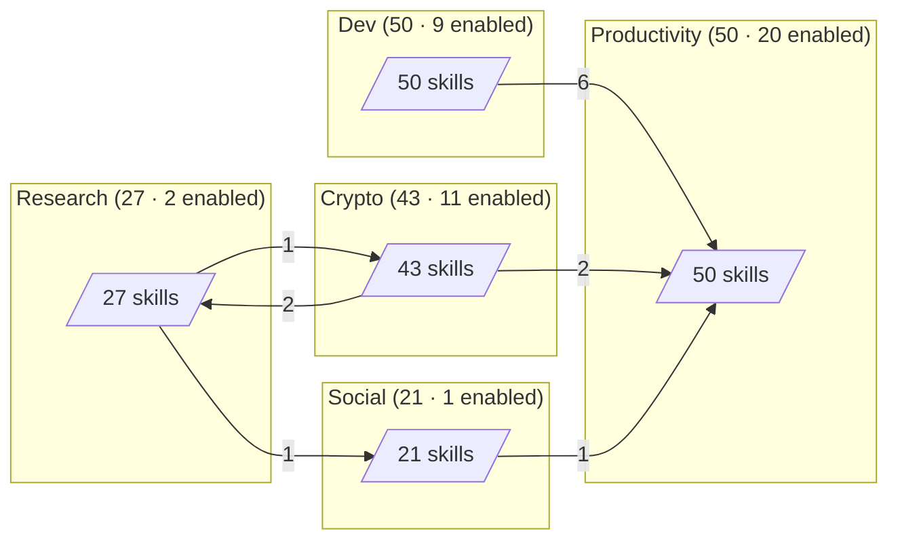
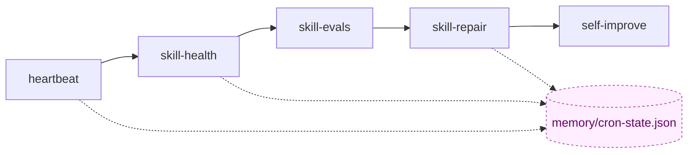
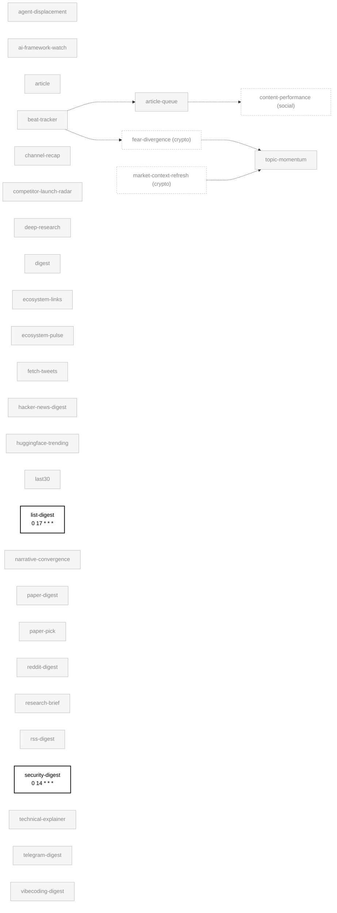

# Skill Dependency Graph

_Auto-generated by `skill-graph` on 2026-08-16._
_Mode:_ `SKILL_GRAPH_OK`  ·  _Verdict:_ `ARCHITECTURE_OK`

> The map below is derived from `aeon.yml`, `skills.json`, and every `skills/*/SKILL.md`. Solid arrows are explicit `depends_on` edges; dashed arrows are shared-state derived (one skill writes a memory topic another skill reads). Every skill writes `memory/cron-state.json`; that edge is collapsed into the self-healing-loop callout below rather than 191 arrows into `heartbeat`/`skill-health`/`skill-repair`.

## What changed since last run

- Prior generated: 2026-07-19
- Prior skills_total: 191 → now: 191
- Prior enabled: 43 → now: 43
- Prior depends_on edges: 5 → now: 5
- Prior shared_state edges: 27 → now: 27
- Added nodes: none
- Removed nodes: none
- Added edges: none
- Removed edges: none
- Enabled-state flips: none

_28d re-generation with identical topology — same 5 explicit `depends_on` edges, same 27 derived shared-state edges, same 43-of-191 enabled set across the same 5 category buckets. All active drift in the fleet during this window (self-improve PRs #177/#179/#180, ISS-031 usepod dispatcher fallout, chain-output-header-date-drift 5-consec, etc.) is intra-content, not structural. Verdict remains `ARCHITECTURE_OK`._

## Overview

```mermaid
flowchart LR
    classDef enabled fill:#fff,stroke:#000,stroke-width:2px,color:#000
    classDef disabled fill:#f5f5f5,stroke:#bbb,color:#888
    subgraph research["Research (27 · 2 enabled)"]
      research_hub[/"27 skills"/]
    end
    subgraph dev["Dev (50 · 9 enabled)"]
      dev_hub[/"50 skills"/]
    end
    subgraph crypto["Crypto (43 · 11 enabled)"]
      crypto_hub[/"43 skills"/]
    end
    subgraph social["Social (21 · 1 enabled)"]
      social_hub[/"21 skills"/]
    end
    subgraph productivity["Productivity (50 · 20 enabled)"]
      productivity_hub[/"50 skills"/]
    end
    research_hub -->|1| social_hub
    dev_hub -->|6| productivity_hub
    research_hub -->|1| crypto_hub
    crypto_hub -->|2| productivity_hub
    social_hub -->|1| productivity_hub
    crypto_hub -->|2| research_hub
```

## Self-healing loop

```mermaid
flowchart LR
    heartbeat["heartbeat"]
    skill_health["skill-health"]
    skill_evals["skill-evals"]
    skill_repair["skill-repair"]
    self_improve["self-improve"]
    heartbeat --> skill_health
    skill_health --> skill_evals
    skill_evals --> skill_repair
    skill_repair --> self_improve
    cron_state[("memory/cron-state.json")]:::state
    heartbeat -.-> cron_state
    skill_health -.-> cron_state
    skill_repair -.-> cron_state
    click heartbeat "../skills/heartbeat/SKILL.md"
    click skill_health "../skills/skill-health/SKILL.md"
    click skill_evals "../skills/skill-evals/SKILL.md"
    click skill_repair "../skills/skill-repair/SKILL.md"
    click self_improve "../skills/self-improve/SKILL.md"
    classDef state fill:#fef,stroke:#a4a,stroke-dasharray:3 3,color:#606
```

> _Every skill writes to `memory/cron-state.json`; the loop above only shows the ones that drive corrective action._

## Per-category

### Research & Content — 27 skills (2 enabled)

```mermaid
flowchart LR
    classDef enabled fill:#fff,stroke:#000,stroke-width:2px,color:#000
    classDef disabled fill:#f5f5f5,stroke:#bbb,color:#888
    classDef external fill:none,stroke:#bbb,stroke-dasharray:3 3,color:#888
    agent_displacement["agent-displacement"]:::disabled
    ai_framework_watch["ai-framework-watch"]:::disabled
    article["article"]:::disabled
    article_queue["article-queue"]:::disabled
    beat_tracker["beat-tracker"]:::disabled
    channel_recap["channel-recap"]:::disabled
    competitor_launch_radar["competitor-launch-radar"]:::disabled
    deep_research["deep-research"]:::disabled
    digest["digest"]:::disabled
    ecosystem_links["ecosystem-links"]:::disabled
    ecosystem_pulse["ecosystem-pulse"]:::disabled
    fetch_tweets["fetch-tweets"]:::disabled
    hacker_news_digest["hacker-news-digest"]:::disabled
    huggingface_trending["huggingface-trending"]:::disabled
    last30["last30"]:::disabled
    list_digest["list-digest\n0 17 * * *"]:::enabled
    narrative_convergence["narrative-convergence"]:::disabled
    paper_digest["paper-digest"]:::disabled
    paper_pick["paper-pick"]:::disabled
    reddit_digest["reddit-digest"]:::disabled
    research_brief["research-brief"]:::disabled
    rss_digest["rss-digest"]:::disabled
    security_digest["security-digest\n0 14 * * *"]:::enabled
    technical_explainer["technical-explainer"]:::disabled
    telegram_digest["telegram-digest"]:::disabled
    topic_momentum["topic-momentum"]:::disabled
    vibecoding_digest["vibecoding-digest"]:::disabled
    beat_tracker -..-> article_queue
    article_queue -..-> ext_content_performance
    beat_tracker -..-> ext_fear_divergence
    ext_fear_divergence -..-> topic_momentum
    ext_market_context_refresh -..-> topic_momentum
    ext_content_performance["content-performance (social)"]:::external
    ext_fear_divergence["fear-divergence (crypto)"]:::external
    ext_market_context_refresh["market-context-refresh (crypto)"]:::external
    click agent_displacement "../skills/agent-displacement/SKILL.md"
    click ai_framework_watch "../skills/ai-framework-watch/SKILL.md"
    click article "../skills/article/SKILL.md"
    click article_queue "../skills/article-queue/SKILL.md"
    click beat_tracker "../skills/beat-tracker/SKILL.md"
    click channel_recap "../skills/channel-recap/SKILL.md"
    click competitor_launch_radar "../skills/competitor-launch-radar/SKILL.md"
    click deep_research "../skills/deep-research/SKILL.md"
    click digest "../skills/digest/SKILL.md"
    click ecosystem_links "../skills/ecosystem-links/SKILL.md"
    click ecosystem_pulse "../skills/ecosystem-pulse/SKILL.md"
    click fetch_tweets "../skills/fetch-tweets/SKILL.md"
    click hacker_news_digest "../skills/hacker-news-digest/SKILL.md"
    click huggingface_trending "../skills/huggingface-trending/SKILL.md"
    click last30 "../skills/last30/SKILL.md"
    click list_digest "../skills/list-digest/SKILL.md"
    click narrative_convergence "../skills/narrative-convergence/SKILL.md"
    click paper_digest "../skills/paper-digest/SKILL.md"
    click paper_pick "../skills/paper-pick/SKILL.md"
    click reddit_digest "../skills/reddit-digest/SKILL.md"
    click research_brief "../skills/research-brief/SKILL.md"
    click rss_digest "../skills/rss-digest/SKILL.md"
    click security_digest "../skills/security-digest/SKILL.md"
    click technical_explainer "../skills/technical-explainer/SKILL.md"
    click telegram_digest "../skills/telegram-digest/SKILL.md"
    click topic_momentum "../skills/topic-momentum/SKILL.md"
    click vibecoding_digest "../skills/vibecoding-digest/SKILL.md"
```

### Dev & Code — 50 skills (9 enabled)

```mermaid
flowchart LR
    classDef enabled fill:#fff,stroke:#000,stroke-width:2px,color:#000
    classDef disabled fill:#f5f5f5,stroke:#bbb,color:#888
    classDef external fill:none,stroke:#bbb,stroke-dasharray:3 3,color:#888
    atrium_watch["atrium-watch"]:::disabled
    auto_merge["auto-merge"]:::disabled
    auto_workflow["auto-workflow"]:::disabled
    autoresearch["autoresearch\nworkflow_dispatch"]:::enabled
    capabilities_map["capabilities-map"]:::disabled
    changelog["changelog"]:::disabled
    code_health["code-health"]:::disabled
    config_validator["config-validator"]:::disabled
    create_skill["create-skill"]:::disabled
    deploy_prototype["deploy-prototype"]:::disabled
    disclosure_tracker["disclosure-tracker"]:::disabled
    external_feature["external-feature"]:::disabled
    fleet_control["fleet-control"]:::disabled
    fork_cohort["fork-cohort\n0 19 * * 0"]:::enabled
    fork_first_run_alert["fork-first-run-alert"]:::disabled
    fork_fleet["fork-fleet"]:::disabled
    fork_skill_gap["fork-skill-gap\n0 21 * * 0"]:::enabled
    github_issues["github-issues"]:::disabled
    github_monitor["github-monitor"]:::disabled
    github_releases["github-releases"]:::disabled
    github_trending["github-trending\n0 9 * * *"]:::enabled
    install_skill["install-skill"]:::disabled
    issue_triage["issue-triage"]:::disabled
    pr_merge["pr-merge"]:::disabled
    pr_review["pr-review"]:::disabled
    pr_tracker["pr-tracker"]:::disabled
    pr_triage["pr-triage"]:::disabled
    project_lens["project-lens"]:::disabled
    push_recap["push-recap"]:::disabled
    pvr_triage["pvr-triage"]:::disabled
    pvr_watchlist["pvr-watchlist"]:::disabled
    repo_actions["repo-actions"]:::disabled
    repo_article["repo-article"]:::disabled
    repo_pulse["repo-pulse"]:::disabled
    repo_scanner["repo-scanner"]:::disabled
    search_skill["search-skill\n0 14 * * 1"]:::enabled
    skill_enabler["skill-enabler"]:::disabled
    skill_freshness["skill-freshness\n0 8 * * *"]:::enabled
    skill_graph["skill-graph\n0 17 * * 0"]:::enabled
    skill_security_scan["skill-security-scan\n0 16 * * 1"]:::enabled
    skill_triage["skill-triage"]:::disabled
    smithery_manifest["smithery-manifest"]:::disabled
    sparkleware_catalog["sparkleware-catalog"]:::disabled
    spawn_instance["spawn-instance"]:::disabled
    star_milestone["star-milestone"]:::disabled
    vercel_projects["vercel-projects"]:::disabled
    vuln_scanner["vuln-scanner\n0 16 * * 6"]:::enabled
    vuln_tracker["vuln-tracker"]:::disabled
    workflow_security_audit["workflow-security-audit"]:::disabled
    x402_monitor["x402-monitor"]:::disabled
    external_feature --> repo_scanner
    vuln_scanner --> github_trending
    vuln_tracker --> vuln_scanner
    fork_cohort -..-> ext_contributor_spotlight
    pr_tracker -..-> disclosure_tracker
    repo_scanner -..-> external_feature
    vercel_projects -..-> external_feature
    fork_cohort -..-> ext_fleet_state
    fork_cohort -..-> fork_first_run_alert
    fork_cohort -..-> ext_fork_health
    fork_cohort -..-> fork_skill_gap
    deploy_prototype -..-> ext_idea_pipeline
    vercel_projects -..-> ext_idea_pipeline
    repo_scanner -..-> repo_actions
    vercel_projects -..-> repo_actions
    fork_cohort -..-> ext_skill_adoption
    ext_contributor_spotlight["contributor-spotlight (productivity)"]:::external
    ext_fleet_state["fleet-state (productivity)"]:::external
    ext_fork_health["fork-health (productivity)"]:::external
    ext_idea_pipeline["idea-pipeline (productivity)"]:::external
    ext_skill_adoption["skill-adoption (productivity)"]:::external
    click atrium_watch "../skills/atrium-watch/SKILL.md"
    click auto_merge "../skills/auto-merge/SKILL.md"
    click auto_workflow "../skills/auto-workflow/SKILL.md"
    click autoresearch "../skills/autoresearch/SKILL.md"
    click capabilities_map "../skills/capabilities-map/SKILL.md"
    click changelog "../skills/changelog/SKILL.md"
    click code_health "../skills/code-health/SKILL.md"
    click config_validator "../skills/config-validator/SKILL.md"
    click create_skill "../skills/create-skill/SKILL.md"
    click deploy_prototype "../skills/deploy-prototype/SKILL.md"
    click disclosure_tracker "../skills/disclosure-tracker/SKILL.md"
    click external_feature "../skills/external-feature/SKILL.md"
    click fleet_control "../skills/fleet-control/SKILL.md"
    click fork_cohort "../skills/fork-cohort/SKILL.md"
    click fork_first_run_alert "../skills/fork-first-run-alert/SKILL.md"
    click fork_fleet "../skills/fork-fleet/SKILL.md"
    click fork_skill_gap "../skills/fork-skill-gap/SKILL.md"
    click github_issues "../skills/github-issues/SKILL.md"
    click github_monitor "../skills/github-monitor/SKILL.md"
    click github_releases "../skills/github-releases/SKILL.md"
    click github_trending "../skills/github-trending/SKILL.md"
    click install_skill "../skills/install-skill/SKILL.md"
    click issue_triage "../skills/issue-triage/SKILL.md"
    click pr_merge "../skills/pr-merge/SKILL.md"
    click pr_review "../skills/pr-review/SKILL.md"
    click pr_tracker "../skills/pr-tracker/SKILL.md"
    click pr_triage "../skills/pr-triage/SKILL.md"
    click project_lens "../skills/project-lens/SKILL.md"
    click push_recap "../skills/push-recap/SKILL.md"
    click pvr_triage "../skills/pvr-triage/SKILL.md"
    click pvr_watchlist "../skills/pvr-watchlist/SKILL.md"
    click repo_actions "../skills/repo-actions/SKILL.md"
    click repo_article "../skills/repo-article/SKILL.md"
    click repo_pulse "../skills/repo-pulse/SKILL.md"
    click repo_scanner "../skills/repo-scanner/SKILL.md"
    click search_skill "../skills/search-skill/SKILL.md"
    click skill_enabler "../skills/skill-enabler/SKILL.md"
    click skill_freshness "../skills/skill-freshness/SKILL.md"
    click skill_graph "../skills/skill-graph/SKILL.md"
    click skill_security_scan "../skills/skill-security-scan/SKILL.md"
    click skill_triage "../skills/skill-triage/SKILL.md"
    click smithery_manifest "../skills/smithery-manifest/SKILL.md"
    click sparkleware_catalog "../skills/sparkleware-catalog/SKILL.md"
    click spawn_instance "../skills/spawn-instance/SKILL.md"
    click star_milestone "../skills/star-milestone/SKILL.md"
    click vercel_projects "../skills/vercel-projects/SKILL.md"
    click vuln_scanner "../skills/vuln-scanner/SKILL.md"
    click vuln_tracker "../skills/vuln-tracker/SKILL.md"
    click workflow_security_audit "../skills/workflow-security-audit/SKILL.md"
    click x402_monitor "../skills/x402-monitor/SKILL.md"
```

### Crypto & Markets — 43 skills (11 enabled)

```mermaid
flowchart LR
    classDef enabled fill:#fff,stroke:#000,stroke-width:2px,color:#000
    classDef disabled fill:#f5f5f5,stroke:#bbb,color:#888
    classDef external fill:none,stroke:#bbb,stroke-dasharray:3 3,color:#888
    aixbt_pulse["aixbt-pulse\n0 9,21 * * *"]:::enabled
    approval_audit["approval-audit"]:::disabled
    base_mcp["base-mcp"]:::disabled
    beamr_route["beamr-route"]:::disabled
    btc_levels["btc-levels\n15 */4 * * *"]:::enabled
    contract_audit["contract-audit"]:::disabled
    contributor_reward["contributor-reward"]:::disabled
    ctrl["ctrl"]:::disabled
    defi_monitor["defi-monitor\n40 12 * * *"]:::enabled
    defi_overview["defi-overview\n0 12 * * *"]:::enabled
    deployer_trace["deployer-trace"]:::disabled
    distribute_tokens["distribute-tokens"]:::disabled
    fear_divergence["fear-divergence"]:::disabled
    fund_flow["fund-flow"]:::disabled
    holder_concentration["holder-concentration"]:::disabled
    honeypot_check["honeypot-check"]:::disabled
    investigation_report["investigation-report"]:::disabled
    linked_wallets["linked-wallets"]:::disabled
    liquidpad_launch["liquidpad-launch"]:::disabled
    lp_lock["lp-lock"]:::disabled
    market_context_refresh["market-context-refresh\n0 13 * * *"]:::enabled
    monitor_kalshi["monitor-kalshi"]:::disabled
    monitor_polymarket["monitor-polymarket"]:::disabled
    monitor_runners["monitor-runners"]:::disabled
    narrative_tracker["narrative-tracker\n30 13 * * *"]:::enabled
    on_chain_monitor["on-chain-monitor\n20 12 * * *"]:::enabled
    pm_manipulation["pm-manipulation"]:::disabled
    pm_pulse["pm-pulse"]:::disabled
    polymarket_comments["polymarket-comments"]:::disabled
    price_threshold_alert["price-threshold-alert"]:::disabled
    rug_scan["rug-scan"]:::disabled
    rwa_pulse["rwa-pulse"]:::disabled
    token_alert["token-alert\n0 12 * * *"]:::enabled
    token_movers["token-movers\n10 12 * * *"]:::enabled
    token_pick["token-pick\n0 12 * * *"]:::enabled
    token_report["token-report"]:::disabled
    treasury_info["treasury-info"]:::disabled
    tx_explain["tx-explain"]:::disabled
    unlock_monitor["unlock-monitor\n0 10 * * 1"]:::enabled
    vigil["vigil"]:::disabled
    vigil_revoke["vigil-revoke"]:::disabled
    wallet_profile["wallet-profile"]:::disabled
    wallet_risk["wallet-risk"]:::disabled
    ext_beat_tracker -..-> fear_divergence
    fear_divergence -..-> ext_idea_pipeline
    market_context_refresh -..-> ext_idea_pipeline
    pm_pulse -..-> pm_manipulation
    fear_divergence -..-> rwa_pulse
    market_context_refresh -..-> rwa_pulse
    fear_divergence -..-> ext_topic_momentum
    market_context_refresh -..-> ext_topic_momentum
    ext_beat_tracker["beat-tracker (research)"]:::external
    ext_idea_pipeline["idea-pipeline (productivity)"]:::external
    ext_topic_momentum["topic-momentum (research)"]:::external
    click aixbt_pulse "../skills/aixbt-pulse/SKILL.md"
    click approval_audit "../skills/approval-audit/SKILL.md"
    click base_mcp "../skills/base-mcp/SKILL.md"
    click beamr_route "../skills/beamr-route/SKILL.md"
    click btc_levels "../skills/btc-levels/SKILL.md"
    click contract_audit "../skills/contract-audit/SKILL.md"
    click contributor_reward "../skills/contributor-reward/SKILL.md"
    click ctrl "../skills/ctrl/SKILL.md"
    click defi_monitor "../skills/defi-monitor/SKILL.md"
    click defi_overview "../skills/defi-overview/SKILL.md"
    click deployer_trace "../skills/deployer-trace/SKILL.md"
    click distribute_tokens "../skills/distribute-tokens/SKILL.md"
    click fear_divergence "../skills/fear-divergence/SKILL.md"
    click fund_flow "../skills/fund-flow/SKILL.md"
    click holder_concentration "../skills/holder-concentration/SKILL.md"
    click honeypot_check "../skills/honeypot-check/SKILL.md"
    click investigation_report "../skills/investigation-report/SKILL.md"
    click linked_wallets "../skills/linked-wallets/SKILL.md"
    click liquidpad_launch "../skills/liquidpad-launch/SKILL.md"
    click lp_lock "../skills/lp-lock/SKILL.md"
    click market_context_refresh "../skills/market-context-refresh/SKILL.md"
    click monitor_kalshi "../skills/monitor-kalshi/SKILL.md"
    click monitor_polymarket "../skills/monitor-polymarket/SKILL.md"
    click monitor_runners "../skills/monitor-runners/SKILL.md"
    click narrative_tracker "../skills/narrative-tracker/SKILL.md"
    click on_chain_monitor "../skills/on-chain-monitor/SKILL.md"
    click pm_manipulation "../skills/pm-manipulation/SKILL.md"
    click pm_pulse "../skills/pm-pulse/SKILL.md"
    click polymarket_comments "../skills/polymarket-comments/SKILL.md"
    click price_threshold_alert "../skills/price-threshold-alert/SKILL.md"
    click rug_scan "../skills/rug-scan/SKILL.md"
    click rwa_pulse "../skills/rwa-pulse/SKILL.md"
    click token_alert "../skills/token-alert/SKILL.md"
    click token_movers "../skills/token-movers/SKILL.md"
    click token_pick "../skills/token-pick/SKILL.md"
    click token_report "../skills/token-report/SKILL.md"
    click treasury_info "../skills/treasury-info/SKILL.md"
    click tx_explain "../skills/tx-explain/SKILL.md"
    click unlock_monitor "../skills/unlock-monitor/SKILL.md"
    click vigil "../skills/vigil/SKILL.md"
    click vigil_revoke "../skills/vigil-revoke/SKILL.md"
    click wallet_profile "../skills/wallet-profile/SKILL.md"
    click wallet_risk "../skills/wallet-risk/SKILL.md"
```

### Social — 21 skills (1 enabled)

```mermaid
flowchart LR
    classDef enabled fill:#fff,stroke:#000,stroke-width:2px,color:#000
    classDef disabled fill:#f5f5f5,stroke:#bbb,color:#888
    classDef external fill:none,stroke:#bbb,stroke-dasharray:3 3,color:#888
    agent_buzz["agent-buzz\n30 17 * * *"]:::enabled
    builder_map["builder-map"]:::disabled
    content_performance["content-performance"]:::disabled
    create_campaign["create-campaign"]:::disabled
    engagement_act["engagement-act"]:::disabled
    farcaster_digest["farcaster-digest"]:::disabled
    mention_radar["mention-radar"]:::disabled
    product_hunt_launch["product-hunt-launch"]:::disabled
    refresh_x["refresh-x"]:::disabled
    remix_tweets["remix-tweets"]:::disabled
    reply_maker["reply-maker"]:::disabled
    repo_revive["repo-revive"]:::disabled
    schedule_ads["schedule-ads"]:::disabled
    show_hn_draft["show-hn-draft"]:::disabled
    skill_spotlight["skill-spotlight"]:::disabled
    soul_builder["soul-builder"]:::disabled
    star_momentum_alert["star-momentum-alert"]:::disabled
    syndicate_article["syndicate-article"]:::disabled
    thread_formatter["thread-formatter"]:::disabled
    tweet_roundup["tweet-roundup"]:::disabled
    write_tweet["write-tweet"]:::disabled
    ext_article_queue -..-> content_performance
    builder_map -..-> ext_idea_pipeline
    ext_article_queue["article-queue (research)"]:::external
    ext_idea_pipeline["idea-pipeline (productivity)"]:::external
    click agent_buzz "../skills/agent-buzz/SKILL.md"
    click builder_map "../skills/builder-map/SKILL.md"
    click content_performance "../skills/content-performance/SKILL.md"
    click create_campaign "../skills/create-campaign/SKILL.md"
    click engagement_act "../skills/engagement-act/SKILL.md"
    click farcaster_digest "../skills/farcaster-digest/SKILL.md"
    click mention_radar "../skills/mention-radar/SKILL.md"
    click product_hunt_launch "../skills/product-hunt-launch/SKILL.md"
    click refresh_x "../skills/refresh-x/SKILL.md"
    click remix_tweets "../skills/remix-tweets/SKILL.md"
    click reply_maker "../skills/reply-maker/SKILL.md"
    click repo_revive "../skills/repo-revive/SKILL.md"
    click schedule_ads "../skills/schedule-ads/SKILL.md"
    click show_hn_draft "../skills/show-hn-draft/SKILL.md"
    click skill_spotlight "../skills/skill-spotlight/SKILL.md"
    click soul_builder "../skills/soul-builder/SKILL.md"
    click star_momentum_alert "../skills/star-momentum-alert/SKILL.md"
    click syndicate_article "../skills/syndicate-article/SKILL.md"
    click thread_formatter "../skills/thread-formatter/SKILL.md"
    click tweet_roundup "../skills/tweet-roundup/SKILL.md"
    click write_tweet "../skills/write-tweet/SKILL.md"
```

### Productivity & Meta — 50 skills (20 enabled)

```mermaid
flowchart LR
    classDef enabled fill:#fff,stroke:#000,stroke-width:2px,color:#000
    classDef disabled fill:#f5f5f5,stroke:#bbb,color:#888
    classDef external fill:none,stroke:#bbb,stroke-dasharray:3 3,color:#888
    action_converter["action-converter\n0 18 * * *"]:::enabled
    api_health["api-health"]:::disabled
    batch_health["batch-health"]:::disabled
    compute_pulse["compute-pulse"]:::disabled
    contributor_spotlight["contributor-spotlight"]:::disabled
    cost_report["cost-report\n0 7 * * 1"]:::enabled
    daily_routine["daily-routine\n0 7 * * *"]:::enabled
    deal_flow["deal-flow\n0 14 * * 1"]:::enabled
    evening_recap["evening-recap\n0 21 * * *"]:::enabled
    fleet_scorecard["fleet-scorecard"]:::disabled
    fleet_state["fleet-state"]:::disabled
    followup_patrol["followup-patrol"]:::disabled
    fork_contributor_leaderboard["fork-contributor-leaderboard"]:::disabled
    fork_health["fork-health"]:::disabled
    fork_release_tracker["fork-release-tracker"]:::disabled
    fork_skill_digest["fork-skill-digest\n30 18 * * 0"]:::enabled
    frequency_guard["frequency-guard"]:::disabled
    goal_tracker["goal-tracker\n0 18 * * *"]:::enabled
    heartbeat["heartbeat\n0 8,14,20 * * *"]:::enabled
    idea_capture["idea-capture"]:::disabled
    idea_pipeline["idea-pipeline"]:::disabled
    idea_validator["idea-validator"]:::disabled
    janitor["janitor"]:::disabled
    mcp_pulse["mcp-pulse"]:::disabled
    memory_dedupe["memory-dedupe"]:::disabled
    milestone_tracker["milestone-tracker"]:::disabled
    morning_brief["morning-brief\n0 7 * * *"]:::enabled
    onboard["onboard"]:::disabled
    operator_scorecard["operator-scorecard\n30 10 * * 1"]:::enabled
    reflect["reflect\n0 18 * * *"]:::enabled
    reg_monitor["reg-monitor\n0 14 * * 3"]:::enabled
    rss_feed["rss-feed"]:::disabled
    self_improve["self-improve\n0 18 1/2 * *"]:::enabled
    signal_verdict["signal-verdict"]:::disabled
    skill_adoption["skill-adoption"]:::disabled
    skill_analytics["skill-analytics\n30 18 * * 3"]:::enabled
    skill_evals["skill-evals\n0 22 * * 0"]:::enabled
    skill_health["skill-health\n0 18 * * *"]:::enabled
    skill_leaderboard["skill-leaderboard"]:::disabled
    skill_repair["skill-repair"]:::disabled
    skill_update_check["skill-update-check\n0 19 * * 0"]:::enabled
    spend_monitor["spend-monitor"]:::disabled
    startup_idea["startup-idea"]:::disabled
    strategy_builder["strategy-builder"]:::disabled
    thought_review["thought-review\n0 7,21 * * *"]:::enabled
    tool_builder["tool-builder"]:::disabled
    update_gallery["update-gallery"]:::disabled
    v4_readiness["v4-readiness"]:::disabled
    weekly_review["weekly-review\n0 19 * * 1"]:::enabled
    weekly_shiplog["weekly-shiplog\n0 9 * * 1"]:::enabled
    skill_repair --> skill_health
    tool_builder --> action_converter
    ext_fork_cohort -..-> contributor_spotlight
    ext_fork_cohort -..-> fleet_state
    fork_release_tracker -..-> fleet_state
    contributor_spotlight -..-> fleet_state
    ext_fork_cohort -..-> fork_health
    idea_validator -..-> idea_pipeline
    ext_deploy_prototype -..-> idea_pipeline
    ext_vercel_projects -..-> idea_pipeline
    ext_fear_divergence -..-> idea_pipeline
    ext_market_context_refresh -..-> idea_pipeline
    ext_builder_map -..-> idea_pipeline
    ext_fork_cohort -..-> skill_adoption
    ext_fork_cohort["fork-cohort (dev)"]:::external
    ext_deploy_prototype["deploy-prototype (dev)"]:::external
    ext_vercel_projects["vercel-projects (dev)"]:::external
    ext_fear_divergence["fear-divergence (crypto)"]:::external
    ext_market_context_refresh["market-context-refresh (crypto)"]:::external
    ext_builder_map["builder-map (social)"]:::external
    click action_converter "../skills/action-converter/SKILL.md"
    click api_health "../skills/api-health/SKILL.md"
    click batch_health "../skills/batch-health/SKILL.md"
    click compute_pulse "../skills/compute-pulse/SKILL.md"
    click contributor_spotlight "../skills/contributor-spotlight/SKILL.md"
    click cost_report "../skills/cost-report/SKILL.md"
    click daily_routine "../skills/daily-routine/SKILL.md"
    click deal_flow "../skills/deal-flow/SKILL.md"
    click evening_recap "../skills/evening-recap/SKILL.md"
    click fleet_scorecard "../skills/fleet-scorecard/SKILL.md"
    click fleet_state "../skills/fleet-state/SKILL.md"
    click followup_patrol "../skills/followup-patrol/SKILL.md"
    click fork_contributor_leaderboard "../skills/fork-contributor-leaderboard/SKILL.md"
    click fork_health "../skills/fork-health/SKILL.md"
    click fork_release_tracker "../skills/fork-release-tracker/SKILL.md"
    click fork_skill_digest "../skills/fork-skill-digest/SKILL.md"
    click frequency_guard "../skills/frequency-guard/SKILL.md"
    click goal_tracker "../skills/goal-tracker/SKILL.md"
    click heartbeat "../skills/heartbeat/SKILL.md"
    click idea_capture "../skills/idea-capture/SKILL.md"
    click idea_pipeline "../skills/idea-pipeline/SKILL.md"
    click idea_validator "../skills/idea-validator/SKILL.md"
    click janitor "../skills/janitor/SKILL.md"
    click mcp_pulse "../skills/mcp-pulse/SKILL.md"
    click memory_dedupe "../skills/memory-dedupe/SKILL.md"
    click milestone_tracker "../skills/milestone-tracker/SKILL.md"
    click morning_brief "../skills/morning-brief/SKILL.md"
    click onboard "../skills/onboard/SKILL.md"
    click operator_scorecard "../skills/operator-scorecard/SKILL.md"
    click reflect "../skills/reflect/SKILL.md"
    click reg_monitor "../skills/reg-monitor/SKILL.md"
    click rss_feed "../skills/rss-feed/SKILL.md"
    click self_improve "../skills/self-improve/SKILL.md"
    click signal_verdict "../skills/signal-verdict/SKILL.md"
    click skill_adoption "../skills/skill-adoption/SKILL.md"
    click skill_analytics "../skills/skill-analytics/SKILL.md"
    click skill_evals "../skills/skill-evals/SKILL.md"
    click skill_health "../skills/skill-health/SKILL.md"
    click skill_leaderboard "../skills/skill-leaderboard/SKILL.md"
    click skill_repair "../skills/skill-repair/SKILL.md"
    click skill_update_check "../skills/skill-update-check/SKILL.md"
    click spend_monitor "../skills/spend-monitor/SKILL.md"
    click startup_idea "../skills/startup-idea/SKILL.md"
    click strategy_builder "../skills/strategy-builder/SKILL.md"
    click thought_review "../skills/thought-review/SKILL.md"
    click tool_builder "../skills/tool-builder/SKILL.md"
    click update_gallery "../skills/update-gallery/SKILL.md"
    click v4_readiness "../skills/v4-readiness/SKILL.md"
    click weekly_review "../skills/weekly-review/SKILL.md"
    click weekly_shiplog "../skills/weekly-shiplog/SKILL.md"
```

## Legend

- `-->` **depends_on** — declared in `SKILL.md` frontmatter.
- `-.->` **consume/reactive** — chain-output injection or event-trigger.
- `-..->` **shared state** — one skill writes a `memory/topics/*` or `memory/state/*` file another skill reads.
- **Enabled** = bold black border + schedule annotation. **Disabled** = grey.
- Nodes are clickable — hover/click routes to the source `SKILL.md`.
- Every skill writes `memory/cron-state.json`; that edge is collapsed into the self-healing-loop diagram, not repeated 191 times.

## Summary

| Category | Total | Enabled |
|---|---|---|
| Research & Content | 27 | 2 |
| Dev & Code | 50 | 9 |
| Crypto & Markets | 43 | 11 |
| Social | 21 | 1 |
| Productivity & Meta | 50 | 20 |
| **Total** | **191** | **43** |

| Edge type | Count |
|---|---|
| depends_on | 5 |
| consume | 0 |
| reactive | 0 |
| shared_state (derived) | 27 |

_Source-status: skills parsed: 191 · depends_on: 5 · consume: 0 · reactive: 0 · shared-state derived: 27 · enabled: 43/191 · mode: SKILL_GRAPH_OK_
