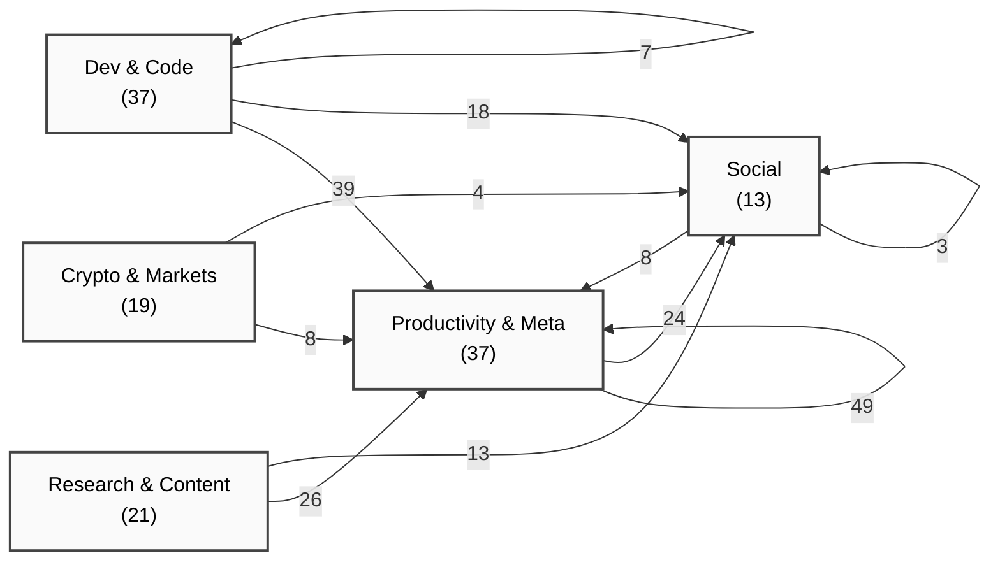
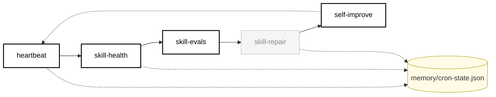
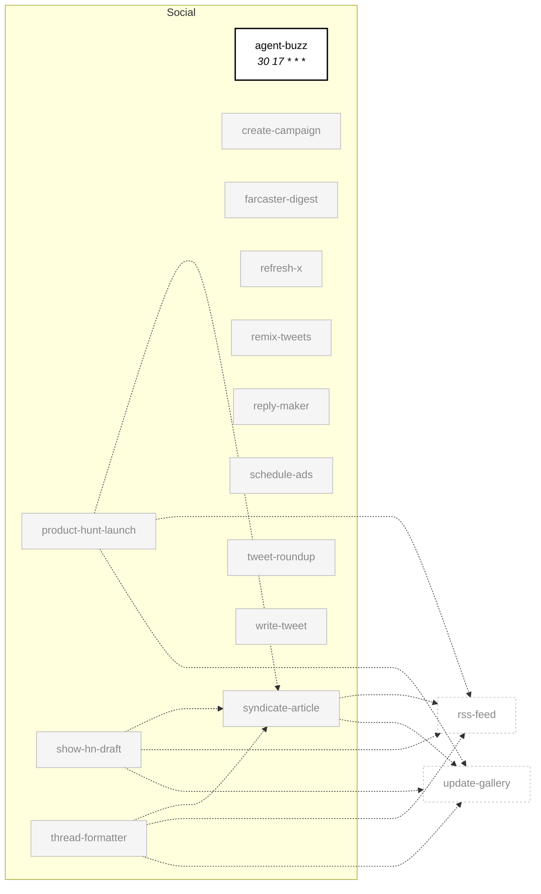

# Skill Dependency Graph

> Auto-generated by `skill-graph` on 2026-06-14. Mode: `SKILL_GRAPH_OK`.

**Verdict:** `NEW_SKILLS: btc-levels, reppo-voter, thought-review · NEW_DEPS: fork-release-tracker->fleet-state, vercel-projects->external-feature, vercel-projects->repo-actions, vercel-projects->repo-scanner, action-converter->syndicate-article, action-converter->rss-feed (+154 more) · REMOVED_DEPS: skill-evals->cron-state, repo-scanner->external-feature, repo-scanner->repo-actions, repo-scanner->vercel-projects, reppo-orchestrator->reppo-trading-agent, reppo-orchestrator->reppo-digest (+6 more) · NEW_ENABLED: aixbt-pulse, btc-levels, deal-flow, defi-monitor, fork-cohort, fork-skill-digest, fork-skill-gap, list-digest (+8 more) · NEW_DISABLED: vibecoding-digest`

Navigable Mermaid map of every Aeon skill, grouped by category, with a self-healing-loop callout, per-category drill-downs, click-through to source, and an enabled overlay.

---

## What changed since last run

- **Added nodes (3)**: `btc-levels`, `reppo-voter`, `thought-review`
- **Added edges (160)**: `fork-release-tracker->fleet-state`, `vercel-projects->external-feature`, `vercel-projects->repo-actions`, `vercel-projects->repo-scanner`, `action-converter->syndicate-article`, `action-converter->rss-feed`, `action-converter->update-gallery`, `aixbt-pulse->syndicate-article`, `aixbt-pulse->rss-feed`, `aixbt-pulse->update-gallery`, `auto-workflow->syndicate-article`, `auto-workflow->rss-feed` and 148 more
- **Removed edges (12)**: `skill-evals->cron-state`, `repo-scanner->external-feature`, `repo-scanner->repo-actions`, `repo-scanner->vercel-projects`, `reppo-orchestrator->reppo-trading-agent`, `reppo-orchestrator->reppo-digest`, `reppo-trading-agent->reppo-digest`, `reppo-digest->reppo-orchestrator`, `reppo-digest->reppo-trading-agent`, `daily-routine->token-movers`, `daily-routine->paper-pick`, `daily-routine->github-issues`
- **Newly enabled (16)**: `aixbt-pulse`, `btc-levels`, `deal-flow`, `defi-monitor`, `fork-cohort`, `fork-skill-digest`, `fork-skill-gap`, `list-digest`, `narrative-tracker`, `on-chain-monitor`, `reg-monitor`, `security-digest`, `thought-review`, `token-movers`, `unlock-monitor`, `vuln-scanner`
- **Newly disabled (1)**: `vibecoding-digest`

---

## Overview

```mermaid
flowchart LR
    research["Research & Content<br/>(21)"]:::cat
    dev["Dev & Code<br/>(37)"]:::cat
    crypto["Crypto & Markets<br/>(19)"]:::cat
    social["Social<br/>(13)"]:::cat
    productivity["Productivity & Meta<br/>(37)"]:::cat

    productivity -- "49" --> productivity
    dev -- "39" --> productivity
    research -- "26" --> productivity
    productivity -- "24" --> social
    dev -- "18" --> social
    research -- "13" --> social
    crypto -- "8" --> productivity
    social -- "8" --> productivity
    dev -- "7" --> dev
    crypto -- "4" --> social
    social -- "3" --> social

    classDef cat fill:#fafafa,stroke:#444,stroke-width:2px,color:#000
```

Edge labels = number of edges crossing that category boundary (or staying inside it). Self-loops collapsed into a single line per category.

---

## Self-Healing Loop

The most load-bearing chain in the fleet. Five skills + one shared state file form a closed loop that detects, classifies, and patches failures without operator intervention.

```mermaid
flowchart LR
    heartbeat["heartbeat"]:::enabled
    skill-health["skill-health"]:::enabled
    skill-evals["skill-evals"]:::enabled
    skill-repair["skill-repair"]:::disabled
    self-improve["self-improve"]:::enabled
    cron-state[("memory/cron-state.json")]:::state

    heartbeat --> skill-health
    skill-health --> skill-evals
    skill-evals --> skill-repair
    skill-repair --> self-improve
    self-improve -.-> heartbeat
    heartbeat -..-> cron-state
    skill-health -..-> cron-state
    skill-repair -..-> cron-state

    click heartbeat "../skills/heartbeat/SKILL.md"
    click skill-health "../skills/skill-health/SKILL.md"
    click skill-evals "../skills/skill-evals/SKILL.md"
    click skill-repair "../skills/skill-repair/SKILL.md"
    click self-improve "../skills/self-improve/SKILL.md"

    classDef enabled fill:#fff,stroke:#000,stroke-width:2px,color:#000
    classDef disabled fill:#f5f5f5,stroke:#bbb,color:#888
    classDef state fill:#fffbe6,stroke:#b3a000,color:#333
```

---

## Per-Category Drill-Downs

### Research & Content (21)

```mermaid
flowchart LR
    subgraph research_cluster["Research & Content"]
      ai-framework-watch["ai-framework-watch"]
      aixbt-pulse["aixbt-pulse<br/><i>0 9,21 * * *</i>"]
      article["article"]
      channel-recap["channel-recap"]
      competitor-launch-radar["competitor-launch-radar"]
      deep-research["deep-research"]
      digest["digest"]
      fetch-tweets["fetch-tweets"]
      hacker-news-digest["hacker-news-digest"]
      huggingface-trending["huggingface-trending"]
      last30["last30"]
      list-digest["list-digest<br/><i>0 17 * * *</i>"]
      paper-digest["paper-digest"]
      paper-pick["paper-pick"]
      reddit-digest["reddit-digest"]
      research-brief["research-brief"]
      rss-digest["rss-digest"]
      security-digest["security-digest<br/><i>0 14 * * *</i>"]
      technical-explainer["technical-explainer"]
      telegram-digest["telegram-digest"]
      vibecoding-digest["vibecoding-digest"]
    end
    syndicate-article_ext["syndicate-article"]:::external
    ai-framework-watch -..-> syndicate-article_ext
    rss-feed_ext["rss-feed"]:::external
    ai-framework-watch -..-> rss-feed_ext
    update-gallery_ext["update-gallery"]:::external
    ai-framework-watch -..-> update-gallery_ext
    aixbt-pulse -..-> syndicate-article_ext
    aixbt-pulse -..-> rss-feed_ext
    aixbt-pulse -..-> update-gallery_ext
    article -..-> syndicate-article_ext
    article -..-> rss-feed_ext
    article -..-> update-gallery_ext
    channel-recap -..-> syndicate-article_ext
    channel-recap -..-> rss-feed_ext
    channel-recap -..-> update-gallery_ext
    competitor-launch-radar -..-> syndicate-article_ext
    competitor-launch-radar -..-> rss-feed_ext
    competitor-launch-radar -..-> update-gallery_ext
    deep-research -..-> syndicate-article_ext
    deep-research -..-> rss-feed_ext
    deep-research -..-> update-gallery_ext
    hacker-news-digest -..-> syndicate-article_ext
    hacker-news-digest -..-> rss-feed_ext
    hacker-news-digest -..-> update-gallery_ext
    huggingface-trending -..-> syndicate-article_ext
    huggingface-trending -..-> rss-feed_ext
    huggingface-trending -..-> update-gallery_ext
    last30 -..-> syndicate-article_ext
    last30 -..-> rss-feed_ext
    last30 -..-> update-gallery_ext
    paper-digest -..-> syndicate-article_ext
    paper-digest -..-> rss-feed_ext
    paper-digest -..-> update-gallery_ext
    paper-pick -..-> syndicate-article_ext
    paper-pick -..-> rss-feed_ext
    paper-pick -..-> update-gallery_ext
    research-brief -..-> syndicate-article_ext
    research-brief -..-> rss-feed_ext
    research-brief -..-> update-gallery_ext
    technical-explainer -..-> syndicate-article_ext
    technical-explainer -..-> rss-feed_ext
    technical-explainer -..-> update-gallery_ext
    class ai-framework-watch disabled
    click ai-framework-watch "../skills/ai-framework-watch/SKILL.md"
    class aixbt-pulse enabled
    click aixbt-pulse "../skills/aixbt-pulse/SKILL.md"
    class article disabled
    click article "../skills/article/SKILL.md"
    class channel-recap disabled
    click channel-recap "../skills/channel-recap/SKILL.md"
    class competitor-launch-radar disabled
    click competitor-launch-radar "../skills/competitor-launch-radar/SKILL.md"
    class deep-research disabled
    click deep-research "../skills/deep-research/SKILL.md"
    class digest disabled
    click digest "../skills/digest/SKILL.md"
    class fetch-tweets disabled
    click fetch-tweets "../skills/fetch-tweets/SKILL.md"
    class hacker-news-digest disabled
    click hacker-news-digest "../skills/hacker-news-digest/SKILL.md"
    class huggingface-trending disabled
    click huggingface-trending "../skills/huggingface-trending/SKILL.md"
    class last30 disabled
    click last30 "../skills/last30/SKILL.md"
    class list-digest enabled
    click list-digest "../skills/list-digest/SKILL.md"
    class paper-digest disabled
    click paper-digest "../skills/paper-digest/SKILL.md"
    class paper-pick disabled
    click paper-pick "../skills/paper-pick/SKILL.md"
    class reddit-digest disabled
    click reddit-digest "../skills/reddit-digest/SKILL.md"
    class research-brief disabled
    click research-brief "../skills/research-brief/SKILL.md"
    class rss-digest disabled
    click rss-digest "../skills/rss-digest/SKILL.md"
    class security-digest enabled
    click security-digest "../skills/security-digest/SKILL.md"
    class technical-explainer disabled
    click technical-explainer "../skills/technical-explainer/SKILL.md"
    class telegram-digest disabled
    click telegram-digest "../skills/telegram-digest/SKILL.md"
    class vibecoding-digest disabled
    click vibecoding-digest "../skills/vibecoding-digest/SKILL.md"
    classDef enabled fill:#fff,stroke:#000,stroke-width:2px,color:#000
    classDef disabled fill:#f5f5f5,stroke:#bbb,color:#888
    classDef external fill:none,stroke:#bbb,stroke-dasharray:3 3,color:#888
```

### Dev & Code (37)

```mermaid
flowchart LR
    subgraph dev_cluster["Dev & Code"]
      auto-merge["auto-merge"]
      auto-workflow["auto-workflow"]
      autoresearch["autoresearch<br/><i>workflow_dispatch</i>"]
      changelog["changelog"]
      code-health["code-health"]
      create-skill["create-skill"]
      deploy-prototype["deploy-prototype"]
      external-feature["external-feature"]
      fleet-control["fleet-control<br/><i>0 9,15 * * *</i>"]
      fork-cohort["fork-cohort<br/><i>0 19 * * 0</i>"]
      fork-first-run-alert["fork-first-run-alert"]
      fork-fleet["fork-fleet"]
      fork-release-tracker["fork-release-tracker"]
      fork-skill-gap["fork-skill-gap<br/><i>0 21 * * 0</i>"]
      github-issues["github-issues"]
      github-monitor["github-monitor"]
      github-releases["github-releases"]
      github-trending["github-trending<br/><i>0 9 * * *</i>"]
      issue-triage["issue-triage"]
      pr-review["pr-review"]
      pr-triage["pr-triage"]
      project-lens["project-lens"]
      push-recap["push-recap"]
      repo-actions["repo-actions"]
      repo-article["repo-article"]
      repo-pulse["repo-pulse"]
      repo-scanner["repo-scanner"]
      search-skill["search-skill<br/><i>0 14 * * *</i>"]
      skill-freshness["skill-freshness<br/><i>0 8 * * *</i>"]
      skill-graph["skill-graph<br/><i>0 17 * * 0</i>"]
      skill-security-scan["skill-security-scan<br/><i>0 16 * * 1</i>"]
      smithery-manifest["smithery-manifest"]
      spawn-instance["spawn-instance"]
      star-milestone["star-milestone"]
      vercel-projects["vercel-projects"]
      vuln-scanner["vuln-scanner<br/><i>0 16 * * 6</i>"]
      workflow-security-audit["workflow-security-audit"]
    end
    external-feature --> repo-scanner
    vuln-scanner --> github-trending
    fork-cohort -..-> fork-first-run-alert
    fork-cohort -..-> fork-skill-gap
    vercel-projects -..-> external-feature
    vercel-projects -..-> repo-actions
    vercel-projects -..-> repo-scanner
    contributor-spotlight_ext["contributor-spotlight"]:::external
    fork-cohort -..-> contributor-spotlight_ext
    fleet-state_ext["fleet-state"]:::external
    fork-cohort -..-> fleet-state_ext
    fork-release-tracker -..-> fleet-state_ext
    syndicate-article_ext["syndicate-article"]:::external
    auto-workflow -..-> syndicate-article_ext
    rss-feed_ext["rss-feed"]:::external
    auto-workflow -..-> rss-feed_ext
    update-gallery_ext["update-gallery"]:::external
    auto-workflow -..-> update-gallery_ext
    changelog -..-> syndicate-article_ext
    changelog -..-> rss-feed_ext
    changelog -..-> update-gallery_ext
    code-health -..-> syndicate-article_ext
    code-health -..-> rss-feed_ext
    code-health -..-> update-gallery_ext
    deploy-prototype -..-> syndicate-article_ext
    deploy-prototype -..-> rss-feed_ext
    deploy-prototype -..-> update-gallery_ext
    fleet-control -..-> syndicate-article_ext
    fleet-control -..-> rss-feed_ext
    fleet-control -..-> update-gallery_ext
    fork-cohort -..-> syndicate-article_ext
    fork-cohort -..-> rss-feed_ext
    fork-cohort -..-> update-gallery_ext
    fork-fleet -..-> syndicate-article_ext
    fork-fleet -..-> rss-feed_ext
    fork-fleet -..-> update-gallery_ext
    fork-release-tracker -..-> syndicate-article_ext
    fork-release-tracker -..-> rss-feed_ext
    fork-release-tracker -..-> update-gallery_ext
    fork-skill-gap -..-> syndicate-article_ext
    fork-skill-gap -..-> rss-feed_ext
    fork-skill-gap -..-> update-gallery_ext
    project-lens -..-> syndicate-article_ext
    project-lens -..-> rss-feed_ext
    project-lens -..-> update-gallery_ext
    push-recap -..-> syndicate-article_ext
    push-recap -..-> rss-feed_ext
    push-recap -..-> update-gallery_ext
    repo-actions -..-> syndicate-article_ext
    repo-actions -..-> rss-feed_ext
    repo-actions -..-> update-gallery_ext
    repo-article -..-> syndicate-article_ext
    repo-article -..-> rss-feed_ext
    repo-article -..-> update-gallery_ext
    skill-freshness -..-> syndicate-article_ext
    skill-freshness -..-> rss-feed_ext
    skill-freshness -..-> update-gallery_ext
    skill-graph -..-> syndicate-article_ext
    skill-graph -..-> rss-feed_ext
    skill-graph -..-> update-gallery_ext
    skill-security-scan -..-> syndicate-article_ext
    skill-security-scan -..-> rss-feed_ext
    skill-security-scan -..-> update-gallery_ext
    vuln-scanner -..-> syndicate-article_ext
    vuln-scanner -..-> rss-feed_ext
    vuln-scanner -..-> update-gallery_ext
    workflow-security-audit -..-> syndicate-article_ext
    workflow-security-audit -..-> rss-feed_ext
    workflow-security-audit -..-> update-gallery_ext
    class auto-merge disabled
    click auto-merge "../skills/auto-merge/SKILL.md"
    class auto-workflow disabled
    click auto-workflow "../skills/auto-workflow/SKILL.md"
    class autoresearch enabled
    click autoresearch "../skills/autoresearch/SKILL.md"
    class changelog disabled
    click changelog "../skills/changelog/SKILL.md"
    class code-health disabled
    click code-health "../skills/code-health/SKILL.md"
    class create-skill disabled
    click create-skill "../skills/create-skill/SKILL.md"
    class deploy-prototype disabled
    click deploy-prototype "../skills/deploy-prototype/SKILL.md"
    class external-feature disabled
    click external-feature "../skills/external-feature/SKILL.md"
    class fleet-control enabled
    click fleet-control "../skills/fleet-control/SKILL.md"
    class fork-cohort enabled
    click fork-cohort "../skills/fork-cohort/SKILL.md"
    class fork-first-run-alert disabled
    click fork-first-run-alert "../skills/fork-first-run-alert/SKILL.md"
    class fork-fleet disabled
    click fork-fleet "../skills/fork-fleet/SKILL.md"
    class fork-release-tracker disabled
    click fork-release-tracker "../skills/fork-release-tracker/SKILL.md"
    class fork-skill-gap enabled
    click fork-skill-gap "../skills/fork-skill-gap/SKILL.md"
    class github-issues disabled
    click github-issues "../skills/github-issues/SKILL.md"
    class github-monitor disabled
    click github-monitor "../skills/github-monitor/SKILL.md"
    class github-releases disabled
    click github-releases "../skills/github-releases/SKILL.md"
    class github-trending enabled
    click github-trending "../skills/github-trending/SKILL.md"
    class issue-triage disabled
    click issue-triage "../skills/issue-triage/SKILL.md"
    class pr-review disabled
    click pr-review "../skills/pr-review/SKILL.md"
    class pr-triage disabled
    click pr-triage "../skills/pr-triage/SKILL.md"
    class project-lens disabled
    click project-lens "../skills/project-lens/SKILL.md"
    class push-recap disabled
    click push-recap "../skills/push-recap/SKILL.md"
    class repo-actions disabled
    click repo-actions "../skills/repo-actions/SKILL.md"
    class repo-article disabled
    click repo-article "../skills/repo-article/SKILL.md"
    class repo-pulse disabled
    click repo-pulse "../skills/repo-pulse/SKILL.md"
    class repo-scanner disabled
    click repo-scanner "../skills/repo-scanner/SKILL.md"
    class search-skill enabled
    click search-skill "../skills/search-skill/SKILL.md"
    class skill-freshness enabled
    click skill-freshness "../skills/skill-freshness/SKILL.md"
    class skill-graph enabled
    click skill-graph "../skills/skill-graph/SKILL.md"
    class skill-security-scan enabled
    click skill-security-scan "../skills/skill-security-scan/SKILL.md"
    class smithery-manifest disabled
    click smithery-manifest "../skills/smithery-manifest/SKILL.md"
    class spawn-instance disabled
    click spawn-instance "../skills/spawn-instance/SKILL.md"
    class star-milestone disabled
    click star-milestone "../skills/star-milestone/SKILL.md"
    class vercel-projects disabled
    click vercel-projects "../skills/vercel-projects/SKILL.md"
    class vuln-scanner enabled
    click vuln-scanner "../skills/vuln-scanner/SKILL.md"
    class workflow-security-audit disabled
    click workflow-security-audit "../skills/workflow-security-audit/SKILL.md"
    classDef enabled fill:#fff,stroke:#000,stroke-width:2px,color:#000
    classDef disabled fill:#f5f5f5,stroke:#bbb,color:#888
    classDef external fill:none,stroke:#bbb,stroke-dasharray:3 3,color:#888
```

### Crypto & Markets (19)

```mermaid
flowchart LR
    subgraph crypto_cluster["Crypto & Markets"]
      btc-levels["btc-levels<br/><i>15 */4 * * *</i>"]
      contributor-reward["contributor-reward"]
      defi-monitor["defi-monitor<br/><i>40 12 * * *</i>"]
      defi-overview["defi-overview<br/><i>0 12 * * *</i>"]
      distribute-tokens["distribute-tokens"]
      market-context-refresh["market-context-refresh<br/><i>0 13 * * *</i>"]
      monitor-kalshi["monitor-kalshi"]
      monitor-polymarket["monitor-polymarket"]
      monitor-runners["monitor-runners"]
      narrative-tracker["narrative-tracker<br/><i>30 13 * * *</i>"]
      on-chain-monitor["on-chain-monitor<br/><i>20 12 * * *</i>"]
      polymarket-comments["polymarket-comments"]
      price-threshold-alert["price-threshold-alert"]
      token-alert["token-alert<br/><i>0 12 * * *</i>"]
      token-movers["token-movers<br/><i>10 12 * * *</i>"]
      token-pick["token-pick<br/><i>0 12 * * *</i>"]
      token-report["token-report"]
      treasury-info["treasury-info"]
      unlock-monitor["unlock-monitor<br/><i>0 10 * * 1</i>"]
    end
    syndicate-article_ext["syndicate-article"]:::external
    contributor-reward -..-> syndicate-article_ext
    rss-feed_ext["rss-feed"]:::external
    contributor-reward -..-> rss-feed_ext
    update-gallery_ext["update-gallery"]:::external
    contributor-reward -..-> update-gallery_ext
    monitor-kalshi -..-> syndicate-article_ext
    monitor-kalshi -..-> rss-feed_ext
    monitor-kalshi -..-> update-gallery_ext
    narrative-tracker -..-> syndicate-article_ext
    narrative-tracker -..-> rss-feed_ext
    narrative-tracker -..-> update-gallery_ext
    token-report -..-> syndicate-article_ext
    token-report -..-> rss-feed_ext
    token-report -..-> update-gallery_ext
    class btc-levels enabled
    click btc-levels "../skills/btc-levels/SKILL.md"
    class contributor-reward disabled
    click contributor-reward "../skills/contributor-reward/SKILL.md"
    class defi-monitor enabled
    click defi-monitor "../skills/defi-monitor/SKILL.md"
    class defi-overview enabled
    click defi-overview "../skills/defi-overview/SKILL.md"
    class distribute-tokens disabled
    click distribute-tokens "../skills/distribute-tokens/SKILL.md"
    class market-context-refresh enabled
    click market-context-refresh "../skills/market-context-refresh/SKILL.md"
    class monitor-kalshi disabled
    click monitor-kalshi "../skills/monitor-kalshi/SKILL.md"
    class monitor-polymarket disabled
    click monitor-polymarket "../skills/monitor-polymarket/SKILL.md"
    class monitor-runners disabled
    click monitor-runners "../skills/monitor-runners/SKILL.md"
    class narrative-tracker enabled
    click narrative-tracker "../skills/narrative-tracker/SKILL.md"
    class on-chain-monitor enabled
    click on-chain-monitor "../skills/on-chain-monitor/SKILL.md"
    class polymarket-comments disabled
    click polymarket-comments "../skills/polymarket-comments/SKILL.md"
    class price-threshold-alert disabled
    click price-threshold-alert "../skills/price-threshold-alert/SKILL.md"
    class token-alert enabled
    click token-alert "../skills/token-alert/SKILL.md"
    class token-movers enabled
    click token-movers "../skills/token-movers/SKILL.md"
    class token-pick enabled
    click token-pick "../skills/token-pick/SKILL.md"
    class token-report disabled
    click token-report "../skills/token-report/SKILL.md"
    class treasury-info disabled
    click treasury-info "../skills/treasury-info/SKILL.md"
    class unlock-monitor enabled
    click unlock-monitor "../skills/unlock-monitor/SKILL.md"
    classDef enabled fill:#fff,stroke:#000,stroke-width:2px,color:#000
    classDef disabled fill:#f5f5f5,stroke:#bbb,color:#888
    classDef external fill:none,stroke:#bbb,stroke-dasharray:3 3,color:#888
```

### Social (13)

```mermaid
flowchart LR
    subgraph social_cluster["Social"]
      agent-buzz["agent-buzz<br/><i>30 17 * * *</i>"]
      create-campaign["create-campaign"]
      farcaster-digest["farcaster-digest"]
      product-hunt-launch["product-hunt-launch"]
      refresh-x["refresh-x"]
      remix-tweets["remix-tweets"]
      reply-maker["reply-maker"]
      schedule-ads["schedule-ads"]
      show-hn-draft["show-hn-draft"]
      syndicate-article["syndicate-article"]
      thread-formatter["thread-formatter"]
      tweet-roundup["tweet-roundup"]
      write-tweet["write-tweet"]
    end
    product-hunt-launch -..-> syndicate-article
    show-hn-draft -..-> syndicate-article
    thread-formatter -..-> syndicate-article
    rss-feed_ext["rss-feed"]:::external
    product-hunt-launch -..-> rss-feed_ext
    update-gallery_ext["update-gallery"]:::external
    product-hunt-launch -..-> update-gallery_ext
    show-hn-draft -..-> rss-feed_ext
    show-hn-draft -..-> update-gallery_ext
    syndicate-article -..-> rss-feed_ext
    syndicate-article -..-> update-gallery_ext
    thread-formatter -..-> rss-feed_ext
    thread-formatter -..-> update-gallery_ext
    class agent-buzz enabled
    click agent-buzz "../skills/agent-buzz/SKILL.md"
    class create-campaign disabled
    click create-campaign "../skills/create-campaign/SKILL.md"
    class farcaster-digest disabled
    click farcaster-digest "../skills/farcaster-digest/SKILL.md"
    class product-hunt-launch disabled
    click product-hunt-launch "../skills/product-hunt-launch/SKILL.md"
    class refresh-x disabled
    click refresh-x "../skills/refresh-x/SKILL.md"
    class remix-tweets disabled
    click remix-tweets "../skills/remix-tweets/SKILL.md"
    class reply-maker disabled
    click reply-maker "../skills/reply-maker/SKILL.md"
    class schedule-ads disabled
    click schedule-ads "../skills/schedule-ads/SKILL.md"
    class show-hn-draft disabled
    click show-hn-draft "../skills/show-hn-draft/SKILL.md"
    class syndicate-article disabled
    click syndicate-article "../skills/syndicate-article/SKILL.md"
    class thread-formatter disabled
    click thread-formatter "../skills/thread-formatter/SKILL.md"
    class tweet-roundup disabled
    click tweet-roundup "../skills/tweet-roundup/SKILL.md"
    class write-tweet disabled
    click write-tweet "../skills/write-tweet/SKILL.md"
    classDef enabled fill:#fff,stroke:#000,stroke-width:2px,color:#000
    classDef disabled fill:#f5f5f5,stroke:#bbb,color:#888
    classDef external fill:none,stroke:#bbb,stroke-dasharray:3 3,color:#888
```

### Productivity & Meta (37)

```mermaid
flowchart LR
    subgraph productivity_cluster["Productivity & Meta"]
      action-converter["action-converter<br/><i>0 18 * * *</i>"]
      contributor-spotlight["contributor-spotlight"]
      cost-report["cost-report<br/><i>0 7 * * 1</i>"]
      daily-routine["daily-routine<br/><i>0 7 * * *</i>"]
      deal-flow["deal-flow<br/><i>0 14 * * 1</i>"]
      evening-recap["evening-recap<br/><i>0 21 * * *</i>"]
      fleet-state["fleet-state"]
      fork-contributor-leaderboard["fork-contributor-leaderboard"]
      fork-skill-digest["fork-skill-digest<br/><i>30 18 * * 0</i>"]
      goal-tracker["goal-tracker<br/><i>0 18 * * *</i>"]
      heartbeat["heartbeat<br/><i>0 8,14,20 * * *</i>"]
      idea-capture["idea-capture"]
      morning-brief["morning-brief<br/><i>0 7 * * *</i>"]
      onboard["onboard"]
      operator-scorecard["operator-scorecard<br/><i>30 10 * * 1</i>"]
      reflect["reflect<br/><i>0 18 * * *</i>"]
      reg-monitor["reg-monitor<br/><i>0 14 * * 3</i>"]
      reppo-digest["reppo-digest"]
      reppo-orchestrator["reppo-orchestrator"]
      reppo-trading-agent["reppo-trading-agent"]
      reppo-voter["reppo-voter"]
      rss-feed["rss-feed"]
      self-improve["self-improve<br/><i>0 18 1/2 * *</i>"]
      skill-analytics["skill-analytics<br/><i>30 18 * * 3</i>"]
      skill-evals["skill-evals<br/><i>0 6 * * 0</i>"]
      skill-health["skill-health<br/><i>0 18 * * *</i>"]
      skill-leaderboard["skill-leaderboard"]
      skill-repair["skill-repair"]
      skill-update-check["skill-update-check<br/><i>0 19 * * 0</i>"]
      star-momentum-alert["star-momentum-alert"]
      startup-idea["startup-idea"]
      thought-review["thought-review<br/><i>0 7,21 * * *</i>"]
      tool-builder["tool-builder"]
      update-gallery["update-gallery"]
      v4-readiness["v4-readiness"]
      weekly-review["weekly-review<br/><i>0 19 * * 1</i>"]
      weekly-shiplog["weekly-shiplog<br/><i>0 9 * * 1</i>"]
    end
    skill-repair --> skill-health
    tool-builder --> action-converter
    contributor-spotlight -..-> fleet-state
    action-converter -..-> rss-feed
    action-converter -..-> update-gallery
    contributor-spotlight -..-> rss-feed
    contributor-spotlight -..-> update-gallery
    cost-report -..-> rss-feed
    cost-report -..-> update-gallery
    deal-flow -..-> rss-feed
    deal-flow -..-> update-gallery
    evening-recap -..-> rss-feed
    evening-recap -..-> update-gallery
    fleet-state -..-> rss-feed
    fleet-state -..-> update-gallery
    fork-contributor-leaderboard -..-> rss-feed
    fork-contributor-leaderboard -..-> update-gallery
    fork-skill-digest -..-> rss-feed
    fork-skill-digest -..-> update-gallery
    heartbeat -..-> rss-feed
    heartbeat -..-> update-gallery
    onboard -..-> rss-feed
    onboard -..-> update-gallery
    operator-scorecard -..-> rss-feed
    operator-scorecard -..-> update-gallery
    reflect -..-> rss-feed
    reflect -..-> update-gallery
    reg-monitor -..-> rss-feed
    reg-monitor -..-> update-gallery
    rss-feed -..-> update-gallery
    self-improve -..-> rss-feed
    self-improve -..-> update-gallery
    skill-analytics -..-> rss-feed
    skill-analytics -..-> update-gallery
    skill-evals -..-> rss-feed
    skill-evals -..-> update-gallery
    skill-leaderboard -..-> rss-feed
    skill-leaderboard -..-> update-gallery
    skill-update-check -..-> rss-feed
    skill-update-check -..-> update-gallery
    star-momentum-alert -..-> rss-feed
    star-momentum-alert -..-> update-gallery
    update-gallery -..-> rss-feed
    v4-readiness -..-> rss-feed
    v4-readiness -..-> update-gallery
    weekly-review -..-> rss-feed
    weekly-review -..-> update-gallery
    weekly-shiplog -..-> rss-feed
    weekly-shiplog -..-> update-gallery
    syndicate-article_ext["syndicate-article"]:::external
    action-converter -..-> syndicate-article_ext
    contributor-spotlight -..-> syndicate-article_ext
    cost-report -..-> syndicate-article_ext
    deal-flow -..-> syndicate-article_ext
    evening-recap -..-> syndicate-article_ext
    fleet-state -..-> syndicate-article_ext
    fork-contributor-leaderboard -..-> syndicate-article_ext
    fork-skill-digest -..-> syndicate-article_ext
    heartbeat -..-> syndicate-article_ext
    onboard -..-> syndicate-article_ext
    operator-scorecard -..-> syndicate-article_ext
    reflect -..-> syndicate-article_ext
    reg-monitor -..-> syndicate-article_ext
    rss-feed -..-> syndicate-article_ext
    self-improve -..-> syndicate-article_ext
    skill-analytics -..-> syndicate-article_ext
    skill-evals -..-> syndicate-article_ext
    skill-leaderboard -..-> syndicate-article_ext
    skill-update-check -..-> syndicate-article_ext
    star-momentum-alert -..-> syndicate-article_ext
    update-gallery -..-> syndicate-article_ext
    v4-readiness -..-> syndicate-article_ext
    weekly-review -..-> syndicate-article_ext
    weekly-shiplog -..-> syndicate-article_ext
    class action-converter enabled
    click action-converter "../skills/action-converter/SKILL.md"
    class contributor-spotlight disabled
    click contributor-spotlight "../skills/contributor-spotlight/SKILL.md"
    class cost-report enabled
    click cost-report "../skills/cost-report/SKILL.md"
    class daily-routine enabled
    click daily-routine "../skills/daily-routine/SKILL.md"
    class deal-flow enabled
    click deal-flow "../skills/deal-flow/SKILL.md"
    class evening-recap enabled
    click evening-recap "../skills/evening-recap/SKILL.md"
    class fleet-state disabled
    click fleet-state "../skills/fleet-state/SKILL.md"
    class fork-contributor-leaderboard disabled
    click fork-contributor-leaderboard "../skills/fork-contributor-leaderboard/SKILL.md"
    class fork-skill-digest enabled
    click fork-skill-digest "../skills/fork-skill-digest/SKILL.md"
    class goal-tracker enabled
    click goal-tracker "../skills/goal-tracker/SKILL.md"
    class heartbeat enabled
    click heartbeat "../skills/heartbeat/SKILL.md"
    class idea-capture disabled
    click idea-capture "../skills/idea-capture/SKILL.md"
    class morning-brief enabled
    click morning-brief "../skills/morning-brief/SKILL.md"
    class onboard disabled
    click onboard "../skills/onboard/SKILL.md"
    class operator-scorecard enabled
    click operator-scorecard "../skills/operator-scorecard/SKILL.md"
    class reflect enabled
    click reflect "../skills/reflect/SKILL.md"
    class reg-monitor enabled
    click reg-monitor "../skills/reg-monitor/SKILL.md"
    class reppo-digest disabled
    click reppo-digest "../skills/reppo-digest/SKILL.md"
    class reppo-orchestrator disabled
    click reppo-orchestrator "../skills/reppo-orchestrator/SKILL.md"
    class reppo-trading-agent disabled
    click reppo-trading-agent "../skills/reppo-trading-agent/SKILL.md"
    class reppo-voter disabled
    click reppo-voter "../skills/reppo-voter/SKILL.md"
    class rss-feed disabled
    click rss-feed "../skills/rss-feed/SKILL.md"
    class self-improve enabled
    click self-improve "../skills/self-improve/SKILL.md"
    class skill-analytics enabled
    click skill-analytics "../skills/skill-analytics/SKILL.md"
    class skill-evals enabled
    click skill-evals "../skills/skill-evals/SKILL.md"
    class skill-health enabled
    click skill-health "../skills/skill-health/SKILL.md"
    class skill-leaderboard disabled
    click skill-leaderboard "../skills/skill-leaderboard/SKILL.md"
    class skill-repair disabled
    click skill-repair "../skills/skill-repair/SKILL.md"
    class skill-update-check enabled
    click skill-update-check "../skills/skill-update-check/SKILL.md"
    class star-momentum-alert disabled
    click star-momentum-alert "../skills/star-momentum-alert/SKILL.md"
    class startup-idea disabled
    click startup-idea "../skills/startup-idea/SKILL.md"
    class thought-review enabled
    click thought-review "../skills/thought-review/SKILL.md"
    class tool-builder disabled
    click tool-builder "../skills/tool-builder/SKILL.md"
    class update-gallery disabled
    click update-gallery "../skills/update-gallery/SKILL.md"
    class v4-readiness disabled
    click v4-readiness "../skills/v4-readiness/SKILL.md"
    class weekly-review enabled
    click weekly-review "../skills/weekly-review/SKILL.md"
    class weekly-shiplog enabled
    click weekly-shiplog "../skills/weekly-shiplog/SKILL.md"
    classDef enabled fill:#fff,stroke:#000,stroke-width:2px,color:#000
    classDef disabled fill:#f5f5f5,stroke:#bbb,color:#888
    classDef external fill:none,stroke:#bbb,stroke-dasharray:3 3,color:#888
```

---

## Legend

| Element | Meaning |
|---------|---------|
| `A --> B` | `depends_on` (frontmatter) |
| `A -.-> B` | `consume` (chain output passed into B) |
| `A -..-> B` | reactive trigger or derived shared-state edge |
| **bold border** | `enabled: true` in `aeon.yml` |
| _grey faded_ | `enabled: false` (catalog only) |
| dashed ghost | cross-category dependency (drawn in target category) |

Every node is clickable — points to `skills/<slug>/SKILL.md`. Click-through paths are relative to this file.

> **Cron-state collapse:** every skill writes `memory/cron-state.json` as a heartbeat side effect. Those 127+ edges are not drawn; treat `heartbeat → skill-health → skill-evals → skill-repair` as the canonical reader of that state.

---

## Summary

| Metric | Count |
|--------|-------|
| Skills total | 127 |
| Skills enabled | 44 |
| Skills disabled | 83 |
| Research & Content | 21 |
| Dev & Code | 37 |
| Crypto & Markets | 19 |
| Social | 13 |
| Productivity & Meta | 37 |
| Edges (depends_on) | 4 |
| Edges (consume) | 0 |
| Edges (reactive) | 0 |
| Edges (shared-state derived) | 195 |

> **Source-status:** skills parsed: 127 · depends_on: 4 · consume: 0 · reactive: 0 · shared-state derived: 195 · enabled: 44/127 · mode: `SKILL_GRAPH_OK`
